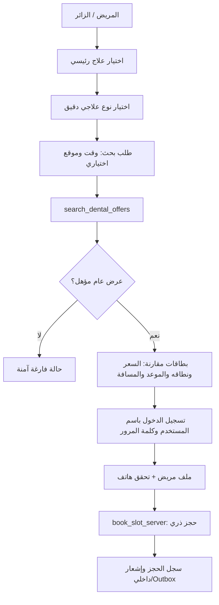
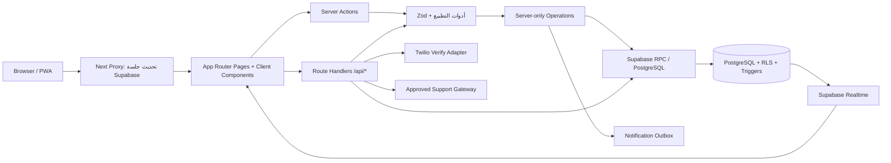

# أسناني قطر — MMC-MMS

> **المرجع التشغيلي والهندسي الرئيسي للمستودع.**
>
> **MMC-MMS** اختصار لـ **Medical Marketplace Comparison – Medical Matching Service**. التطبيق منصة ويب تقدّم مقارنة منضبطة لخدمات الأسنان، ونطاق السعر، والتوفر، وطلبات الحجز لدى العيادات المشاركة في قطر. لا يمثّل التطبيق جهة تشخيص أو علاج، ولا يَعد بسعر أو شمول علاجي غير موثّق من العيادة.

[الموقع الرسمي](https://www.mmc-mms.com) · [تقرير جاهزية الإطلاق](docs/PRODUCTION_LAUNCH_READINESS_AUDIT_2026-08-18.md) · [تدقيق كتالوج العلاج ونطاق السعر](docs/TREATMENT_CATALOG_AND_PRICE_SCOPE_AUDIT_2026-08-18.md) · [التحقق المرئي](docs/VISUAL_REDESIGN_VALIDATION_2026-08-18.md)

## 1. حالة المشروع ونطاق الحقيقة

هذا الملف هو **مصدر الحقيقة الحالي** حول البنية والتشغيل. التقارير المؤرخة تحت `docs/` أدلة تاريخية لمرحلة أو اختبار محدد؛ لا تُعدّل بأثر رجعي ولا تُستخدم وحدها لوصف حالة النشر أو عدد الاختبارات الحالي. بذلك تُدمج المعرفة المتكررة هنا، وتبقى التقارير القديمة قابلة للتدقيق بسياق تاريخها الصحيح.

| البند | الحالة الموثقة |
|---|---|
| التطبيق | Next.js App Router، واجهة عربية/إنجليزية، PWA، وسيرفر Next.js. |
| النطاقات | `https://www.mmc-mms.com` و`https://mmc-mms.com`. |
| البيانات | Supabase PostgreSQL مع RLS؛ المشروع المرجعي: `bqvcukxfsnchvkgejolz`. |
| الكتالوج | 48 علاجًا رئيسيًا و79 نوعًا علاجيًا دقيقًا عند آخر تدقيق موثق. |
| الحجز | لا ينشأ إلا عبر مسار خادمي ذري مع مفتاح idempotency وملف مريض مكتمل وهاتف موثق. |
| السعر | لا يظهر عرض عام إذا لم يصرّح بنطاق السعر للبنود المطلوبة. |
| الرسائل الخارجية | SMS والتحقق عبر Twilio Verify مبنيان لكنهما يفشلان بأمان عند غياب الأسرار؛ لا توجد بيانات اعتماد في المستودع. |
| الدفع | الدفع المباشر لدى العيادة فقط؛ لا توجد بوابة تحصيل بطاقات مفعلة داخل التطبيق. |
| البيانات الواقعية | لا تُنشأ حجوزات أو رسائل حقيقية في اختبارات التطوير أو التحقق العام. |

## 2. ما الذي يحلّه التطبيق؟

المشكلة ليست «أرخص سعر» فقط؛ بل مطابقة **النوع العلاجي الدقيق نفسه** بسعر معلوم النطاق، وموعد صالح، ومركز مؤهل، ومسافة اختيارية. لهذا يفصل التطبيق بين الكتالوج، العرض السعري، الموعد، ملف المريض، والحجز؛ فلا تتحول المقارنة إلى خلط بين خدمات مختلفة أو أسعار لا تبيّن ما يشملها.



## 3. المعمارية وطبقات المسؤولية



| الطبقة | المسؤولية | نقاط الدخول الرئيسية |
|---|---|---|
| `app/` | الصفحات، Route Handlers، Server Actions، التخطيط والهوية. | App Router. |
| `components/` | مكوّنات العرض والتفاعل والتحديث اللحظي. | React client/server components. |
| `lib/` | العقود، التطبيع، الخدمات الخادمية، عملاء Supabase، التسعير، المطابقة. | TypeScript وحدات صغيرة قابلة للاختبار. |
| `supabase/` | ترحيلات PostgreSQL، RLS، RPC، triggers، seed واختبارات قبول SQL. | مصدر تغير المخطط. |
| `tests/` | Vitest وPlaywright. | اختبارات منطق، أمان، PWA، ومسارات المستخدم. |
| `scripts/` | بوابات ما قبل النشر، تحميل آمن، تهيئة أدوار، ومزامنة الأنواع. | أوامر غير تفاعلية قابلة للتكرار. |

## 4. المسارات العامة والصفحات

| المسار | الجمهور | الغرض |
|---|---|---|
| `/` | عام | البحث والمقارنة وملخص الكتالوج والمساعد. |
| `/results` | عام | نتائج النوع العلاجي الدقيق؛ يحترم الوقت، نطاق البحث، ومسافة اختيارية. |
| `/login` | عام | الدخول باسم المستخدم وكلمة المرور، مع `next` داخلي آمن وإتاحة تفعيل بيانات الدخول للحسابات السابقة عبر صفحة الحساب. |
| `/auth/confirm` | مستخدم مصدّق عبر تدفق خارجي قديم | تأكيد رمز جلسة مستلم وإعادة التوجيه؛ ليس مسار تسجيل الدخول الاعتيادي. |
| `/auth/signout` | مستخدم مصدّق | إنهاء جلسة Supabase عبر `POST` من الأصل نفسه فقط؛ يرفض الأصل الخارجي قبل لمس الجلسة. |
| `/account` | المريض | ملفات المرضى التابعة، الحجوزات، الإلغاء، والمراجعات. |
| `/clinic` | أعضاء المركز | الفروع والساعات والممارسون والعروض والمواعيد وعمليات الحجز. |
| `/admin` | مدير المنصة فقط | الكتالوج، العروض، المواعيد، المراجعات، المعرفة، الإشعارات، التحليلات، والتسويات. |
| `/operation-error` | عام | عرض رسائل فشل تشغيلية آمنة. |
| `/manifest.webmanifest` و`/pwa/icon/[size]` | PWA | تعريف التطبيق وأيقوناته. |

## 5. واجهات API والنهايات

جميع النهايات تُرجع أخطاء عامة آمنة، وتتجنب كشف SQL أو الأسرار. تخضع المدخلات إلى Zod قبل أي كتابة أو RPC.

| النهاية | الطريقة | المصادقة | المدخلات الجوهرية | النتيجة والضمانات |
|---|---|---|---|---|
| `/api/health` | `GET` | لا | لا يوجد | حالة التطبيق، اتصال القاعدة، جاهزية عمليات الخادم، وعدد العلاجات. |
| `/api/search` | `GET` | لا | `variant`, `lat?`, `lng?`, `radius?`, `when` | بحث non-cacheable؛ يتحقق من النوع والموقع والنطاق، ثم يعرض العروض المؤهلة فقط. |
| `/api/book` | `POST` | مطلوب | `slot_id`, `offer_id`, `idempotency_key`, `patient_profile_id` | RPC ذري `book_slot_server`؛ حد 10 محاولات/ساعة/مستخدم؛ يعود بـ201 أو أخطاء 400/401/403/409/429/503. |
| `/api/choices` | `POST` | اختياري | حدث اختيار مضبوط | أصل مسموح، حد حجم، 60 حدثًا/60 ثانية/عميل، إدخال مكرّر idempotent. |
| `/api/device-installations` | `POST` | اختياري | `installation_id`, معلومات الجهاز والمنصة والإصدار | Upsert خادمي مع حد 60/ساعة/تثبيت. |
| `/api/patient-phone-verification/start` | `POST` | مطلوب | بيانات المريض والرقم و`patient_profile_id?` | ينشئ/يحدّث الملف، يرسل OTP عبر المحول، ويحفظ challenge صالحًا 10 دقائق؛ حد 3/ساعة للحساب والرقم. |
| `/api/patient-phone-verification/confirm` | `POST` | مطلوب | `patient_profile_id`, `code` | يؤكد OTP، يحدّث `phone_verified_at` ويستهلك challenge؛ حد 5/10 دقائق. |
| `/api/support` | `POST` | مطلوب | `message`, `locale`, `conversation_id?` | دعم محكوم بقاعدة معرفة معتمدة؛ يمنع التشخيص ويصعّد كلمات الطوارئ؛ حد 30/ساعة. |
| `/api/admin/reports/csv` | `GET` | مدير فقط | نطاق تقرير مصدق | تصدير تقارير تشغيلية/مالية عبر طبقة الإدارة. |
| `/api/admin/reports/activity-csv` | `GET` | مدير المنصة فقط | `start`, `end`, `granularity` | يستدعي ملخص النشاط على نطاق المنصة ويصدر CSV؛ لا يتيح للعيادة تصدير بيانات المنصة. |

### عقود الإدخال المركزية

المصدر الوحيد لعقود الإدخال هو [`lib/validation.ts`](lib/validation.ts). تشمل العقود: `searchSchema`، `searchQuerySchema`، `searchWhenSchema`، `activityReportSchema`، `bookingSchema`، `choiceEventSchema`، `clinicApplicationSchema`، `branchSchema`، `offerSchema`، `slotSchema`، `verificationSchema`، `featureFlagSchema`، `practitionerSchema`، `bookingStatusSchema`، `reviewSchema`، `offerRevisionSchema`، `attendanceSchema`، `settlementPeriodSchema`، `financialReportSchema`، `supportMessageSchema`، `supportKnowledgeArticleSchema`، `notificationTemplateSchema`، `patientProfileSchema`، `patientPhoneVerificationStartSchema`، `patientPhoneVerificationConfirmSchema`، `deviceInstallationSchema`، `treatmentCatalogSchema`، `treatmentVariantSchema`، و`adminOfferUpdateSchema`/`adminSlotUpdateSchema`.

ينفّذ الملف نفسه تطبيع الرقم الشخصي القطري (`normalizeNationalId`) ورقم الهاتف (`normalizePhone`) وتاريخ/وقت قطر (`normalizeQatarDateTime`). لا يُنشأ عقد منفصل متكرر في الواجهة أو Route Handler.

## 6. خوارزميات وقواعد العمل

| المجال | القاعدة المنفذة |
|---|---|
| المطابقة | البحث على `treatment_variants.id` وليس اسم علاج حر. لذلك لا تُقارن خدمتان مختلفتان تحت تسمية عامة واحدة. |
| تفضيل الموعد | `earliest` يعرض جميع المؤهل؛ `today` و`tomorrow` يرشحان `earliest_slot_at` وفق المنطقة الزمنية `Asia/Qatar`. |
| نطاق البحث والترتيب | يقبل البحث نطاقاً صريحاً من 1 أو 5 أو 10 أو 25 أو 50 كم عند وجود موقع، وتستعمل الصفحة وواجهة API المحلل نفسه. «الأرخص» و«الأعلى تقييماً» و«الأقرب» و«الأسرع» معايير منفصلة؛ «أفضل توازن شامل» ترتيب موزون مستقل: 35% سعر، 25% تقييم، 25% موعد، 15% مسافة. الواجهة تحفظ النطاق ولا تخزن إحداثيات المستخدم في أحداث الاختيار. |
| نطاق السعر | `price_scope` يفرض حالة لكل من التسجيل والفحص والأشعة والتشخيص الإضافي والتخدير والمختبر والدواء: `included` أو `excluded` أو `assessment_required` أو `not_applicable`. لا يظهر العرض العام إن لم يكن النطاق قابلًا للنشر. |
| العملة | تحفظ مبالغ QAR بوحدات صغرى صحيحة، وتحوّلها `qarInputToMinor`/`priceInputsToMinor` قبل الحفظ؛ يمنع ذلك كسور الفاصلة العائمة. |
| الحجز | `book_slot_server` يتحقق من الممثل والملف والموعد والعرض ويستخدم `idempotency_key`؛ يعيد كود الحجز وحالته من معاملة واحدة. |
| دور المركز | `effectiveClinicRole` يحسب الدور الفعلي من عضوية العيادة؛ لا تعتمد الواجهة وحدها كحاجز صلاحيات. |
| حد المعدل | `consume_rate_limit_server` يطبق نوافذ وحدودًا لكل مجال: حجز، دعم، OTP، تثبيت جهاز، أو telemetry. |
| المساعد | الكلمات الدالة على حالة طبية/طارئة تعطي رد سلامة ثابتًا، ولا تستدعي النموذج. الحالة القياسية تستخدم مقالات معرفة approved/public للغة المطلوبة فقط. |
| التحديث اللحظي | مكونات realtime تعيد جلب البيانات عند تغير الجداول السطحية المصرح بها؛ سياسة RLS هي الحكم النهائي لما يراه كل دور. |

## 7. قاعدة البيانات: الجداول

كل الجداول العامة التالية عليها **RLS مفعّل** عند آخر جرد مباشر. تذكر أعداد الصفوف في التقارير التاريخية فقط؛ لا يعرض README بيانات شخصية أو سجلات تشغيلية.

| المجال | الجداول |
|---|---|
| الهوية والمراكز | `profiles`, `clinics`, `branches`, `clinic_memberships`, `practitioners`, `verification_records`, `suspensions` |
| كتالوج ومقارنة | `treatment_catalog`, `treatment_variants`, `branch_service_offers`, `offer_revisions`, `reviews`, `price_disputes` |
| التوفر والحجز | `branch_hours`, `branch_hour_exceptions`, `resources`, `availability_slots`, `instant_slots`, `bookings`, `booking_status_history`, `booking_attendance_events`, `idempotency_keys` |
| ملف المريض والتحقق | `patient_profiles`, `patient_phone_verification_challenges`, `consent_records`, `device_installations` |
| المال والتسوية | `payment_intents`, `payment_events`, `reconciliation_exceptions`, `clinic_fee_rules`, `settlement_periods`, `accounting_journals`, `accounting_journal_lines`, `report_exports` |
| الإشعارات | `notification_subscriptions`, `notification_preferences`, `notification_templates`, `notification_outbox`, `notification_delivery_attempts` |
| الدعم والتحليلات والحوكمة | `support_knowledge_articles`, `support_conversations`, `support_messages`, `customer_choice_events`, `audit_events`, `feature_flags`, `rate_limit_buckets` |

### دوال PostgreSQL العامة

| المجموعة | الدوال |
|---|---|
| البحث والتسعير | `search_dental_offers`, `is_valid_price_scope`, `is_price_scope_publishable`, `enforce_public_offer_price_scope` (trigger). |
| الحجز | `book_slot`, `book_slot_server`, `cancel_booking_server`, `change_booking_status_server`, `clinic_booking_patient_details`. |
| التشغيل والحوكمة | `consume_rate_limit_server`, `register_device_installation_server`, `verify_and_activate_server`, `create_clinic_application`, `create_branch_application`. |
| مراجعة السعر والحضور | `request_offer_revision`, `request_offer_revision_server`, `review_offer_revision`, `review_offer_revision_server`, `record_booking_check_in`, `record_booking_check_in_server`, `reverse_booking_attendance`, `reverse_booking_attendance_server`. |
| التسوية والتقارير | `create_settlement_period`, `create_settlement_period_server`, `financial_report_summary`, `financial_report_summary_server`, `admin_customer_choice_analytics`, `activity_report_summary`, `activity_report_summary_server`. |
| ملفات المرضى | `handle_new_account_patient_profile` (trigger). |

> لا يستدعي المتصفح أي دالة تتطلب امتيازات. الدوال ذات اللاحقة `_server` تستقبل `p_actor_id` وتتحقق من الهوية والصلاحية في PostgreSQL؛ أما `SECURITY DEFINER` فمقصورة على مسارات خادمية موثوقة وسياسات قاعدة البيانات.

## 8. دورة البيانات والعمليات

### 8.1 المريض والحجز

1. يختار المريض علاجًا رئيسيًا ثم نوعًا دقيقًا.
2. يطلب `/results` أو `/api/search`، فتستدعي الخوادم `search_dental_offers`.
3. لا تظهر بطاقة حجز إلا إذا أعاد العرض موعدًا صالحًا؛ ويُعرض نطاق السعر بدل افتراض أن الفحص أو الأشعة مشمولان.
4. يسجل المستخدم الدخول باسم المستخدم وكلمة المرور، ثم يُنشئ أو يحدّث ملف مريض.
5. يبدأ OTP، ويؤكد الرمز؛ لا يتم ملء `phone_verified_at` من المتصفح.
6. يرسل `BookButton` طلبًا بمفتاح idempotency؛ الحجز يحصل أو يفشل بصورة ذرية، ولا ينشأ حجز مكرر من إعادة الضغط.

### 8.2 العيادة والإدارة

| السطح | ما يديره | الحد الفاصل |
|---|---|---|
| العيادة | طلب الانضمام، الفروع، ساعات العمل، الممارسون، المسودات، العروض، المواعيد، طلب تعديل السعر، الحضور وحالة الحجز. | عضوية العيادة وRLS ومصفوفة انتقالات الحجز. |
| الإدارة | اعتماد وتنشيط المراكز/الفروع، الحوكمة، الكتالوج والأنواع، feature flags، عروض/مواعيد عامة، مراجعات، معرفة الدعم، قوالب الإشعار، تقارير وتسويات. | `app_metadata.platform_admin` ثم التحقق داخل العمليات الخادمية والقاعدة. |
| المريض | ملفه وملفات التابعين والحجوزات والمراجعات. | ملكية الحساب، ملف غير مؤرشف، وهاتف موثق قبل الحجز. |

## 9. طبقة Supabase والتحديث اللحظي

- [`lib/supabase/client.ts`](lib/supabase/client.ts): عميل متصفح بمفتاح publishable فقط.
- [`lib/supabase/server.ts`](lib/supabase/server.ts): عميل SSR مرتكز على cookies.
- [`lib/supabase/proxy.ts`](lib/supabase/proxy.ts): تحديث الجلسة في Proxy/Middleware ومزامنة cookies.
- [`lib/supabase/admin.ts`](lib/supabase/admin.ts): عميل خادمي مميز؛ لا يحمّل إلا على الخادم، ويطلب `SUPABASE_SECRET_KEY` أو البديل المرحلي `SUPABASE_SERVICE_ROLE_KEY`.
- [`components/results-live-refresh.tsx`](components/results-live-refresh.tsx)، [`components/account-live-refresh.tsx`](components/account-live-refresh.tsx)، [`components/clinic-live-refresh.tsx`](components/clinic-live-refresh.tsx)، و[`components/admin-analytics-live-refresh.tsx`](components/admin-analytics-live-refresh.tsx): أسطح إعادة التحقق/realtime.

## 10. الأمن والخصوصية

| التحكم | التطبيق |
|---|---|
| RLS | مفعّل على جداول `public`؛ RLS وليس إخفاء عناصر الواجهة هو آلية فرض الوصول. |
| الجلسات | Supabase Auth باسم المستخدم وكلمة المرور وcookies SSR؛ Proxy ينعش claims. يبقى `/auth/confirm` لتدفقات رمز الجلسة الخارجية فقط، وليس واجهة الدخول الاعتيادية. |
| الأسرار | لا تضع مفاتيح فعلية في Git أو `NEXT_PUBLIC_*`. لا يُعرض `SUPABASE_SECRET_KEY` أو مفاتيح Twilio/OpenAI في السجل أو الواجهة. |
| التحقق | Zod في كل حدود الإدخال، وتطبيع للرقم الشخصي والهاتف والعملة والتاريخ. |
| الحجز | RPC ذري ومفتاح idempotency وقيد ملف المريض/OTP. |
| حارس الكتابة العامة | `lib/public-write-request-guard.ts` يفرض الأصل نفسه وحجم الجسم قبل الكتابة في الحجز وتسجيل المريض وOTP والدعم وتثبيت الجهاز والتحليلات. |
| التعديل الحرج | سياسات PostgreSQL تسحب التعديل العميل المباشر للحجوزات ودعم العملاء وتغيير حالة المراجعة؛ الإجراءات الخادمية المقيّدة هي المسار التشغيلي المعتمد. |
| Telemetry | `/api/choices` يرفض الأصل غير المسموح، الجسم الكبير، والفيض؛ الإدخال المباشر من المتصفح إلى الجدول مسحوب. |
| الدعم | رد أمان للحالات الطبية/الطارئة، ومعرفة approved فقط، ولا تشخيص أو توصية علاجية. |
| CSP وPWA | اختبارات E2E تتحقق من CSP وعدم تحويل فشل API offline إلى HTML مخزّن. |

## 11. متغيرات البيئة والأسرار

انسخ `.env.example` إلى `.env.local` محليًا. ضع القيم الحقيقية في مخزن أسرار الاستضافة فقط. الأسماء التالية هي **عقود إعداد**؛ لا يضع هذا المستودع أي قيمة فعلية.

| المتغير | النطاق | الغرض |
|---|---|---|
| `NEXT_PUBLIC_SUPABASE_URL` | عام/خادم | عنوان مشروع Supabase. |
| `NEXT_PUBLIC_SUPABASE_PUBLISHABLE_KEY` | عام/خادم | مفتاح Supabase القابل للنشر فقط. |
| `NEXT_PUBLIC_SITE_URL` | عام/خادم | أصل الموقع القانوني وروابط Magic Link. |
| `SUPABASE_SECRET_KEY` | خادم فقط | مفتاح Supabase الخادمي المميز الحالي. |
| `SUPABASE_SERVICE_ROLE_KEY` | خادم فقط | بديل legacy مرحلي فقط عند عدم وجود المفتاح الحالي. |
| `OPENAI_API_BASE` | خادم فقط | عنوان بوابة الدعم المعتمدة المتوافقة مع OpenAI. |
| `OPENAI_API_KEY` | خادم فقط | مفتاح بوابة الدعم. |
| `TWILIO_VERIFY_SERVICE_SID` | خادم فقط | معرّف خدمة Twilio Verify. |
| `TWILIO_API_KEY` | خادم فقط | مفتاح Twilio API. |
| `TWILIO_API_SECRET` | خادم فقط | سر Twilio API. |

> لا تكتب قيمة سرية في README، issue، log، client bundle، أو commit. غياب مفاتيح SMS/الدعم الخارجي يجب أن ينتج 503 آمنًا، لا سلوكًا تجريبيًا ولا إرسالًا فعليًا.

## 12. هيكل الملفات الكامل

الملفات التالية هي خريطة المصدر التنفيذي والاختبارات والترحيلات. ملفات الصور الثابتة وتقارير الإثبات المرئية تحت `public/` و`docs/visual-proof/` لا تحمل منطقًا تنفيذيًا.

```text
app/
  account/actions.ts                    account/page.tsx
  actions/locale.ts
  admin/actions.ts                      admin/page.tsx
  api/admin/reports/activity-csv/route.ts  api/admin/reports/csv/route.ts
  api/book/route.ts                     api/choices/route.ts
  api/device-installations/route.ts     api/health/route.ts
  api/patient-phone-verification/confirm/route.ts
  api/patient-phone-verification/start/route.ts
  api/search/route.ts                   api/support/route.ts
  apple-icon.tsx                        auth/confirm/page.tsx
  auth/signout/route.ts                 clinic/actions.ts
  clinic/page.tsx                       globals.css
  icon.tsx                              layout.tsx
  login/actions.ts                      login/page.tsx
  manifest.ts                           operation-error/page.tsx
  page.tsx                              pwa/icon/[size]/route.tsx
  results/page.tsx
components/
  account-live-refresh.tsx              activity-report-card.tsx
  admin-analytics-live-refresh.tsx      admin-choice-analytics.tsx
  app-icon-artwork.tsx
  book-button.tsx                       brand-lockup.tsx
  clinic-booking-status-form.tsx        clinic-live-refresh.tsx
  device-installation-registrar.tsx     icons.tsx
  locale-provider.tsx                   locale-toggle.tsx
  price-scope-fields.tsx                price-scope-summary.tsx
  print-report-button.tsx               results-live-refresh.tsx
  search-form.tsx                       site-header.tsx
  support-chat.tsx                      ui.tsx
lib/
  account-copy.ts                       admin-copy.ts
  booking-intent.client.ts              choice-event-guard.ts
  choice-events.client.ts               clinic-copy.ts
  clinic-role-display.ts                customer-choice-analytics.ts
  database.types.ts                     device-installation.client.ts
  i18n/ar.ts                            i18n/en.ts                 i18n/index.ts
  models.ts                             money-input.ts
  notifications.server.ts               operation-feedback.ts
  operations.server.ts                  phone-verification.server.ts
  price-scope.ts                        price.ts
  public-write-request-guard.ts         search-offers.ts
  search-query.ts                       server-readiness.ts
  activity-report.ts                    supabase/admin.ts
  supabase/client.ts
  supabase/proxy.ts                     supabase/server.ts
  validation.ts
public/
  sw.js                                 brand/*                    visuals/*
scripts/
  predeploy-check.mjs                   provision-role-simulation.mjs
  safe-load-test.mjs                    sync-supabase-types.mjs
supabase/
  seed.dev.sql                          tests/acceptance.sql
  REMOTE_APPLIED_MIGRATIONS.md          migrations/*.sql
tests/
  booking-intent.test.ts                choice-event-guard.test.ts
  clinic-role-display.test.ts           customer-choice-analytics.test.ts
  e2e/home.spec.ts                      i18n.test.ts
  money-input.test.ts                   operation-feedback.test.ts
  phone-verification.test.ts            price.test.ts
  server-operations.test.ts             service-worker.test.ts
  validation.test.ts                    mocks/server-only.ts
```

### سجل الترحيلات المحلي الكامل

<details>
<summary>فتح قائمة ترحيلات PostgreSQL بالترتيب</summary>

```text
20260814213531_customer_choice_event_ingestion_v1.sql
20260814214421_customer_choice_event_fk_indexes_v1.sql
20260814220327_admin_customer_choice_analytics_v1.sql
20260814221217_customer_choice_analytics_hardening_v1.sql
20260814221320_customer_choice_analytics_cohort_v1.sql
20260814221926_consolidate_analytics_catalog_policies_v1.sql
20260815050556_exclude_synthetic_dev_clinics_from_public_search.sql
20260815051408_public_search_dev_guard_security_definer.sql
20260815051730_public_search_dev_guard_view.sql
20260815051855_public_search_dev_guard_private_helper.sql
20260815051946_grant_private_schema_usage_for_public_search_helper.sql
20260815052459_denormalize_synthetic_clinic_visibility.sql
20260815052839_revoke_private_schema_usage_after_search_guard.sql
20260815065426_operational_finance_core_v1.sql
20260815065524_notification_support_core_v1.sql
20260815065653_operational_service_rpcs_v1.sql
20260815065937_operational_rpcs_server_only_v1.sql
20260815071750_transactional_notification_outbox_triggers_v1.sql
20260815073143_operational_performance_indexes_rls_v1.sql
20260815080505_patient_profiles_and_device_installations_v1.sql
20260815080906_new_account_self_patient_profile_v1.sql
20260815081009_patient_booking_server_only_hardening_v1.sql
20260815081707_rate_limit_buckets_server_only_v1.sql
20260815082138_bookings_patient_profile_index_v1.sql
20260815160747_booking_cancellation_server_only_v1.sql
20260815192828_customer_choice_server_only_ingestion_v1.sql
20260815194453_offer_verification_trigger_security_context_v1.sql
20260815195113_admin_verify_activate_atomic_v1.sql
20260815201835_device_installation_server_upsert_v1.sql
20260816063608_private_rls_review_integrity_v1.sql
20260816063824_clinic_application_wrapper_invoker_v1.sql
20260816064530_clinic_booking_status_server_v1.sql
20260816065017_support_admin_and_template_privileges_v1.sql
20260816180742_support_knowledge_policy_dedup_v1.sql
20260816181409_review_pending_edit_guard_v1.sql
20260816181434_offer_revision_price_invariants_v1.sql
20260816182205_booking_completion_attendance_guard_v1.sql
20260816182801_clinic_booking_transition_matrix_v1.sql
20260816183333_attendance_event_cycle_v1.sql
20260816183532_attendance_sequence_order_v1.sql
20260817184500_secure_patient_booking_realtime_v1.sql
20260817184600_patient_details_rls_hardening_v1.sql
20260817185500_clinic_mutation_role_hardening_v1.sql
20260817190500_admin_catalog_display_governance_v1.sql
20260817191500_realtime_surface_completion_v1.sql
20260818044000_localize_clinic_booking_notifications_v1.sql
20260818053000_localize_recent_choice_events_v1.sql
20260818195000_treatment_catalog_and_price_scope_transparency.sql
20260818230000_username_password_and_clinic_operator_accounts.sql
20260819003000_public_search_branch_coordinates_for_directions.sql
20260819053000_lock_down_clinic_operator_security_definer_rpcs.sql
20260819055000_add_service_only_clinic_operator_rpcs.sql
20260819060000_revoke_legacy_clinic_operator_rpcs.sql
20260819063000_explicitly_deny_operator_account_table_access.sql
20260819070000_scale_critical_search_and_operator_indexes.sql
20260819080000_activity_report_rpc.sql
20260819140000_server_only_critical_mutation_policies.sql
```

</details>

## 13. التشغيل المحلي

```bash
cp .env.example .env.local
npm install
npm run verify
npm run test:e2e
npm run dev
```

| الأمر | ما يتحقق منه |
|---|---|
| `npm run predeploy:check` | مسارات حاسمة، قوالب البيئة، وكشف أسرار حقيقي. |
| `npm run typecheck` | TypeScript بلا إصدار ملفات. |
| `npm run lint` | ESLint. |
| `npm run test` | Vitest لعقود الإدخال والسعر والحجز والصلاحيات وPWA. |
| `npm run build` | حزمة Next.js للإنتاج. |
| `npm run verify` | بوابة موحدة: predeploy ثم الأنواع ثم lint ثم unit ثم build. |
| `npm run test:e2e` | بناء إنتاج ثم Playwright لمسارات سطح المكتب والهاتف. |
| `npm run start -- -p 3000` | معاينة بناء الإنتاج محليًا. |

## 14. الاختبار والمراقبة

- بوابة الجودة الحالية: **64 اختبار وحدة** و**52 اختبار متصفح** ناجحة، إضافة إلى TypeScript وESLint وبناء إنتاجي ضمن `npm run verify`.
- [`tests/e2e/home.spec.ts`](tests/e2e/home.spec.ts) واختبارات المتصفح المرتبطة تغطي البحث العربي/الإنجليزي، النوع الدقيق، التفضيل الزمني، نطاق 25 كم، رفض تفضيل موعد غير صالح، الدخول باسم المستخدم وكلمة المرور، المسارات المحمية، health، حارس عروض DEV، CSP، PWA وعدم الاتصال، وحماية تصدير النشاط.
- اختبارات الوحدة تفحص تحويل المال، validation وعقد البحث، فرز التوازن المستقل، نموذج كشف النشاط، idempotency intent، حارس telemetry والكتابة العامة، أدوار العيادة، الترجمة، server operations، OTP adapter، وservice worker.
- [`supabase/tests/acceptance.sql`](supabase/tests/acceptance.sql) يضم مجسات قبول قاعدة البيانات.
- [`scripts/safe-load-test.mjs`](scripts/safe-load-test.mjs) للاختبارات المحلية غير الهدمية فقط؛ لا تنفّذ حملاً على الإنتاج أو تنشئ حجوزات واقعية من دون تفويض واضح وخطة اختبار مخصصة.

## 15. النشر والتشغيل

يُنشر `main` إلى مشروع Vercel `dental-marketplace-pwa`. الضبط التفصيلي في [`docs/DEPLOYMENT_RUNBOOK.md`](docs/DEPLOYMENT_RUNBOOK.md). قبل أي تغيير إنتاجي:

1. شغّل `npm run verify` و`npm run test:e2e` محليًا.
2. راجع `git diff --check` ولا ترفع `.env.local` أو مفاتيح أو مخرجات تجريبية.
3. طبّق ترحيلات DDL عبر مسار Supabase المعتمد، ثم تحقق بالـSQL read-only أو اختبارات القبول.
4. ادفع إلى `main`، راقب حالة النشر، ثم تحقق حيًا من الصفحة و`/api/health` دون إحداث بيانات حقيقية.
5. احفظ دليل التحقق في تقرير مؤرخ داخل `docs/` إذا غيّر النشر سلوكًا أو عقدًا عامًّا.

## 16. قواعد التطوير وعدم التعارض

| القاعدة | التطبيق العملي |
|---|---|
| مصدر حقيقة واحد | العقود في `lib/validation.ts`، عمليات الامتياز في `lib/operations.server.ts`، وأنواع القاعدة في `lib/database.types.ts`. |
| لا تكرار لعقد سعر | `lib/price-scope.ts` ومكوّنا `price-scope-fields`/`price-scope-summary` هما الواجهة الموحدة للإدخال والعرض. |
| لا منطق صلاحية في الواجهة فقط | تستخدم الصفحات العرض الإرشادي فقط؛ Supabase RLS وRPC الخادمي يفرضان القرار. |
| لا أسعار أو عروض مصطنعة | لا يضيف الكود المساعد أو الترحيل عرضًا حيًا أو سعرًا تخمينيًا. |
| لا توثيق متضارب | README هو الوضع الحالي؛ التقارير المؤرخة snapshots ودليل إثبات، مع روابطها لا نسخ محتواها هنا. |
| لا أسرار في Git | الأسماء موثقة، والقيم توضع حصريًا في مخزن أسرار البيئة. |

## 17. الوثائق المساندة

| المرجع | استخدامه |
|---|---|
| [`docs/DEPLOYMENT_RUNBOOK.md`](docs/DEPLOYMENT_RUNBOOK.md) | تشغيل النشر وإعدادات الاستضافة. |
| [`docs/BOOKING_ACCESS_REALTIME_CONTRACT_2026-08-17.md`](docs/BOOKING_ACCESS_REALTIME_CONTRACT_2026-08-17.md) | عقد الحجز والصلاحيات وRealtime. |
| [`docs/TREATMENT_CATALOG_AND_PRICE_SCOPE_AUDIT_2026-08-18.md`](docs/TREATMENT_CATALOG_AND_PRICE_SCOPE_AUDIT_2026-08-18.md) | كتالوج العلاج ونطاق السعر. |
| [`docs/PRODUCTION_LAUNCH_READINESS_AUDIT_2026-08-18.md`](docs/PRODUCTION_LAUNCH_READINESS_AUDIT_2026-08-18.md) | ملاحظات الجاهزية والقيود التشغيلية التاريخية. |
| [`docs/CURRENT_PRODUCTION_STATUS.md`](docs/CURRENT_PRODUCTION_STATUS.md) | موجز الحالة الإنتاجية والقيود الحالية وآخر تحقق موثق. |
| [`supabase/REMOTE_APPLIED_MIGRATIONS.md`](supabase/REMOTE_APPLIED_MIGRATIONS.md) | سجل الترحيلات الذي ظهر في قاعدة البيانات البعيدة. |
| [`docs/README.md`](docs/README.md) | فهرس الوثائق: يميز المرجع الحالي عن تقارير التدقيق والاختبار التاريخية. |
| [`docs/SOURCE_MANIFEST.md`](docs/SOURCE_MANIFEST.md) | فهرس مولّد من `git ls-files` لكل الملفات المتتبعة، بما فيها الأصول المرئية ولقطات الإثبات. |
| [`docs/operations-manual/OPERATIONS_MANUAL_AR.md`](docs/operations-manual/OPERATIONS_MANUAL_AR.md) | كتيب تشغيل ذاتي بالصور الحقيقية للمريض والعيادة والإدارة. |

---

**سياسة التحديث:** أي تغيير في المسارات أو عقود API أو الجداول أو الدوال أو متغيرات البيئة أو قيود النشر يرافقه تحديث لهذا README في الإيداع نفسه. لا تُوثّق قيمة سرية، ولا يُقال إن ميزة خارجية مفعلة من دون اختبار مقصود ودليل تشغيلي.
