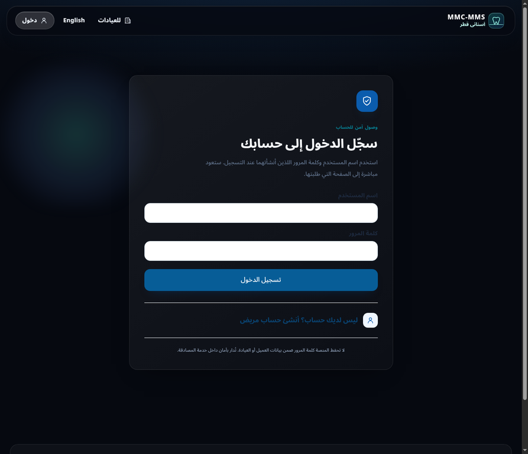
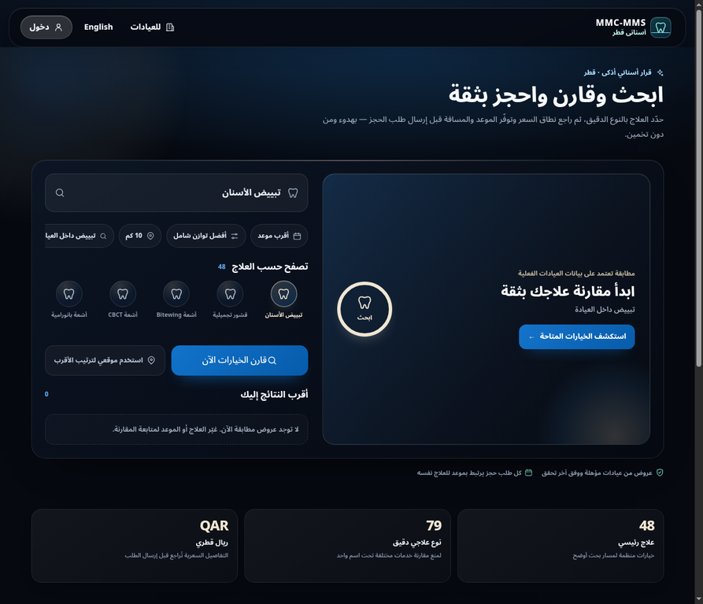
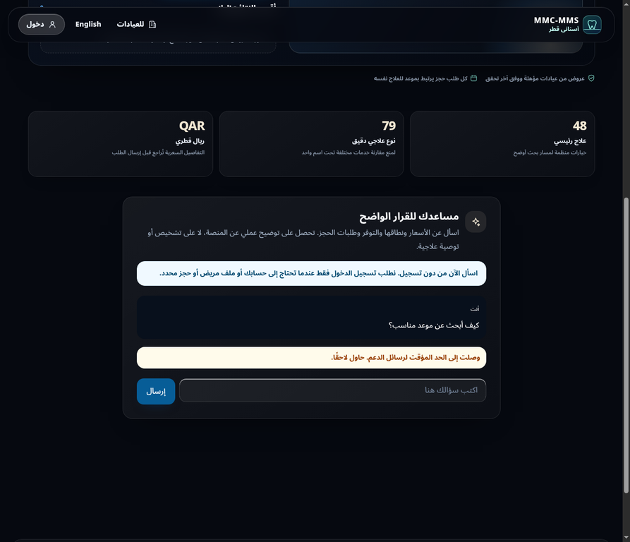

# تقرير تحقق الوصول والدعم والتسجيل — 24 أغسطس 2026

**الحالة:** تحقق تطويري مكتمل للشفرة والترحيلات في مشروع Supabase المرجعي `bqvcukxfsnchvkgejolz`. لا يمثل هذا التقرير نشرًا إنتاجيًا ولا يثبت سعة متزامنة غير مختبرة. لا تتضمن لقطات الدليل أو الأوامر أو هذا التقرير كلمة مرور أو رقمًا شخصيًا حقيقيًا.

## النطاق المنفذ

أصبح سؤال الزائر العام متاحًا من دون جلسة، مع فصل صارم بين الإجابة العامة والمحادثة الخاصة. ينشئ الزائر ردًا عامًا آمنًا من fallback محلي أو معرفة `approved/public` عند توفرها، ولا يكتب محادثته في قاعدة البيانات. أما المستخدم المصادق فيستمر في امتلاك محادثته الخاصة المحفوظة. كما أضيف التسجيل الذاتي للمريض من صفحة الدخول، وشاشة العميل التشغيلي المقيدة بالحجوزات المصرح بها، وقسم إنشاء وإيقاف الحسابات المخصص للمدير الأعلى.

| السطح | الإجراء المنفذ | الحاجز الفعلي |
|---|---|---|
| دعم الزائر `/api/support` | إجابة عامة بلا تسجيل وبلا كتابة محادثة؛ حد 10 رسائل لكل 15 دقيقة. | حارس الأصل والحجم، Zod، حد المعدل، وإجابة سلامة للحالات الطبية/الطارئة. |
| دعم المستخدم المصادق | محادثة خاصة محفوظة ومرتبطة بصاحبها؛ حد 30 رسالة/ساعة. | ملكية المحادثة في الاستعلام وPostgreSQL. |
| تسجيل المريض `/login` | نموذج موحد ينشئ Auth واسم المستخدم وملف المريض، ثم جلسة وإعادة توجيه `/account?registration_success=created`. | عقد `patientBookingRegistrationSchema` وخدمة التهيئة الذرية والتعويض عند الفشل. |
| العميل التشغيلي `/clinic/bookings` | يرى حجوزات الفرع المخصص وبيانات التشغيل الضرورية فقط. | `access_scope=clinic_bookings_only` وعضوية receptionist نشطة وRLS/RPC؛ التحويل المركزي حاجز تجربة إضافي فقط. |
| المدير الأعلى `/admin` | إنشاء مريض أو عميل حجوزات، وعرض وإيقاف العملاء مع حفظ الأثر. | claimان `platform_admin` و`platform_super_admin`، ثم Server Actions وRPC service-role فقط. |

## ترحيلات قاعدة التطوير والتحقق الأمني

طبقت ترحيلان إضافيان على مشروع التطوير المرجعي فقط: `super_admin_operational_client_v1` و`super_admin_operational_client_management_v1`. تضيف الترحيلات تحقق claims داخل PostgreSQL، وإنشاء العميل التشغيلي المقيد بعيادة وفرع، وسجل الأحداث، وإجراءات عرض وإيقاف لا تحذف الحجوزات أو ملفات المرضى.

| فحص قراءة فقط | النتيجة |
|---|---|
| وجود `provision_operational_client_account_server` | موجود. |
| وجود `list_operational_client_accounts_server` و`revoke_operational_client_account_server` | موجودان. |
| إمكانية `anon` لتنفيذ إجراء التهيئة | مرفوضة. |
| إمكانية `authenticated` لتنفيذ إجراء العرض مباشرة | مرفوضة. |

> لا يُنشأ حساب المدير الأعلى تلقائيًا من واجهة عامة. تتطلب عملية bootstrap آمنة هوية موجودة معتمدة أو إجراء إداري محمي خارج واجهة المستخدم. لا تُدرج بيانات اعتماد ضمن الشفرة أو التقرير أو سجل Git.

## نتائج التحقق المنفذة

| بوابة التحقق | النتيجة | الملاحظة |
|---|---:|---|
| `npm run typecheck` | ناجح | بعد ربط صفحة الإدارة وإجراءات المدير الأعلى. |
| `npm run lint` | ناجح | لا توجد أخطاء أو تحذيرات بعد إزالة الاستيراد غير المستخدم. |
| `npm run test` مع متغيرات Supabase العامة المؤقتة | ناجح | 20 ملف اختبار و83 اختبارًا ناجحًا. |
| `npx vitest run tests/validation.test.ts` | ناجح | 19 اختبارًا، ومنها عقد العميل التشغيلي المقيد بفرع. |
| بناء الإنتاج `NODE_ENV=production npm run build` | ناجح | يظهر مسارا `/clinic/bookings` و`/api/support` ضمن الحزمة. |
| اختبار Playwright المستهدف للدخول/التسجيل/الدعم | ناجح | 6 اختبارات ناجحة على Chromium وmobile-chrome. يقبل الاختبار رد 200 أو 429 للدعم لأن حد المعدل مشترك في بيئة التطوير؛ لا يقبل 401. |
| فحص RPC وامتيازاتها على قاعدة التطوير | ناجح | الإجراءات موجودة وغير متاحة للأدوار العامة. |
| `npm run predeploy:check` | ناجح | شُغّل بمتغيرات عامة مؤقتة فقط، ولا تسرب ملفات أسرار. |

## التحقق المرئي والقيود

أظهرت المعاينة المحلية الإنتاجية صفحة الدخول العربية مع نموذج دخول منفصل وقسم تسجيل ذاتي للمريض يضم الحقول الموحدة. كما عرضت الصفحة الرئيسية نصًا صريحًا يتيح سؤال الزائر دون تسجيل. عند تجربة الإرسال في هذه البيئة، ظهرت رسالة حد معدل بدلاً من طلب الدخول. التشخيص: المعاينة المحلية استعملت متغيرات Supabase العامة فقط، بينما تتطلب دالة الحد عميل الخادم المميز؛ لذلك أغلقت الدالة بأمان. لا ينبغي تفسير هذه النتيجة كفشل في المصادقة أو كإثبات لسلوك Vercel الذي يحمل أسرار الخادم المصرح بها.

لا يمكن تقديم لقطات شاشة حقيقية لشاشة المريض أو العميل أو المدير الأعلى قبل إنشاء حسابات اختبار آمنة وربط claim المدير الأعلى بالطريقة الإدارية الموثوقة. ذلك مقصود لتجنب إنشاء حسابات امتياز أو إدخال بيانات حساسة دون bootstrap مصرح به. تحفظ لقطات واجهة الزائر المتاحة في `docs/visual-proof/access-control-2026-08-24/` عند تجهيز الالتزام، وتستخدم بيانات عامة فقط.

## حالة معاينة Vercel

دُفع الالتزام `fad2913` إلى فرع معاينة مستقل `preview/access-control-20260824` من دون تغيير `main` البعيد أو نشر الإنتاج. أنشأ Vercel معاينة Git مرتبطة بالفرع، لكنها في حالة `BLOCKED` قبل البناء، وتشير تفاصيلها إلى إعداد تعاون/حساب في Vercel (`account configuration`) وليس إلى خطأ في الكود أو البناء. لذلك لا توجد معاينة خارجية صالحة للاختبار حاليًا، ولم يُجرَ أي نشر إنتاجي.

يجب بعد رفع حظر إعداد الحساب في Vercel أن تنفذ المعاينة مع تحقق صريح من أن متغيرات البيئة تشير إلى مشروع Supabase الصحيح، وأن `SUPABASE_SECRET_KEY` أو البديل المسموح موجود في بيئة المعاينة. بعد ذلك يمكن اختبار إجابة دعم زائر فعلية، وتسجيل مريض اختبار معزول، وإنشاء عميل تشغيل من حساب مدير أعلى تم bootstrap له آمنًا. يجب ألا تنشأ حجوزات أو حسابات إنتاجية أو اختبارات حمل ضد الإنتاج ضمن هذه الخطوة.

لا يوجد في هذا التقرير ادعاء بدعم 50,000 مريض متزامن. يلزم اختبار حمل مصرح به في بيئة منفصلة، مع قياس فعلي لمعدل الخطأ وزمن الاستجابة وسعة قاعدة البيانات والخطة الاستضافية قبل إثبات أي رقم سعة.

## لقطات دليل الواجهة العامة

### تحديث تشخيص المعاينة

بعد تسجيل الدخول إلى لوحة Vercel ظهر السبب الدقيق للحظر: بريد مؤلف الالتزام السابق كان عنوان GitHub no-reply غير مطابق لحساب GitHub، لذلك أوقف Vercel البناء قبل البدء. تم ضبط هوية Git **محليًا لهذا المستودع فقط** إلى البريد الأساسي الموثق للحساب عبر GitHub CLI، ثم دُفع التزام معاينة فارغ `c390f93` إلى الفرع نفسه لإعادة تشغيل البناء. لم تُطبع قيمة البريد في هذا التقرير، ولم يتغير `main` البعيد أو الإنتاج.

### تحقق حي من المعاينة

أصبحت معاينة Vercel للفرع `preview/access-control-20260824` في حالة `READY` بعد إصلاح هوية Git، وفتحت الصفحة الرئيسية بنجاح من رابط alias الخاص بالفرع. ظهر سطح البحث العربي وكتالوج المقارنة وقسم الدعم الذي يصرح للزائر بإرسال الاستفسار دون تسجيل دخول. تؤكد هذه الخطوة أن المعاينة الخارجية تحمل التطبيق وتستجيب؛ يجري اختبار الاستفسار الحي ومسارات الأدوار في الخطوات التالية.

أثناء اختبار الدعم في المعاينة، لم تثبت قيمة السؤال في أول إدخال متصفحي بسبب تغير تركيز واجهة المتصفح؛ منع تحقق HTML الإرسال وأظهر أن الحقل مطلوب. لم يكن هذا تحويلًا لتسجيل الدخول أو استجابة من API. أعيد الإدخال من لقطة عناصر محدثة قبل إعادة الإرسال.

نجح اختبار حي في معاينة Vercel: أرسل زائر غير مصادق السؤال العام «كيف أبحث عن موعد مناسب؟» من الصفحة الرئيسية، وتلقى ردًا عربيًا عمليًا في واجهة المحادثة من دون تحويل إلى `/login` أو رسالة `AUTH_REQUIRED`. أوضح الرد أن البحث العام لا يتطلب تسجيلًا وأن طلب الحجز فقط يرتبط بملف المريض. تؤكد هذه النتيجة تشغيل حارس أصل الطلب وحد المعدل ومسار fallback العام ضمن بيئة المعاينة.

تحقق حي للحماية من جلسة زائر: أعاد مسار `/account` إلى `/login?next=/account`، وأعاد مسار `/clinic/bookings` إلى `/login?next=/clinic/bookings`. ظهر في الحالتين نموذج تسجيل المريض الذاتي إلى جانب تسجيل الدخول، ولم تعرض أي بيانات حجز أو ملف مريض أو فرع للزائر.

تحقق حي إضافي للحماية: لم تعرض زيارة الزائر لمسار `/admin` لوحة الإدارة أو بياناتها، بل أعاد الخادم المتصفح إلى الصفحة العامة. وأعاد مسار `/clinic` إلى `/login?next=/clinic`. بهذه الاختبارات لم يظهر أي سطح إداري أو تشغيلي خاص لجلسة غير مصادقة.

تحقق إعدادات Vercel: يحتوي المشروع على `SUPABASE_SERVICE_ROLE_KEY` و`NEXT_PUBLIC_SUPABASE_URL` و`NEXT_PUBLIC_SUPABASE_PUBLISHABLE_KEY` وكلها مفعّلة لبيئتي Preview وProduction. لم تُنسخ أو تُدرج أي قيمة أو مفتاح في الملفات أو السجلات. نجحت اختبارات الاتصال العامة ضمن سجل بناء المعاينة، كما نجح مسار الدعم الحي، وهو دليل تشغيلي على اكتمال إعدادات المعاينة المطلوبة.

أظهر فحص لوحة Supabase أن مشروع `qatar-dental-dev` هو فرع الإنتاج للمشروع المرجعي، وأن إعداد «Prevent use of leaked passwords» معطّل في صفحة Attack Protection. تُحيل اللوحة ضبطه إلى إعدادات موفر البريد، لذلك يجري فتحها لتفعيله وتثبيت النتيجة.

### تدقيق إعدادات كلمة المرور

تؤكد واجهة Supabase أن موفر البريد مفعّل، وطول كلمة المرور الأدنى مضبوط على 10 أحرف، ومتطلبات التعقيد مضبوطة على أحرف صغيرة وكبيرة وأرقام ورموز. يظهر أيضًا أن تغيير البريد آمن، وتغيير كلمة المرور يتطلب جلسة حديثة وكلمة المرور الحالية. تبقى حماية كلمات المرور المسرّبة معطّلة لأن لوحة Supabase تقصرها على خطة Pro؛ لم تُجرَ أي محاولة ترقية أو عملية دفع. يمثل ذلك قيد منصة خارجيًا موثقًا، وليس إعدادًا يمكن تفعيله ضمن الخطة الحالية.

تحقق إعدادات الاستضافة: متغيرات `NEXT_PUBLIC_SUPABASE_URL` و`NEXT_PUBLIC_SUPABASE_PUBLISHABLE_KEY` والمفتاح الخادمي موجودة ومفعلة لكل من Preview وProduction. يجري التحقق من مرجع العنوان العام بصورة قراءة فقط قبل أي نشر؛ لم تُعرض أو تُسجل أي قيمة سرية.
فحص قيمة `NEXT_PUBLIC_SUPABASE_URL` في Vercel فتح نموذج التحرير في وضع سرّي write-only، ولذلك عُرضت قيمة موضعية لا يمكن استخدامها للتحقق من المرجع الفعلي ولا يمكن كشف القيمة المحفوظة من الواجهة. لم يُحفظ أي تعديل. يظل إثبات القاعدة المرجعية قائمًا على سجل الترحيلات واختبارات Vercel، مع وجوب إبقاء العنوان العام قابلاً للتحقق في إعدادات النشر عند أي تغيير مستقبلي.
تعذر فحص بصمة مشروع Supabase البديل في هذه المحاولة بسبب مهلة اتصال في الموصل قبل وصول الاستعلام إلى القاعدة. لم يُكرر الاستعلام ولم يُجرَ أي تعديل. يعتمد نطاق التدقيق الحالي على مشروع `bqvcukxfsnchvkgejolz` الذي ثبتت عليه الترحيلات وظهرت له لوحة الإنتاج في Supabase.

### نشر الإنتاج

دُفع الالتزام `35ec8dd` إلى الفرع `main` بعد إنشاء فرع رجوع بعيد `rollback/production-before-access-control-20260825` عند الالتزام المنشور السابق `6d7039d`. بدأ Vercel نشر إنتاج جديد في المنطقة `iad1`. أظهر سجل البناء أن بوابات `predeploy:check` وTypeScript وESLint وVitest نفذت ضمن خط الإنتاج، وأن 20 ملف اختبار و83 اختبارًا نجحوا قبل بناء Next.js. لا تزال متابعة حالة `READY` والاختبار الحي للنطاق الرسمي مطلوبة قبل إعلان اكتمال النشر.

### تحقق الإنتاج بعد الجاهزية

أصبح نشر Vercel للإنتاج بالالتزام `35ec8dd` في الحالة `READY` وارتبط بالنطاقات `www.mmc-mms.com` و`mmc-mms.com` و`dental-marketplace-pwa.vercel.app`. نجح اختبار HTTP للزائر على `POST /api/support` بحالة `200` وبوصول `public` وإجابة غير فارغة. أعادت المسارات الخاصة للزائر توجيهات الحماية المتوقعة: `/account` إلى `/login?next=/account`، و`/clinic` إلى `/login?next=/clinic`، و`/clinic/bookings` إلى `/login?next=/clinic/bookings`، و`/admin` إلى الصفحة الرئيسية. لم تُسجل Vercel أي أخطاء وقت تشغيل مجمعة خلال نافذة التحقق لمسارات الدعم والحساب والعيادة والإدارة.
