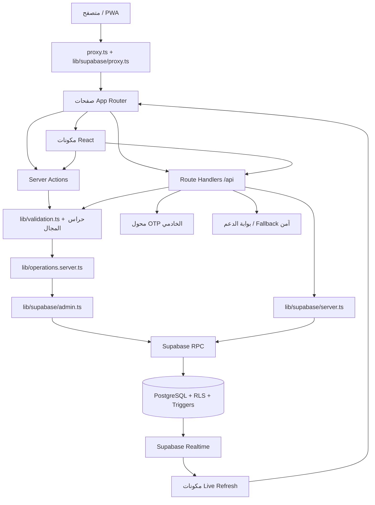

# خريطة الهندسة والكود — أسناني قطر / MMC-MMS

> **وظيفة هذا المستند:** مرجع ملاحي واحد للمسارات والملفات والدوال والخوارزميات. لا يكرر قواعد المنتج أو نتائج الإطلاق؛ فالعقود الحالية في [README الجذري](../README.md)، والحالة المنشورة في [سجل الحالة](CURRENT_PRODUCTION_STATUS.md)، وتعليمات التغيير الآمن في [AGENTS.md](../AGENTS.md).
>
> لا يضع هذا المستند أسرارًا أو قيَم بيئة أو بيانات مرضى أو مخرجات تشغيلية. أسماء الملفات والدوال هنا هي عقد صيانة، وليست واجهة عامة جديدة.

## 1. الرسم المعماري

| الطبقة | مصدر الحقيقة | المسؤولية | ما لا يجوز أن تفعله |
|---|---|---|---|
| العرض | `app/` و`components/` | عرض الحالة وجمع مدخلات المستخدم وإعادة الجلب. | لا تمنح صلاحية اعتمادًا على الإخفاء البصري فقط. |
| العقود | `lib/validation.ts` | Zod والتطبيع وفحص الشكل والحدود. | لا تنسخ schema في صفحة أو endpoint آخر. |
| التشغيل المميز | `lib/operations.server.ts` و`lib/*.server.ts` | مهلات، rate limits، RPC الخادمي، تكاملات الخادم. | لا يستورد في client bundle. |
| البيانات | `supabase/migrations/` وbaseline | RLS وconstraints وRPC وtriggers. | لا تغيّر DDL خارج migration مصدرية. |
| التحقق | `tests/` و`scripts/` و`load-tests/` | كشف الانحدار وفرض بوابات النشر. | لا يشغّل حجزًا أو K6 أو ضغطًا على Production. |

## 2. خريطة المسارات والواجهات

| المسار أو النهاية | الملف الحاكم | الجمهور | العقد المختصر |
|---|---|---|---|
| `/` | `app/page.tsx` | عام | بحث واختيار كتالوج ودعم عام آمن. |
| `/results` | `app/results/page.tsx` | عام | نتائج عروض مؤهلة فقط وفق النوع والوقت والموقع الاختياري. |
| `/login` | `app/login/page.tsx` و`app/login/actions.ts` | عام | دخول باسم مستخدم/كلمة مرور أو تسجيل مريض؛ يعيد `next` الداخلي فقط. |
| `/account` | `app/account/page.tsx` و`app/account/actions.ts` | المريض | الملفات التابعة والحجوزات والإلغاء والمراجعات. |
| `/clinic` | `app/clinic/page.tsx` و`app/clinic/actions.ts` | أعضاء العيادة | تشغيل العيادة حسب العضوية والدور والفرع. |
| `/clinic/bookings` | `app/clinic/bookings/page.tsx` | العميل التشغيلي | حجوزات الفروع المخولة فقط عبر membership receptionist نشطة. |
| `/admin` | `app/admin/page.tsx` و`app/admin/actions.ts` | مدير المنصة | حوكمة المحتوى والتشغيل؛ حسابات خاصة للمدير الأعلى. |
| `/operation-error` | `app/operation-error/page.tsx` | عام | رسائل فشل تشغيلية آمنة. |
| `/auth/confirm` | `app/auth/confirm/page.tsx` | تدفق خارجي قديم | تأكيد جلسة مستلمة وإعادة توجيه مضبوطة. |
| `/auth/signout` | `app/auth/signout/route.ts` | مصدّق | `POST` من نفس الأصل فقط لإنهاء الجلسة. |
| `/api/health` | `app/api/health/route.ts` | عام | `{ ok, time }` فقط، من دون معلومات قاعدة أو أسرار. |
| `/api/search` | `app/api/search/route.ts` | عام | تحقق القراءة والبحث في العروض المؤهلة. |
| `/api/book` | `app/api/book/route.ts` | مريض مصدق | حجز ذري خادمي مع idempotency وملف هاتفه موثق. |
| `/api/choices` | `app/api/choices/route.ts` | اختياري | telemetry محدود ومضبوط المصدر والحجم. |
| `/api/device-installations` | `app/api/device-installations/route.ts` | اختياري | تسجيل جهاز guarded وrate-limited. |
| `/api/patient-booking-registration` | `app/api/patient-booking-registration/route.ts` | عام | تسجيل مريض موحد وآمن ضمن تدفق الحجز. |
| `/api/patient-phone-verification/start` | `app/api/patient-phone-verification/start/route.ts` | مريض مصدق | بدء OTP؛ الفشل عند غياب المزود آمن. |
| `/api/patient-phone-verification/confirm` | `app/api/patient-phone-verification/confirm/route.ts` | مريض مصدق | تأكيد OTP وتحديث الملف داخل المسار الخادمي. |
| `/api/support` | `app/api/support/route.ts` | عام/مصدق | إجابة عامة للزائر، ومحادثة محفوظة للمصدق فقط. |
| `/api/admin/reports/csv` | `app/api/admin/reports/csv/route.ts` | مدير | CSV تشغيلي أو مالي مصرح به. |
| `/api/admin/reports/activity-csv` | `app/api/admin/reports/activity-csv/route.ts` | مدير منصة | تصدير النشاط على نطاق المنصة فقط. |
| PWA | `app/manifest.ts`، `app/pwa/icon/[size]/route.tsx`، `app/apple-icon.tsx`، `app/icon.tsx`، `app/robots.ts`، `app/sitemap.ts` | عام | manifest وأيقونات وفهرسة، بلا منطق صلاحيات. |

## 3. تدفقات البيانات والخوارزميات

| التدفق | الدوال/الملفات المحورية | الخوارزمية أو الحاجز | النتيجة المسموح بها |
|---|---|---|---|
| البحث والمقارنة | `searchQuerySchema`، `search_dental_offers`، `lib/search-query.ts`، `lib/search-offers.ts` | يطابق `treatment_variants.id`، يرشح الوقت والنطاق المكاني، ثم يفرز حسب التفضيل أو توازن موزون. | عروض عامة مؤهلة أو حالة فارغة آمنة. |
| شفافية السعر | `lib/price.ts`، `lib/price-scope.ts`، `is_price_scope_publishable` | يحول QAR إلى وحدات صغرى صحيحة ويتحقق من نطاق التسجيل/الفحص/الأشعة وبقية البنود. | عرض كامل الإفصاح فقط. |
| نية الحجز | `lib/booking-intent.client.ts` و`components/book-button.tsx` | ينشئ مفتاح idempotency محليًا لكل محاولة منطقية. | طلب خادمي واحد قابل للإعادة الآمنة. |
| الحجز الذري | `app/api/book/route.ts`، `book_slot_server`، `private.book_slot_internal` | يثبت actor وملكية profile وهاتف موثق وoffer/slot صالحين، يقفل slot، ينشئ booking/snapshot/history/audit، ثم يحول slot إلى held في معاملة واحدة. | `201` أو خطأ عام مضبوط؛ لا double booking. |
| OTP | `lib/phone-verification.server.ts`، endpoints OTP | challenge محدود العمر والمحاولات، وconfirmation ذري؛ لا يكتب المتصفح `phone_verified_at`. | هاتف موثق أو فشل آمن عند غياب المزود/الرمز. |
| الدخول | `emailForUsername`، `loginWithPassword` | يقرأ username غير المعطل، يستعمل رسالة فشل موحدة، ويحد معدل المحاولات. | جلسة Supabase أو `invalid_credentials` العام. |
| العميل التشغيلي | `lib/supabase/proxy.ts`، `clinic/bookings/page.tsx`، `clinic_booking_patient_details` | `access_scope=clinic_bookings_only` ثم membership receptionist نشطة وفرع مخول؛ RLS/RPC حَكَم نهائي. | مساحة الحجوزات فقط أو إعادة توجيه آمنة. |
| الدعم | `lib/support-model.server.ts` و`lib/support-public-fallback.ts` | كلمات الخطر تعطي رد سلامة ثابتًا؛ لا تشخيص أو أسعار مخترعة؛ الزائر لا ينشئ conversation. | إجابة عامة آمنة أو محادثة خاصة للمصدق. |
| التحديث اللحظي | `components/use-realtime-router-refresh.ts` و`lib/realtime-refresh-policy.ts` | اشتراك على أسطح مسموحة ثم refresh؛ RLS يحدد السجل المرئي. | تحديث عرض مصرح به فقط. |

## 4. فهرس ملفات التطبيق

### 4.1 صفحات وأفعال التطبيق `app/`

| الملفات | المسؤولية |
|---|---|
| `account/page.tsx`، `account/actions.ts` | حساب المريض، ملفات التابعين، الإلغاء، التقييم، وتفعيل بيانات الدخول القديمة. |
| `admin/page.tsx`، `admin/actions.ts` | أسطح حوكمة المنصة، الكتالوج، التقارير، والتحقق؛ ينفرد المدير الأعلى بإنشاء حساب مريض أو حساب عميل تشغيلي من الإدارة. |
| `clinic/page.tsx`، `clinic/actions.ts` | لوحة العيادة، العضويات، الفروع، العروض، المواعيد، حالات الحجز، وحسابا العميل التشغيلي بحد أقصى للمالك النشط. |
| `clinic/bookings/page.tsx` | مساحة العميل التشغيلي المستقلة، القراءة المقيّدة وتغيير الحالة المصرح به. |
| `login/page.tsx`، `login/actions.ts` | صفحة الدخول والتسجيل الذاتي ودوال login/register. |
| `page.tsx`، `results/page.tsx` | صفحة المقارنة وناتجها؛ لا تضعان منطق كتابة مباشرًا. |
| `api/book/route.ts` | بوابة الحجز العامة الخادمية؛ تحقق وحجم وأصل وrate-limit وRPC. |
| `api/search/route.ts`، `api/health/route.ts`، `api/locale/route.ts` | قراءة بحث، health مختصر، ولغة. |
| `api/choices/route.ts`، `api/device-installations/route.ts` | telemetry وتسجيل جهاز تحت حارس المصدر والحدود. |
| `api/patient-booking-registration/route.ts`، `api/patient-phone-verification/*/route.ts` | التسجيل الموحد وتدفق OTP. |
| `api/support/route.ts` | دعم الزائر/المصدق بحفظ مقيد. |
| `api/admin/reports/*/route.ts` | CSV إداري مقيّد بالclaims. |
| `auth/confirm/page.tsx`، `auth/signout/route.ts` | تأكيد تدفق خارجي قديم وخروج محمي بالأصل. |
| `layout.tsx`، `globals.css` | الغلاف، metadata، والتنسيق العام. |
| `apple-icon.tsx`، `icon.tsx`، `manifest.ts`، `pwa/icon/[size]/route.tsx` | أصول PWA المعتمدة على الكود. |
| `operation-error/page.tsx`، `robots.ts`، `sitemap.ts` | واجهة الخطأ العامة وفهرسة محركات البحث. |

### 4.2 المكونات `components/`

| المجموعة | الملفات | المسؤولية |
|---|---|---|
| البحث والحجز | `search-form.tsx`، `book-button.tsx`، `price-scope-fields.tsx`، `price-scope-summary.tsx`، `results-live-refresh.tsx` | إدخال البحث، نية الحجز، وإظهار شفافية السعر وتحديث النتائج. |
| المريض والجلسة | `account-live-refresh.tsx`، `locale-provider.tsx`، `locale-toggle.tsx`، `mobile-navigation.tsx` | تحديث الحساب واللغة والتنقل المتجاوب. |
| العيادة والإدارة | `clinic-booking-status-form.tsx`، `clinic-live-refresh.tsx`، `activity-report-card.tsx`، `admin-analytics-live-refresh.tsx`، `admin-choice-analytics.tsx`، `super-admin-user-management.tsx` | إجراءات الحجز، التقارير، التحليلات، وإدارة حسابات المدير الأعلى. |
| الهوية والواجهة | `brand-lockup.tsx`، `site-header.tsx`، `app-icon-artwork.tsx`، `icons.tsx`، `ui.tsx` | هوية التطبيق ومكتبة واجهة مشتركة؛ لا تنسخ أنماط عناصر أساسية خارجها. |
| الدعم والطباعة والجهاز | `support-chat.tsx`، `print-report-button.tsx`، `device-installation-registrar.tsx` | واجهة الدعم والطباعة وتسجيل الجهاز. |
| realtime مشترك | `use-realtime-router-refresh.ts` | hook موحد لتحديث router ضمن سياسة الاشتراك. |

### 4.3 مكتبة المجال والبنية `lib/`

| المجموعة | الملفات | المسؤولية |
|---|---|---|
| الهوية والنصوص | `account-auth.server.ts`، `auth-claims.server.ts`، `account-copy.ts`، `admin-copy.ts`، `clinic-copy.ts`، `i18n/ar.ts`، `i18n/en.ts`، `i18n/index.ts` | جلسات ودخول ونسخ عربية/إنجليزية؛ كلمات المرور لا تخرج من هذه الطبقة. |
| عقود ونماذج | `validation.ts`، `models.ts`، `database.types.ts` | schemas والنماذج وأنواع Supabase المولدة. |
| بحث وتسعير | `search-query.ts`، `search-offers.ts`، `treatment-catalog.server.ts`، `price.ts`، `price-scope.ts`، `money-input.ts` | تحليل query، cache كتالوج، تحويل المال، ونطاق السعر. |
| حجز وتشغيل | `booking-intent.client.ts`، `operations.server.ts`، `operation-feedback.ts`، `client-booking-workspace.ts`، `clinic-role-display.ts` | idempotency، RPC/مهلات/rate-limits، وتفسير العمل التشغيلي. |
| حراس وتحديث | `public-write-request-guard.ts`، `choice-event-guard.ts`، `choice-events.client.ts`، `device-installation.client.ts`، `realtime-refresh-policy.ts`، `clinic-realtime-refresh.ts` | أصل/حجم الكتابة، telemetry، الجهاز، وسياسة Realtime. |
| تكاملات خادم | `phone-verification.server.ts`، `notifications.server.ts`، `support-model.server.ts`، `support-public-fallback.ts`، `server-readiness.ts` | OTP والإشعارات والدعم والاستعداد الآمن. |
| Supabase | `supabase/client.ts`، `supabase/server.ts`، `supabase/admin.ts`، `supabase/proxy.ts` | عميل publishable، SSR cookies، service role الخادمي، وProxy الجلسة/حارس العميل التشغيلي. |
| تقارير | `activity-report.ts`، `customer-choice-analytics.ts` | تعريف العرض والتجميع للأنشطة والتحليلات. |

### 4.4 البوابات والاختبارات والتشغيل

| الملفات | المسؤولية |
|---|---|
| `package.json`، `next.config.ts`، `proxy.ts`، `playwright.config.ts`، `vitest.config.mts`، `vercel.json`، `.github/workflows/ci.yml` | أوامر المشروع وإعداد Next والـmiddleware والاختبارات والاستضافة وCI. |
| `scripts/predeploy-check.mjs`، `scripts/production-readiness-check.mjs` | كشف أسرار/إعداد خاطئ وفحوص قراءة محكومة قبل الإنتاج. |
| `scripts/safe-load-test.mjs`، `load-tests/k6/shared.js`، `search-flow.js`، `booking-flow.js` | حمولة محروسة: HTTPS وStaging فقط وحجب hosts الإنتاج؛ booking يحتاج fixture/session خاصين. |
| `scripts/provision-role-simulation.mjs` | محاكاة دور محلي مقيّدة، لا بديل عن RLS الحي. |
| `scripts/generate-schema-baseline.py`، `scripts/verify-schema-baseline.py`، `scripts/sync-supabase-types.mjs` | baseline ومقارنة مخطط ومزامنة الأنواع؛ لا تدخل بيانات أعمال. |
| `tests/*.test.ts` و`tests/e2e/home.spec.ts` و`tests/mocks/server-only.ts` | اختبارات وحدات/عقود/E2E وحاجز modules الخادمية. |

## 5. قاعدة البيانات والترحيلات

| الموقع | الاستخدام الصحيح |
|---|---|
| `supabase/migrations/*.sql` | **سجل التغيير الوحيد للـDDL**. يصف اسم كل ملف المجال؛ تسلسله الكامل موجود في [README الجذري](../README.md#سجل-الترحيلات-المحلي-الكامل). |
| `supabase/baselines/20260825000000_asnani_current_schema_snapshot.sql` | snapshot خالٍ من البيانات لإعادة بناء Staging؛ لا يطبق يدويًا على Production. |
| `supabase/baselines/README.md` | ترتيب baseline ثم مهاجرات تقوية RPC. |
| `supabase/seed.dev.sql` | بيانات تطوير محلية فقط؛ لا تنسخ إلى بيئة متصلة. |
| `supabase/tests/acceptance.sql` | مجسات قبول SQL موجهة إلى بيئة اختبار معزولة. |
| `supabase/REMOTE_APPLIED_MIGRATIONS.md` | سجل ما طبّق فعليًا عن بعد؛ لا يساوي تنفيذ ملف محلي تلقائيًا. |

## 6. قواعد التعديل ومنع التعارض

1. أضف route أو schema أو RPC أو متغير بيئة في الإيداع نفسه الذي يحدّث README وهذا المستند و`SOURCE_MANIFEST.md` عند تغير خريطة المسؤولية.
2. لا تنسخ خوارزمية إلى الواجهة إذا كان مصدرها `lib/` أو PostgreSQL. استدع الوحدة أو RPC القائم وأضف اختبارًا لها.
3. لا تستبدل migration ملفًا مطبقًا؛ أضف migration جديدة قابلة للمراجعة ثم حدّث `REMOTE_APPLIED_MIGRATIONS.md` بعد تحقق بعيد.
4. لا تحذف تقريرًا تاريخيًا لمجرد قدمه؛ تحذف فقط أصلًا متطابقًا غير مشار إليه أو مخرجًا غير متتبعًا، ثم تفحص الروابط.
5. قبل دفع `main` شغّل `git diff --check` و`npm run verify`، وافصل اختبارات الكتابة والحمل إلى Staging فقط.

## 7. المراجع

| المرجع | متى يُقرأ |
|---|---|
| [README الجذري](../README.md) | العقود الكاملة، المتغيرات، قاعدة البيانات وقواعد المنتج. |
| [فهرس المصادر](SOURCE_MANIFEST.md) | العثور السريع على المسؤولية التنفيذية. |
| [كتيب التشغيل](operations-manual/OPERATIONS_MANUAL_AR.md) | استخدام المريض والعميل والعيادة والإدارة من دون تخطي صلاحية. |
| [دليل الصيانة](MAINTENANCE_MANUAL_AR.md) | دورات الصيانة، النشر، الحوادث، والتحقق. |
| [دليل النشر](DEPLOYMENT_RUNBOOK.md) | خطوات الاستضافة والرجوع. |
| [الحالة الحالية](CURRENT_PRODUCTION_STATUS.md) | حكم الإطلاق والقيود المثبتة حاليًا. |
