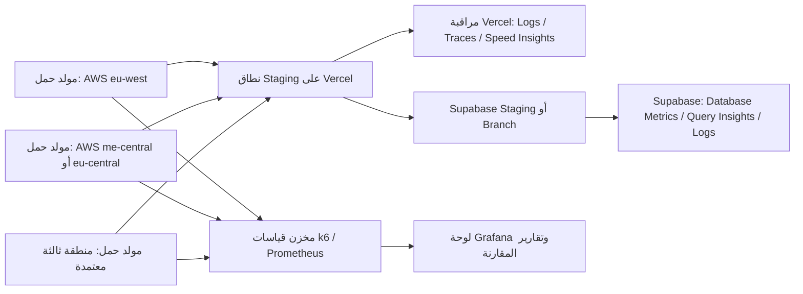

# مخطط اختبار حمل موزع وآمن لـVercel وSupabase

**المؤلف:** Manus AI
**الحالة:** تصميم تشغيلي — لا ينفذ أي حمل كبير تلقائيًا.
**الهدف:** محاكاة آلاف المستخدمين بصورة واقعية وقابلة للقياس، مع حماية الإنتاج والبيانات الطبية والشخصية.

## القرار الأساسي

لا يبدأ اختبار كبير على النطاق الإنتاجي الحالي مباشرة. المسار الصحيح هو إنشاء **بيئة أداء منفصلة** مطابقة للإنتاج من حيث إعدادات Next.js وVercel وSupabase قدر الإمكان، لكن ببيانات اصطناعية ومفاتيح اختبار واسم نطاق معاينة أو staging. بعد نجاح سلسلة تصعيدية في هذه البيئة، يمكن التفكير في اختبار إنتاجي صغير ومراقَب فقط، وبعد تنسيق مسبق مع Vercel وSupabase والجهات المالكة للتكلفة.

توضح سياسة Vercel أن اختبارات الحمل الكبيرة تخضع لتنسيق مسبق، وأن الاختبارات الحجمية مسموحة على خطة Enterprise فقط؛ كما توصي بعدم قياس CDN أو الأصول الثابتة المخزنة مؤقتًا، بل استهداف المسارات الديناميكية والتكاملات التي تمثل التطبيق فعليًا. [1] [2]

## المعمارية المقترحة



| الطبقة | التصميم العملي | الغرض |
|---|---|---|
| التطبيق | نشر Staging مخصص من نفس الالتزام المراد اعتماده، مع متغيرات بيئة staging فقط | فصل الحمل عن المستخدمين الحقيقيين |
| قاعدة البيانات | Supabase Branch أو مشروع staging بنفس المخطط والترحيلات، مع بيانات اصطناعية | اختبار RLS والاستعلامات والتجمعات بلا بيانات إنتاج |
| مولدات الحمل | 2–3 آلات افتراضية موزعة جغرافيًا تشغّل k6 أو Artillery | منع أن يصبح مولد واحد هو عنق الزجاجة، وتقريب مصادر المستخدمين |
| المراقبة | Vercel Observability/Logs/Tracing، مقاييس Supabase، وPrometheus/Grafana لمولدات الحمل | ربط ارتفاع الحمل بزمن المسارات والاستعلامات والموارد |
| التحكم | متغير `LOAD_TEST_RUN_ID` ورأس `x-load-test-run` ونطاق staging محمي | عزل السجلات والطلبات ومنع خلطها بحركة حقيقية |

## ما يلزم قبل البدء

| شرط بوابة | المطلوب | قرار البدء |
|---|---|---|
| موافقة Vercel | تأكيد خطة الحساب وسياسة اختبار الحمل، وإرسال نافذة الاختبار وRPS الأقصى والمضيفات والمناطق وعناوين IP | لا يبدأ حمل حجمي بدونها |
| موافقة Supabase | تأكيد أن حجم compute والاتصالات وحدود API مناسبة لبيئة staging، وتقدير تكلفة الاختبار | لا يبدأ اختبار ديناميكي مكثف بدونها |
| بيئة عزل | نشر Staging وSupabase Branch/Project بالترحيلات نفسها وبيانات اصطناعية | إلزامي |
| مراقبة | لوحات Vercel وSupabase، وسجل k6 ومراقبة CPU/RAM/Network لمولدات الحمل | إلزامي قبل أول ramp |
| أمان | allowlist محددة لعناوين IP مولدات الحمل وقواعد WAF/System Bypass مؤقتة ومقيدة | تفعّل فقط أثناء النافذة ثم تزال |
| خصوصية | حسابات اختبار فقط، لا كلمات مرور حقيقية ولا أسماء أو أرقام هواتف أو حجوزات إنتاج | إلزامي |
| ميزانية | سقف استخدام واضح لـVercel وSupabase والمولدات والمراقبة | موافقة مالك التطبيق |

> لا تُنشأ Supabase Branch أو بيئة مدفوعة هنا تلقائيًا؛ فقد تترتب عليها تكلفة، ويجب تحديد المشروع والمنطقة والتكلفة والموافقة قبل إنشائها.

## ملف العمل الواقعي للتطبيق

لا ينبغي أن يكون الاختبار مجرد `GET /` أو أصل static؛ فهذا يقيس CDN أكثر مما يقيس منطق التطبيق. يوزع ملف العمل وفق الاستخدام المتوقع، وتظل جميع الكتابات في staging وعلى بيانات اختبار معزولة.

| السيناريو | النسبة الابتدائية | المسار أو الفعل | البيانات | ما يقاس |
|---|---:|---|---|---|
| بحث عام ومقارنة | 55% | تحميل `/` ثم `GET /api/search` بمعرّف variant صالح من بيانات staging | علاجات وعروض اصطناعية | زمن SSR وAPI وSupabase وذاكرة الدالة |
| نتائج وفرز | 20% | `/results` مع when/radius/sort واقعية | إحداثيات اختبار لا تمثل أشخاصًا | الاستعلام والفرز وp95/p99 |
| دعم الزائر | 10% | `POST /api/support` برسائل اختبار عامة وفريدة وفق حد المعدل | لا سؤال طبي ولا بيانات شخصية | حدود المعدل، fallback، وتكاليف الطلب |
| دخول/إعادة توجيه | 10% | `/login` ثم المسارات المحمية بدون جلسة أو بجلسات اختبار | حسابات staging فقط | middleware وcookies وredirects |
| حجز أو عميل تشغيلي | 5% | سيناريو staging منفصل بمخزون slots وحسابات اختبار يعاد ضبطها | بيانات اصطناعية فقط | التزامن وRLS وسلامة الحجز |

يجب فصل سيناريو الكتابة عن القراءة، وتشغيله في نافذة قصيرة وبمفاتيح بيانات اختبار قابلة للحذف، ثم التحقق من عدم تراكم السجلات أو تلوث قاعدة staging. لا يختبر تدفق الحجز على الإنتاج.

## تصميم k6 المقترح

يستخدم k6 **معدل وصول متدرج** بدلاً من عدد مستخدمين افتراضيين غير محدد المعنى. يربط كل طلب بوسم run ID، ويتحقق من الرموز والكمونات، ويفصل النتائج حسب السيناريو. المثال التالي هيكل مبدئي لا يشمل أسرارًا أو أسماء نطاقات حقيقية:

```javascript
import http from 'k6/http';
import { check, sleep } from 'k6';

export const options = {
  scenarios: {
    browse: {
      executor: 'ramping-arrival-rate',
      startRate: 10,
      timeUnit: '1s',
      preAllocatedVUs: 100,
      maxVUs: 1500,
      stages: [
        { duration: '10m', target: 50 },
        { duration: '15m', target: 200 },
        { duration: '20m', target: 500 },
        { duration: '10m', target: 0 },
      ],
      tags: { scenario: 'browse' },
    },
  },
  thresholds: {
    http_req_failed: ['rate<0.01'],
    http_req_duration: ['p(95)<4000', 'p(99)<8000'],
    checks: ['rate>0.99'],
  },
};

export default function () {
  const params = { headers: { 'x-load-test-run': __ENV.RUN_ID } };
  const response = http.get(`${__ENV.BASE_URL}/api/search?variant=${__ENV.TEST_VARIANT_ID}&when=earliest&radius=10`, params);
  check(response, { 'response is 200': (r) => r.status === 200 });
  sleep(1 + Math.random() * 3);
}
```

يجب أن تأتي `BASE_URL` و`RUN_ID` ومعرفات بيانات الاختبار من أسرار CI أو مخزن أسرار لا من الشفرة أو Git. وينفذ كل مولد ك6 الشفرة نفسها مع نسبة من معدل الوصول الكلي، ثم تجمع المقاييس مركزيًا.

## مراحل التصعيد

| المرحلة | الشكل | الهدف | شرط الانتقال |
|---|---|---|---|
| 0. Baseline | 5–20 RPS لمدة 10 دقائق | قياس طبيعي والتأكد من صحة المراقبة | لا أخطاء غير متوقعة ومقاييس ظاهرة |
| 1. Ramp | 20 → 100 RPS خلال 15 دقيقة | اكتشاف نقاط التجمع والـcold start | p95 و5xx ضمن العتبات |
| 2. Peak | 100 → 500 RPS خلال 20 دقيقة | تمثيل ذروة قريبة من الهدف | لا تشبع اتصالات أو طوابير |
| 3. Soak | 300–500 RPS لمدة 60–120 دقيقة | كشف التسرب والتدهور البطيء | استقرار الكمون والموارد والتكلفة |
| 4. Burst | قفزة قصيرة مدروسة بعد موافقة | اختبار autoscaling وحدود المعدل | تعافٍ سريع بلا أثر باقٍ |
| 5. Recovery | 0 RPS ثم فحص المراقبة والبيانات | التحقق من الإغلاق والتنظيف | لا أخطاء معلقة أو تلوث بيانات |

القيم ليست وعدًا بسعة نهائية؛ تبدأ منخفضة ثم تعدّل بناءً على معدل الطلب الواقعي المتوقع، ووقت الاستجابة، وحدود Vercel/Supabase المعتمدة. لأي اختبار يصل إلى 50 ألف RPS أو أكثر، تطلب Vercel تذكرة وتنسيقًا هندسيًا مسبقًا. [2]

## مؤشرات المراقبة المطلوبة

| Vercel | Supabase | مولدات الحمل |
|---|---|---|
| RPS حسب route والمنطقة | زمن الاستعلامات البطيئة وخططها | VUs/RPS الفعلية لكل منطقة |
| p50/p95/p99 وزمن الدوال | عدد الاتصالات وSupavisor | CPU/RAM/Network للمولدات |
| 2xx/4xx/5xx وcold starts | API/Auth/Realtime errors | dropped iterations وtimeouts |
| الذاكرة والـGB-hours والتكلفة | CPU/IO/locks والانتظار | زمن DNS/TLS/connect إن لزم |
| traces مرتبطة بـrun ID | Logs مفلترة ببيئة staging | بيانات الخام والملخص الموقّع |

توصي Vercel بمراقبة logs وtraces وSpeed Insights/Web Analytics وربط القفزات في الحمل ببطء الدوال، مع الانتباه إلى تكلفة أدوات المراقبة عند الحمل المرتفع. [2] وتوصي Supabase بتحليل أداء الاستعلامات والاتصالات؛ وتفيد أن الأنماط serverless المتقلبة تستفيد من pooler بدلاً من اتصالات قاعدة مباشرة كثيرة. [4]

## معايير الإيقاف الفوري

يتوقف الاختبار تلقائيًا ويدويًا عند أي من الحالات التالية، ثم تحفظ القياسات وتفحص قبل الاستئناف:

| الإشارة | عتبة بدء مقترحة | الإجراء |
|---|---|---|
| أخطاء 5xx غير متوقعة | أكثر من 1% خلال دقيقتين | إيقاف ramp والعودة إلى آخر مستوى سليم |
| p99 لمسار حرج | أكثر من 8 ثوانٍ خلال دقيقتين | إيقاف المستوى وجمع traces |
| Supabase اتصالات/CPU/IO | أعلى من 80% بصورة مستمرة أو ظهور رفض اتصالات | إيقاف الاختبار وتحليل pooling والاستعلامات |
| إنتاج حقيقي | أي أثر على المستخدمين أو تنبيه تشغيلي | إيقاف فوري وعزل النطاق |
| الميزانية | تجاوز 70% من سقف الاستخدام المعتمد | إيقاف ومراجعة التكلفة |
| WAF أو rate limiting غير المقصود | حجب مصدر مولد مُعتمد | إيقاف؛ لا توسع bypass بلا مراجعة |

## ما يثبت الاختبار وما لا يثبته

يثبت الاختبار أن **ملف العمل المحدد** وبإعداد البيئة المختبرة حافظ على عتبات محددة حتى مستوى RPS وتزامن وزمن محددين. ولا يثبت أن كل ميزة مستقبلية أو كل مزود أو كل جهاز مستخدم سيتصرف بالطريقة نفسها. لذلك تحفظ نسخة الالتزام، متغيرات الاختبار غير الحساسة، أحجام البيانات، مناطق المولدات، ورسوم المراقبة مع كل تشغيل لإتاحة المقارنة بين الإصدارات.

## الخطوة التنفيذية التالية

قبل تنفيذ هذا الاختبار فعليًا نحتاج قرار المالك بشأن: بيئة Supabase staging/branch ومنطقة الاستضافة، حد التكلفة، الهدف الأقصى للـRPS أو المستخدمين المتزامنين، المناطق الجغرافية، ونافذة التنفيذ. عندها يمكن إعداد Terraform للمولدات وملفات k6 وبيانات fixtures وقواعد WAF المؤقتة بصورة معتمدة، ثم البدء من مرحلة baseline فقط.

## المراجع

[1]: https://vercel.com/kb/guide/what-s-vercel-s-policy-regarding-load-testing-deployments "Vercel — Policy regarding load testing deployments"
[2]: https://vercel.com/kb/guide/how-to-effectively-load-test-your-vercel-application "Vercel — How to effectively load test your application"
[3]: https://supabase.com/blog/automating-performance-tests "Supabase — Automating performance tests"
[4]: https://supabase.com/docs/guides/platform/performance "Supabase — Performance tuning"
