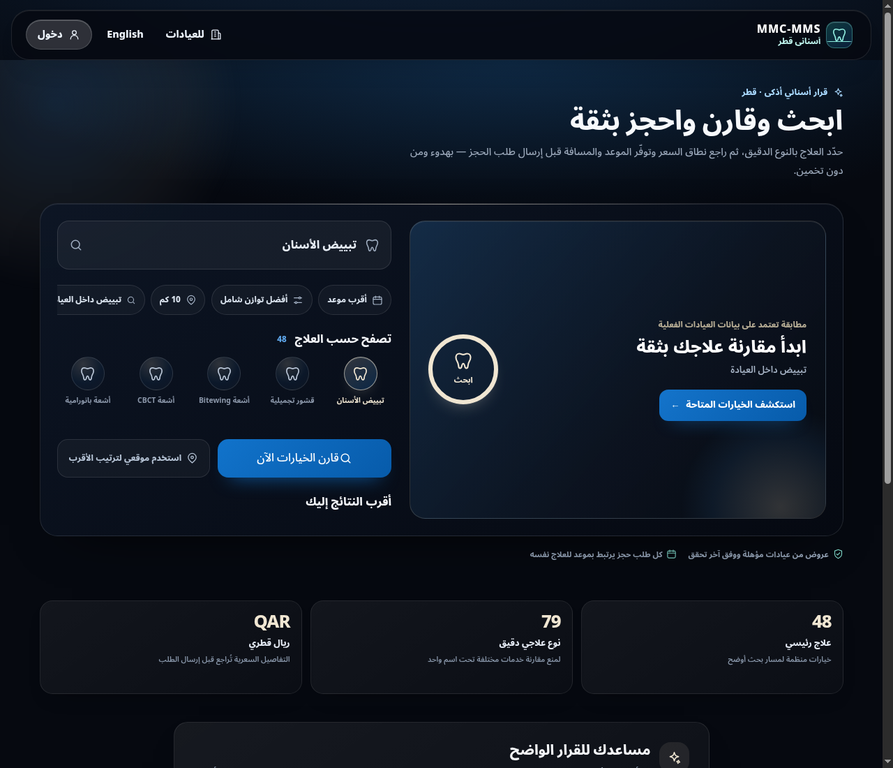

# دورة التقوية والتحقق — 25 أغسطس 2026

**المؤلف:** Manus AI
**النطاق:** تطبيق أسناني قطر، إعدادات الإنتاج، مسارات الكتابة العامة، المصادقة، وقاعدة Supabase المرجعية.

## الملخص التنفيذي

أجريت دورة تقوية إضافية بعد النشر السابق، قائمة على فحوص فعلية للشفرة والإنتاج وقاعدة البيانات، لا على افتراضات أو بيانات مولدة. عالجت الدفعة مشكلتين قابلتين للإصلاح: كانت نقطة الصحة العامة تفصح عن حالة قاعدة البيانات وتهيئة العمليات الخادمية وعدد العلاجات، كما كان تحقق كلمة المرور المحلي أقل صرامة من سياسة موفر الهوية المفعلة فعليًا. لم تعد نقطة الصحة تكشف تلك التفاصيل، وأصبح التحقق المحلي يفرض حرفًا صغيرًا وكبيرًا ورقمًا ورمزًا خاصًا مع حد أدنى 12 حرفًا، بما يطابق سياسة البريد في Supabase.

| المجال | النتيجة المثبتة | حالة الإجراء |
|---|---|---|
| إفصاح نقطة الصحة | أصبحت الاستجابة العامة محصورة في `ok` و`time` فقط، مع `no-store` | عولج في الشفرة واختبر بوحدات مخصصة |
| سياسة كلمة المرور | تحقق محلي موحد: 12+ حرفًا، صغير/كبير/رقم/رمز خاص | عولج واختبر |
| تبعيات الإنتاج | `npm audit --omit=dev`: صفر ثغرات معروفة | ناجح وقت الفحص |
| رؤوس الإنتاج | CSP، منع التأطير، HSTS، منع sniffing، عزل الموارد والسياسات المقيدة ظاهرة فعليًا | ناجح وقت الفحص |
| قاعدة البيانات | جميع جداول نطاق التطبيق تملك RLS، ولا توجد قيود غير متحقق منها أو فهارس غير صالحة في آخر جرد | ناجح في آخر جرد |
| مستشار Supabase | تنبيه واحد: حماية كلمات المرور المسرّبة غير مفعلة ومقيدة بالخطة الحالية | قيد خارجي موثق |

## الإصلاحات المنفذة

### 1. تقليل سطح الإفصاح في الصحة العامة

كانت `GET /api/health` تعيد مؤشرات تفصيلية عن توفر قاعدة البيانات وحالة العمليات الخادمية وعدد عناصر الكتالوج. لا تحتاج مراقبة عامة إلى هذه التفاصيل؛ فأصبحت الاستجابة تؤكد الصحة فقط وتبقي اختبار قاعدة البيانات داخل الخادم. يغلق هذا مسار استطلاع غير ضروري مع المحافظة على دلالة `200` و`503` ومبدأ عدم التخزين المؤقت.

### 2. مواءمة التحقق المحلي مع سياسة الهوية

ضبط Supabase مفعل على حد أدنى 10 أحرف ومتطلبات تشمل أحرفًا صغيرة وكبيرة وأرقامًا ورموزًا، إضافة إلى تغيير بريد وكلمة مرور مؤمنين. كان عقد Zod المحلي يطلب الأحرف الصغيرة والكبيرة والأرقام فقط؛ لذلك كان يمكن لواجهة التسجيل أن تقبل مدخلًا يرفضه موفر الهوية. أصبحت القاعدة المحلية أشد: 12 حرفًا على الأقل ورمز خاص إلزامي، وأضيف اختبار يمنع كلمة مرور تفتقد الرمز.

> هذا يمنع خطأ التوافق بين الواجهة وموفر الهوية، ولا يدّعي فحص قاعدة كلمات مرور مسرّبة محلية أو خارجية.

## أدلة التحقق

| الاختبار | النتيجة |
|---|---|
| اختبار نقطة الصحة الجديد | نجح اختبارا النجاح والفشل، وتحققا من غياب `database` و`server_operations` و`treatments` من الاستجابة العامة |
| اختبارات الوحدة | 21 ملف اختبار و85 اختبارًا ناجحًا |
| TypeScript | `npm run typecheck` ناجح |
| ESLint | `npm run lint` ناجح |
| بناء الإنتاج | `NODE_ENV=production npm run build` ناجح، وظهرت جميع المسارات المتوقعة |
| فحص التبعيات | صفر ثغرات معروفة في تبعيات الإنتاج وقت الفحص |
| اختبار الحمل الآمن | أصل PWA ثابت فقط، عند 5 و25 و50 طلبًا متزامنًا: 100% نجاح؛ لا يمثل هذا اختبارًا لسعة المرضى أو لعمليات الحجز |

## ضوابط الإنتاج المرصودة

تضمنت الرؤوس المرصودة فعليًا `Content-Security-Policy` و`X-Content-Type-Options: nosniff` و`X-Frame-Options: DENY` و`Strict-Transport-Security` و`Referrer-Policy` و`Permissions-Policy`. كما أن سياسة CSP تقصر الاتصالات على المصدر الذاتي وSupabase المرجعي فقط. توضح وثائق Vercel أن رأس `x-forwarded-for` يكتب من المنصة لمنع تزوير عنوان IP في مسارها المباشر، وهو أساس حدود المعدل الحالية، مع ملاحظة أن بناء proxy إضافي فوق Vercel يحتاج مراجعة مستقلة.[1]

## قيود صريحة وخطوات تشغيلية

لا يمكن وعد تطبيق ويب بأنه خالٍ من كل ثغرة حالية أو مستقبلية، ولا يمكن إثبات تحمل 50,000 مستخدم متزامن باختبار ثابت محدود من بيئة واحدة. يلزم اختبار حمل مصرح به على بيئة معزولة يتضمن البحث والحجز وSupabase وقياسات مراقبة قبل أي ادعاء قدرة. كما أن مستشار Supabase ما زال يسجل حماية كلمات المرور المسرّبة كتنبيه خارجي غير مفعّل؛ لم أختلق تفعيلًا لها أو أي نتيجة غير موجودة.

لا تُنشأ بيانات مرضى أو حجوزات اختبارية في الإنتاج من أجل هذا التقرير. تظل اختبارات المريض والعميل والمدير الأعلى ذات البيانات الفعلية مقيدة بهوية مصادق عليها، وتتطلب بيانات تشغيلية مصرحًا بها حتى لا تُخلط مع بيانات الإنتاج أو تُعرض معلومات شخصية في اللقطات.

## المراجع

[1]: https://vercel.com/docs/headers/request-headers "Vercel — Request headers"

## تحقق المعاينة

أصبحت معاينة الالتزام `b10235c` جاهزة في Vercel. حجب طلب HTTP غير مصادق عليه بمعيار حماية معاينات Vercel، وهو سلوك طبقة الاستضافة. عند فتح المعاينة عبر جلسة المتصفح المصرح بها، أعادت `/api/health` الاستجابة `{"ok":true,"time":"…"}` فقط؛ وبذلك تحقق عمليًا غياب تفاصيل قاعدة البيانات والعمليات الخادمية وعدد العلاجات.

### تحقق مرئي للتسجيل

أظهرت معاينة التقوية صفحة دخول عربية RTL، مع نموذج تسجيل مريض ذاتي مستقل يوضح أن إنشاء الحساب لا ينشئ حجزًا، وأن الحجز لاحقًا يستلزم تحقق الهاتف. كما تعرض الواجهة تحذيرًا بعدم مشاركة كلمة المرور أو رمز التحقق، وتوضح أن كلمة المرور لا تحفظ ضمن بيانات العميل أو العيادة.
تم التحقق مرئيًا من ظهور واجهة الدعم العام في الصفحة الرئيسية للمعاينة، مع النص الصريح بأن السؤال متاح من دون تسجيل، وأن الدخول يطلب فقط للحساب أو الملف أو الحجز المحدد. أُدخل سؤال عام غير طبي لإكمال تحقق الإرسال.
لم يثبت إرسال سؤال الدعم المرئي في هذه المحاولة لأن المتصفح أظهر تحقق الحقل الإلزامي بعد التفاعل، لذلك لا يسجل التقرير ذلك نجاحًا. يظل اختبار HTTP السابق لنقطة الدعم في الإنتاج هو الدليل الوظيفي المسجل لاستجابة الزائر دون جلسة.

## تحقق الإنتاج بعد النشر

نُشرت الدفعة إلى `main` عبر الالتزامين `b10235c` و`679bfcc`، وأصبح نشر Vercel الإنتاجي `dpl_7ymzQUBpisZCc2c2EWxYwUU4C7Yt` بحالة `READY`. أُنشئ فرع الرجوع `rollback/production-before-hardening-20260825` عند الالتزام السابق `fdb8454` قبل الدفع، لذلك يمكن الرجوع إلى النسخة السابقة المحددة إن ظهرت ملاحظة تشغيلية.

نفذ الفحص غير المُغيِّر للبيانات على `https://www.mmc-mms.com` بعد جاهزية النشر. أعادت `GET /api/health` الاستجابة المطابقة للعقد المخفف، أي حقلي `ok` و`time` فقط. وأعاد طلب دعم زائر عام بسؤال غير طبي إجابة عربية غير فارغة مع `access: public`، من دون جلسة أو إنشاء حجز. أعادت المسارات `/account` و`/clinic` و`/clinic/bookings` توجيه 307 إلى تسجيل الدخول مع معامل `next`، بينما أعاد `/admin` توجيه 307 إلى `/`. ولم يسجل فحص أخطاء وقت التشغيل في Vercel للمسارات المختبرة خلال نافذة الساعة التالية للنشر أي مجموعة أخطاء.

> حدود الإثبات: اللقطة عامة وخالية من بيانات شخصية. لم تُنشأ بيانات مرضى أو حجوزات أو عميل تشغيلي تجريبي في الإنتاج. لذلك لا تدّعي هذه الدورة تحققًا مصوّرًا من واجهة مدير أعلى أو عميل مصادق؛ يتطلب ذلك جلسة مالك آمنة أو بيئة staging مع بيانات اختبار معتمدة.
