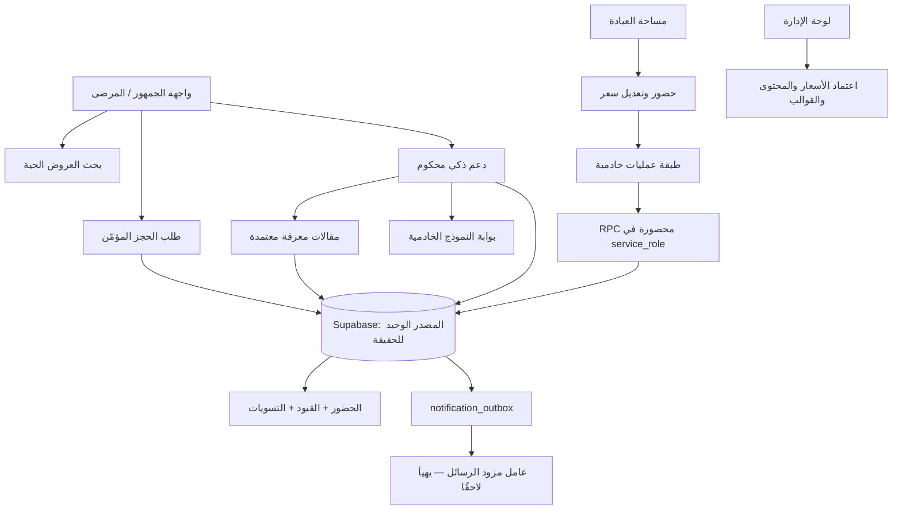

# تقرير الجاهزية والتنفيذ — منصة «أسناني قطر»

**التاريخ:** 15 أغسطس 2026  
**بيئة قاعدة البيانات التي تم التحقق منها:** Supabase DEV `bqvcukxfsnchvkgejolz`  
**فرع العمل:** `audit/production-readiness-20260815`  
**الحالة:** تم تنفيذ طبقة التشغيل الأساسية، وطبقة الترجمة، وواجهة العيادة، ولوحة إدارة المحاسبة، وصندوق الإشعارات، ودعم ذكي محكوم. لا يزال **تسليم الرسائل إلى SMS/البريد/Push الخارجي** معلقًا على تهيئة مزود معتمد وأسراره في بيئة النشر؛ لا تدّعي المنصة الإرسال قبل ذلك.

> لا تستعمل الواجهة العامة بيانات اختبار. تبقى أي بيانات محاكاة محصورة في بيئة منفصلة ولا تُعرض بوصفها عروضًا أو حجوزات حقيقية للعملاء.

## 1. الرسم المعماري ومصدر الحقيقة

| المجال | مصدر الحقيقة | ضابط منع التكرار أو التعارض |
|---|---|---|
| العروض والأسعار | العرض المعتمد وسجل `offer_revisions` | مراجعة إدارية موثقة؛ لا يعدل العميل سعر عيادة أخرى. |
| الحضور والمحاسبة | `booking_attendance_events` ودفتر القيود | عمليات RPC خادمية؛ القيود المنشورة محمية من التعديل. |
| التقارير | `financial_report_summary_server` | تقرير محسوب من قاعدة البيانات، لا من عدّ عناصر الواجهة. |
| إشعارات المعاملات | `notification_outbox` | مفتاح `dedupe_key` فريد؛ مشغلات ذرية للحجز والحضور. |
| محتوى المساعد | `support_knowledge_articles` المعتمدة | لغة وجمهور وحالة اعتماد؛ لا يستخدم المساعد مسودة. |
| محادثات الدعم | `support_conversations` و`support_messages` | محادثة مرتبطة بالمستخدم المصادق فقط وسياسة سلامة مسجلة. |

## 2. الواجهات والمسارات المنفذة

| الواجهة أو المسار | الوظيفة | الحماية والتحقق |
|---|---|---|
| `/` | مقارنة العروض، البحث، اختيار اللغة، ودردشة دعم. | البحث لا يعرض بيانات اختبار؛ الدردشة تتطلب جلسة مصادقة قبل حفظ المحادثة. |
| `/clinic` | إدارة نطاق العيادة المختارة، طلب تعديل سعر، وإثبات حضور. | عضوية العيادة، مخططات Zod، وعمليات خادمية محصورة. |
| `/admin` | التحقق، مراجعة السعر، التسويات، التقرير والطباعة/CSV، المقالات، القوالب، ومراقبة الصندوق. | مطالبة `platform_admin` على مستوى الخادم. |
| `/api/book` | إنشاء الحجز المعتمد على idempotency. | مصادقة ومخطط حجز وRPC للحجز. |
| `/api/choices` | أحداث قرار مجهولة الهوية ومحدودة المعدل. | منشأ مسموح، حد حجم، حد معدل، وidempotency. |
| `/api/admin/reports/csv` | تصدير التقرير المالي الحالي كـ CSV. | إدارة فقط، نطاق تاريخ وعيادة متحقق منهما، و`no-store`. |
| `/api/support` | دعم ذكي من قاعدة معرفة معتمدة. | مصادقة، حد 2,000 حرف، إيقاف الاستشارات الطبية، وحفظ الرسائل والسياسة والمصادر. |

## 3. الملفات المهمة التي أضيفت أو توسعت

| الملف | التغيير أو المسؤولية |
|---|---|
| `lib/operations.server.ts` | غلاف خادمي موحد يتحقق من الهوية ثم يستدعي RPC المحصورة لتعديل السعر والحضور وعكسه والتسوية والتقرير. |
| `lib/notifications.server.ts` | كتابة عناصر صندوق الإرسال بخاصية منع التكرار واختيار القالب الفعال عند وجوده. |
| `lib/validation.ts` | عقود مركزية للحجز، الأسعار، الحضور، التسوية، التقارير، الدعم، المقالات، والقوالب. |
| `lib/i18n/ar.ts` و`lib/i18n/en.ts` | قواميس عربية وإنجليزية موحدة المفاتيح. |
| `lib/i18n/index.ts` و`components/locale-provider.tsx` | تحديد اللغة والاتجاه وقاموس الواجهة لمكونات الخادم والعميل. |
| `components/locale-toggle.tsx` | تغيير لغة محفوظ في Cookie خادمي. |
| `components/support-chat.tsx` | واجهة العميل لدردشة الدعم، مع رسائل مصادقة وتعذر صريحة. |
| `app/actions/locale.ts` | حفظ اختيار اللغة وإعادة التحميل. |
| `app/clinic/actions.ts` و`app/clinic/page.tsx` | إجراءات حضور وطلب تعديل سعر وتحميل يعتمد على العيادة المختارة، لا `clinics[0]`. |
| `app/admin/actions.ts` و`app/admin/page.tsx` | اعتماد تعديلات السعر، التسويات والتقارير، إنشاء/اعتماد المعرفة، وإدارة القوالب. |
| `app/api/admin/reports/csv/route.ts` | تصدير CSV محسوب من تقرير RPC نفسه. |
| `app/api/support/route.ts` | سياسة دعم محكومة، سجل محادثة، استرجاع المقالات المعتمدة، واتصال النموذج الخادمي. |
| `app/api/choices/route.ts` | تأجيل تهيئة عميل Supabase إلى وقت الطلب حتى لا يفشل البناء عند غياب بيئة محلية. |
| `supabase/migrations/20260815070000_operational_finance_core_v1.sql` | أسعار وحضور وتسويات ودفتر أستاذ وتصديرات. |
| `supabase/migrations/20260815071000_notification_support_core_v1.sql` | تفضيلات وقوالب وصندوق إشعارات ومحاولات تسليم ودعم ومعرفة. |
| `supabase/migrations/20260815073000_operational_rpcs_server_only_v1.sql` | عمليات حساسة محصورة بمفتاح الخدمة. |
| `supabase/migrations/20260815074000_transactional_notification_outbox_triggers_v1.sql` | مشغلات ذرية لتسجيل حجز مؤكد وحضور داخل الصندوق مع مفاتيح منع التكرار. |
| `tests/i18n.test.ts` | يمنع اختلاف مفاتيح القواميس العربية والإنجليزية. |
| `tests/validation.test.ts` | يغطي عقود الدعم والمحتوى والقوالب، إضافة إلى عقود البحث والحجز. |

## 4. إثباتات التحقق المنفذة

| الفحص | النتيجة |
|---|---|
| `npm run typecheck` | ناجح. |
| `npm run lint` | ناجح. |
| `npm run test` | **27 اختبارًا ناجحًا** في 6 ملفات. |
| `npm run build` | ناجح؛ شمل المسارات الجديدة `/api/support` و`/api/admin/reports/csv`. |
| `npm run test:e2e` | **4 اختبارات ناجحة** على Chromium النظامي وإعدادات DEV العامة المؤقتة. |
| مستشار أمان Supabase بعد هجرة الإشعارات | `lints: []`. |
| فحص مشغلات قاعدة البيانات | مشغل الحجز على `bookings` ومشغل الحضور على `booking_attendance_events` موجودان. |

## 5. متطلبات النشر التي لا يجوز تجاوزها

| المتطلب | السبب | الإجراء المطلوب قبل التفعيل العام |
|---|---|---|
| `SUPABASE_SERVICE_ROLE_KEY` في Vercel | طبقة العمليات والتقارير الخادمية تستخدمه فقط على الخادم. | إضافته إلى أسرار Production وPreview، وعدم إضافة بادئة `NEXT_PUBLIC_`. |
| `OPENAI_API_BASE` و`OPENAI_API_KEY` في Vercel | مسار الدعم الذكي لا يعمل من دون بوابة النموذج. | إضافتهما كأسرار خادمية واختبار إجابة من مقالة معتمدة. |
| مزود Email/SMS/Push معتمد | الصندوق يسجل الأحداث موثوقًا، لكنه لا يرسل خارجيًا بلا حساب مزود ووجهة موافقة. | اختيار مزود، توفير الأسرار من المالك، وتنفيذ/تشغيل عامل الإرسال مع محاولات `notification_delivery_attempts`. |
| مقالات معرفة وقوالب فعالة | المساعد لا ينبغي أن يخترع سياسات أو معلومات. | ينشئ المسؤول مقالات عربية وإنجليزية ويعتمدها، ثم يفعّل قوالب المعاملات. |
| صلاحية GitHub `workflow` | ملف CI المحلي لا يمكن رفعه بالاعتماد الحالي. | منح الاعتماد صلاحية `workflow` أو تزويد Personal Access Token صالح. |

## 6. الحدود والقرارات الصريحة

لا توجد في هذه الدفعة محاكاة مدفوعة أو إرسال زائف للمستخدمين. صندوق الإشعارات هو **سجل معاملات جاهز ومربوط بالحجز والحضور**، لكن لا يجوز وضعه في حالة `sent` أو الادعاء بوصول رسالة قبل تهيئة مزود خارجي وموافقات الوجهات. كذلك، الدعم الذكي يرفض التشخيص أو العلاج الطبي ويرشد الحالات الطارئة إلى الرعاية العاجلة؛ إنه خدمة للمنصة وليس بديلًا عن طبيب الأسنان.

## 7. قائمة قبول النشر

قبل نشر هذه الدفعة إلى الإنتاج، يجب تنفيذ البنود التالية بالترتيب: إضافة أسرار الخادم إلى Vercel، إنشاء مقالة معرفة معتمدة واحدة على الأقل لكل لغة، إنشاء قالب `booking_confirmed` فعال لكل قناة مختارة، إعداد عامل مزود الرسائل واختبار تسليم فعلي إلى عناوين مملوكة للفريق، ثم تشغيل البناء والاختبارات وفحص تسجيلات الإنتاج. بعد منح صلاحية GitHub اللازمة، يُرفع الفرع، ويُفتح طلب دمج، ويُشغّل CI قبل الدمج.

> النتيجة التقنية الحالية قوية وقابلة للمراجعة محليًا وضمن بيئة DEV. «الجاهزية الفعلية لرسائل SMS/البريد/Push» لا تكتمل من دون أسرار وعقود مزود خارجي؛ إخفاء هذه الحقيقة سيكون تضليلًا تشغيليًا.
