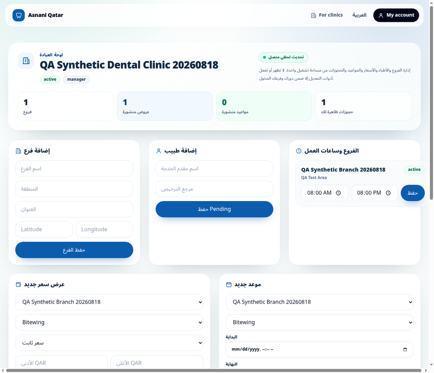
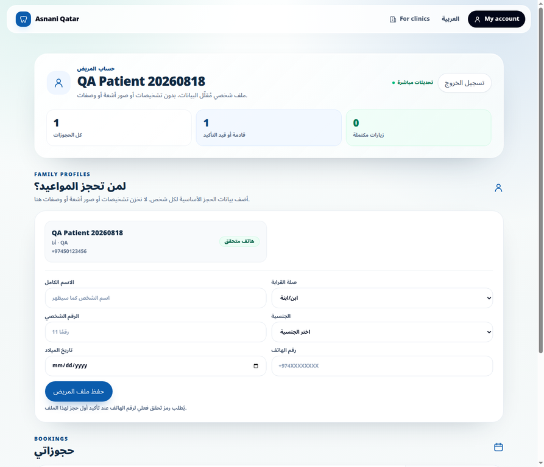
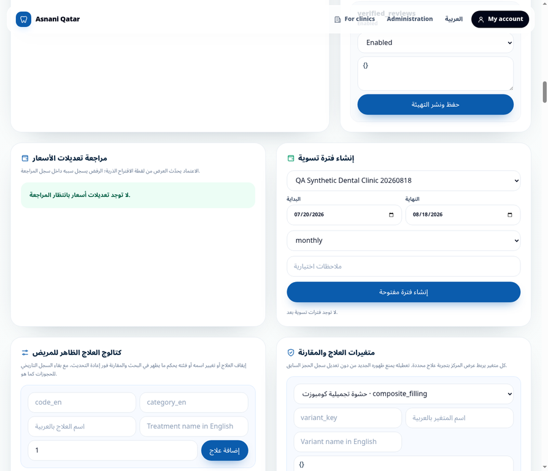

# تقرير الاختبار الحي المحكوم للأدوار والرحلات

**التاريخ:** 18 أغسطس 2026  
**البيئة:** الإنتاج — [www.mmc-mms.com][1]  
**الإصدار الذي تحققنا منه بعد الإصلاح:** `8cc0217` — `fix: display highest effective clinic role` [2]  
**منهج الاختبار:** حسابات وبيانات اصطناعية مؤقتة فقط، ومركز مستبعد من البحث العام، ثم حذف ذري متحقق منه.

> **حدود التقرير:** يسجل هذا المستند ما تم إثباته مباشرة في الإنتاج أو عبر بوابات الجودة. لا يساوي بين ظهور واجهة وبين اختبار كل احتمال وظيفي، ولا يدعي إرسال SMS حقيقي أو اختبار أي بيانات مرضى حقيقية.

## النتيجة التنفيذية

نجح الاختبار الحي المحكوم لرحلة حجز اصطناعية واحدة وتسلسل الأدوار المريض والمشاهد وموظف الاستقبال ومدير الأسعار ومدير المركز ومدير المنصة. تم اكتشاف عيب حقيقي أثناء الفحص: كانت شارة مدير المركز تعتمد أول صف عضوية عائد من قاعدة البيانات، ولذلك ظهرت `viewer` رغم امتلاك المستخدم صلاحية `manager`. عولج العيب بدالة ذات أولوية صريحة للأدوار، وأضيفت ثلاثة اختبارات وحدات، ثم نُشر الإصلاح وأعيد التحقق منه على الموقع الرسمي.

| المجال | النتيجة المثبتة | الدليل |
|---|---|---|
| دخول المريض الاصطناعي | فُتح الحساب المحمي بنجاح، وظهر الملف المختصر وحالة الهاتف المتحقق | `patient-account-confirmed.webp` |
| إنشاء الحجز | أنشئ حجز اصطناعي واحد فقط، بلا SMS أو بيانات حقيقية | سجل الحجز وإشعار المركز المقيدان بالاختبار |
| إشعار المركز | ظهر إشعار الحجز ونوع العلاج في لوحة المركز | `clinic-receptionist-before-confirmation.webp` |
| صلاحية المشاهد | أُخفيت بيانات المريض، وكل أزرار الحفظ التشغيلية كانت معطلة في DOM | `clinic-viewer.webp` |
| صلاحية الاستقبال | أمكن تأكيد الحجز الاصطناعي؛ انتقلت الحالة إلى `confirmed` وظهر زر تسجيل الحضور | `clinic-receptionist-confirmed.webp` |
| صلاحية مدير الأسعار | أُنشئ طلب تعديل سعر اصطناعي من 275.00 إلى 280.00 ر.ق، وبقي `submitted` حتى مراجعة الإدارة | القراءة الخادمية لطلب المراجعة |
| صلاحية مدير المنصة | ظهر الطلب في لوحة الإدارة ثم اختفى من قائمة المعلّق بعد الاعتماد | `platform-admin-price-approved.webp` |
| انعكاس الحالة للمريض | ظهر الحجز ذاته في حساب المريض بحالة **مؤكد** | `patient-account-confirmed.webp` |
| مدير المركز بعد الإصلاح | ظهرت شارة `manager` الفعلية في الإنتاج مع أدوات الدور المتوقعة | `clinic-manager-role-fixed.webp` |
| تنظيف ما بعد الاختبار | أصبح عدد كل عناصر الاختبار المقاسة صفرًا، ثم أُبطلت الجلسة وأعاد `/account` التوجيه للدخول | جرد SQL قبل/بعد التنظيف وسلوك إعادة التوجيه |

## العيب المثبت والإصلاح

كان العرض السابق للدور يختار أول عضوية من قاعدة البيانات للعيادة المختارة. هذا سلوك غير حتمي لأن ترتيب الصفوف غير مضمون؛ وعند وجود عضوية `viewer` وعضوية `manager` لنفس الحساب في بيانات الاختبار، ظهرت الشارة `viewer` على الرغم من أن أدوات المدير كانت مفعّلة. لم يكن هذا مجرد اختلاف بصري مقبول، بل تناقضًا في فهم الصلاحية يجب إصلاحه.

تمت إضافة `effectiveClinicRole` في `lib/clinic-role-display.ts`. تحدد هذه الدالة الدور الأعلى وفق ترتيب صريح: `owner` ثم `manager` ثم `pricing_manager` ثم `receptionist` ثم `viewer`، وتُقيّد الاختيار بالعيادة المعروضة. غُيرت شارة لوحة المركز لاستخدام هذه الدالة، وأضيفت اختبارات تغطي استقلال النتيجة عن ترتيب صفوف قاعدة البيانات، وعزل العيادات، وحالة غياب عضوية معترف بها.

| بند التحقق بعد الإصلاح | النتيجة |
|---|---|
| اختبار الدالة المركّز | 3 من 3 ناجحة |
| بوابة الجودة الشاملة | ناجحة: فحص مسبق، TypeScript، ESLint، 50 اختبار وحدة، وبناء إنتاج |
| الإيداع | `8cc0217` على `main` |
| إصدار الإنتاج | `dpl_3M8AY8K28aRwPbbnGXvwzSDL84iX` بحالة `READY` |
| قبول حي بعد النشر | ظهر `manager` في `https://www.mmc-mms.com/clinic?audit=role-display-8cc0217` |

## الأدلة البصرية

### مدير المركز بعد إصلاح الشارة

### الحجز المؤكد في حساب المريض الاصطناعي

### إدارة الاعتماد في لوحة مدير المنصة

## التنظيف الموثق

لم يبق أي حساب أو سجل تشغيل اصطناعي بعد الاختبار. كان جرد ما قبل الحذف يتضمن ستة مستخدمين وست هويات وستة ملفات مرضى، ومركزًا وفرعًا وعرضًا وموعدًا وحجزًا واحدًا، ومراجعة سعر واحدة، وثلاثة إشعارات، وسجلين لحالة الحجز. نُفذت معاملة واحدة مقيدة بالمعرّفات الاصطناعية فقط، مع إزالة السجلات التابعة قبل الكيانات المرجعية. أثبت جرد ما بعد الحذف أن العدادات التالية كلها **صفر**: المستخدمون، الهويات، ملفات المرضى، العضويات، الحجوزات، سجلات الحضور وحالة الحجز، الإشعارات، مراجعات السعر، العروض، المواعيد، الفروع، والمركز.

بعد الحذف، مُسحت جلسة الاختبار من المتصفح. فتح `/account` أعاد التوجيه إلى `/login?next=/account`، ولذلك لا يوجد وصول متبقٍ عبر رمز الاختبار المحلي.

## عناصر لا يدعي هذا الاختبار إكمالها

| العنصر | الحالة الدقيقة |
|---|---|
| تحقق SMS عبر Twilio | الطبقة البرمجية واختبارات الفشل الآمن موجودة، لكن لا يمكن إثبات إرسال رمز حقيقي قبل إعداد أسرار Twilio في الإنتاج. لم تُرسل رسالة اختبار في هذه المهمة. |
| كل مسار إداري أو كل زر على حدة | تم فحص مسارات التحكم ذات الصلة بالحجز والتسعير والكتالوج بصريًا، واختبار تسلسل تسعير/اعتماد حقيقي على بيانات اصطناعية. لا يدعي التقرير اختبار كل حقل أو إجراء إداري ممكن. |
| انقطاع الشبكة أو التوفر الدائم | لا يمكن إثبات عدم الانقطاع مطلقًا باختبار محدود زمنيًا. تم التحقق من نقاط الصحة والنشر وبوابات الجودة ضمن نوافذ القياس المسجلة. |

## المراجع

[1]: https://www.mmc-mms.com/ "الموقع الرسمي لأسناني قطر"
[2]: https://github.com/Bomussa/dental-marketplace-pwa/commit/8cc02176c5c98ff681db3f0f991b7b8134ed82a2 "إيداع إصلاح الدور الفعلي الأعلى"

## إعادة تحقق حي لاحقة — جلسة مريض اصطناعية

بدأت إعادة تحقق حية على الإنتاج بصندوق بريد مؤقت مخصص للاختبار فقط. أُدخل العنوان الاصطناعي في نموذج الدخول لمسار `/account` ولم تُنشأ أي حجوزات أو بيانات طبية أو رسائل SMS في هذه الخطوة. ستسجل نتيجة الإرسال ووصول الرابط وفتح الجلسة أو أي فشل صريح قبل استنتاج النتيجة.
أثبت الموقع الرسمي قبول إرسال رابط الدخول (`sent=1`) إلى صندوق البريد الاصطناعي، ثم فُتح رابط التحقق وعاد مزود المصادقة إلى النطاق الرسمي مع رمز مصادقة. لا يُستنتج نجاح الجلسة من هذه العودة وحدها؛ الخطوة التالية هي فتح `/account` والتحقق من الوصول المحمي مباشرة.
عاد رابط التحقق أولًا إلى الجذر برمز مصادقة بدل صفحة التأكيد المتوقعة. عند تمرير الرمز إلى `/auth/confirm?next=/account` ظهرت شارة الحساب في رأس الموقع، ما يثبت أن جلسة متصفح قد ثُبتت، لكن ظهرت أيضًا رسالة فشل لإرسال الرابط بعد محاولة تبادل الرمز مرة ثانية. لا يُصنف هذا نجاحًا لمسار العودة بعد؛ ستتحقق الخطوة التالية مباشرة من `/account` وتفصل بين نجاح الجلسة وعيب إعادة التوجيه أو تبادل الرمز المكرر.
فُتح `/account` بعد ذلك بنجاح داخل الجلسة الاصطناعية، وظهرت واجهة حساب المريض الكاملة مع ملف «أنا» وحالة عدم وجود حجوزات. يثبت ذلك نجاح الدخول الفعلي والوصول المحمي. بدأ تبديل اللغة من العربية إلى الإنجليزية داخل الحساب؛ ستسجل النتيجة بعد استقرار إعادة التحميل.
فُتحت لوحة `/clinic` حيًا ضمن جلسة الحساب الاصطناعي بعد إسناد عضوية `manager` لمركز وفرع اصطناعيين بحالة معلقة لا تظهر في البحث العام. ظهرت شارة **Manager** وحالة التحديث الحي المتصل وواجهة إدارة المركز، مع عدادات صفرية وعدم وجود حجوزات أو عروض أو مواعيد. كانت الشاشة إنجليزية بالكامل، وتؤكد أن صلاحية المدير ونسخة اللغة الإنجليزية تعملان على مركز اختبار معزول دون لمس بيانات تشغيلية حقيقية.
أُسنِدت مطالبة `platform_admin=true` إلى حساب الاختبار فقط للتحقق من لوحة الإدارة. لأن مطالبة الصلاحية تُضمَّن في رمز الجلسة، سيجري تجديد جلسة الحساب قبل فتح `/admin`؛ لن تُنفذ أي عملية إدارية تغير بيانات التشغيل أثناء هذا الاختبار.
بعد إسناد مطالبة مدير المنصة، أُنهيت جلسة الاختبار السابقة وبدأ إرسال رابط دخول جديد لمسار `/admin` إلى صندوق البريد الاصطناعي نفسه لتضمين المطالبة المحدثة في رمز الجلسة. لم يجرِ فتح لوحة الإدارة أو تنفيذ أي إجراء إداري بعد في هذه الخطوة.
بعد فتح رابط الدخول الإداري، ظهرت في رأس الموقع روابط **Administration** و**My account**، ما يثبت أن رمز الجلسة الجديد يحمل مطالبة مدير المنصة. ومع ذلك أعادت صفحة التأكيد إلى رسالة `confirm_failed`، وهو سلوك غير متسق بين تثبيت الجلسة ورسالة واجهة التأكيد وسيُسجل كعيب مصادقة مثبت إذا تأكدت لوحة `/admin` مستقلةً عن الرسالة.
### فجوات مثبتة أثناء التحقق الأخير وإصلاحها

كشف العرض الإنجليزي المصادق عليه عن نص **«تحديثات مباشرة»** ثابت داخل مكوّن تحديث حساب المريض، وعن ظهور قيمة الاسم الافتراضي «أنا» في بطاقة الملف الأساسي. رُبط مكوّن التحديث بقاموس الحساب، وصارت قيمة الاسم الافتراضية تتبع اللغة المختارة مع بقاء الاسم الحقيقي الذي يدخله المريض كما هو.

وكشف العرض الإنجليزي للوحة الإدارة أن قائمة الأحداث الحديثة تستقبل وتعرض حقول الاسم العربي فقط. أضيفت حقول `treatment_name_en` و`variant_name_en` إلى ناتج دالة التحليلات عبر مهاجرة إنتاجية مطبقة بنجاح، ثم اختير الاسم المطابق للغة الواجهة مع رجوع آمن إلى الاسم المتاح. اجتازت بوابات الجودة الكاملة بعد هذه الإصلاحات.
أثبت فتح `/admin` بجلسة مدير المنصة الحية الوصول إلى لوحة الإدارة الكاملة والإنجليزية، كما كشف عرض قوائم متغيرات العلاج عن أسماء عربية ثابتة وبعض حالات الإدارة وفئات المعرفة وقنوات الإشعار على هيئة قيم تقنية. رُبطت أسماء العلاج في القوائم باللغة المختارة، واستبدلت الحالات والفئات والقنوات بتسميات القاموس، مع إبقاء قيم النماذج الداخلية نفسها. اجتازت بوابات الجودة الكاملة مرة أخرى بعد هذا التصحيح الإضافي.
أُعيد فتح لوحة الإدارة الإنجليزية على الإصدار `9513869` بنجاح. ثبتت قائمة الأحداث الأخيرة بالأسماء الإنجليزية الصحيحة، كما ظهرت قوائم متغيرات العلاج بأسماء إنجليزية بدل العربية. لا تُنشئ هذه المراجعة أو تعدل سجلات الإدارة؛ وهي تحقق قراءة وعرض فقط ضمن جلسة مدير المنصة الاصطناعية.
أُعيد فتح حساب المريض الإنجليزي على الإصدار `9513869` بعد استقرار الاشتراك. ظهرت شارة **Live updates** المتصلة واسم الملف الافتراضي **Me**، بدل النصين العربيين اللذين كشفهما الاختبار السابق. بقيت الحسابات صفرية ولم يُنشأ أي حجز أو ملف مريض إضافي.
### تنظيف إعادة التحقق الحية

كان الجرد قبل الحذف يتضمن حساب اختبار واحدًا، وملفًا شخصيًا واحدًا، وملف مريض واحدًا، وجهازًا واحدًا، وعضوية مدير واحدة، ومركزًا وفرعًا اصطناعيين، مع **صفر** حجوزات وسجلات تحقق هاتف وإشعارات ومحادثات دعم. بعد تسجيل الخروج، حُذفت هذه العناصر ضمن عملية ذرية مقيدة بمعرفات الاختبار فقط. أكد جرد ما بعد الحذف أن جميع العدادات السابقة أصبحت **صفرًا**، بما فيها الحساب/الملفات/الجهاز/العضوية/المركز/الفرع، ولم تنشأ أي حجوزات أو رسائل SMS أو بيانات تشغيلية حقيقية.
بعد تسجيل الخروج والتنظيف، أعاد فتح `/account` حيًا إلى `/login?next=/account` ولم يعرض أي بيانات حساب أو صلاحيات. يثبت ذلك إبطال الجلسة وحماية المسار بعد حذف حساب الاختبار.
### إصلاح مسار تأكيد الدخول

كشف الاختبار الحي أن رابط التحقق قد يعود أحيانًا إلى الجذر مع معامل `code` بدل صفحة `/auth/confirm`، رغم طلب التطبيق لمسار التأكيد؛ كان ذلك يثبت الجلسة بعد تدخل يدوي لكنه يعرض حالة تأكيد غير متسقة. أضيف تحويل حاجز آمن ومقيد: لا يعمل إلا عند وجود `code` على الجذر، وينقله إلى `/auth/confirm` مع الرمز وحده. اجتازت بوابات الجودة الكاملة قبل النشر؛ وسيعاد تنفيذ الدخول المؤقت مرة واحدة بعد النشر للتحقق من الإنهاء التلقائي ثم تنظيفه.
