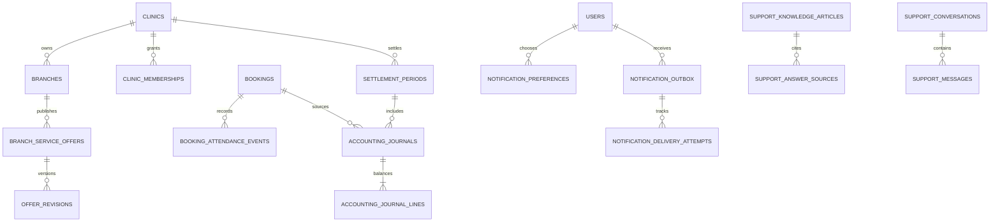

# عقد مصدر الحقيقة الواحد للتشغيل والمحاسبة والإشعارات والدعم

## مبادئ لا تقبل الاستثناء

> **الحالة التشغيلية، وحضور المريض، وسعر العرض، والقيد المالي، وتسليم الرسالة ليست أرقامًا تعرضها الواجهة؛ بل أحداث وقيود مستقلة قابلة للتدقيق داخل قاعدة البيانات.**

1. لا يُستخدم طول قائمة أو عداد محلي لحساب زيارة أو رصيد أو تقرير.
2. لا يكتب العميل أي قيد مالي أو حالة تسوية أو محاولة رسالة مباشرة.
3. لا يعدّل السعر المنشور في مكانه؛ ينشأ إصدار جديد مرتبط بالعرض، وتبقى لقطة الحجز كما هي.
4. كل مصدر خارجي أو عملية قابلة لإعادة الإرسال تستخدم `dedupe_key` أو `source_type/source_id` فريدًا.
5. لا يوجد حذف فعلي للقيود التشغيلية أو المالية؛ التصحيح قيد معاكس أو event ذي سبب.
6. لا يستنتج النص العربي والإنجليزي من بعضهما وقت التشغيل؛ كلاهما مفتاحان من قاموس versioned واحد.
7. لا يتصل مساعد AI مباشرة بجداول الحجوزات أو المرضى أو المراكز؛ يمر عبر أدوات خادم صغيرة محددة العقد.

## مخطط العلاقات المستهدف

## العقد 1: الأسعار وإصدارات العرض

| الكيان | مصدر الحقيقة | القواعد |
| --- | --- | --- |
| `branch_service_offers` | العرض الحالي فقط | يملك الفرع، ويخضع لحالة تحقق وتاريخ فعالية. |
| `offer_revisions` | تاريخ immutable للتعديل | مفتاح فريد `(offer_id, revision_no)`؛ snapshot قبل/بعد؛ actor، سبب، وقت، وحالة مراجعة. |
| حجز الموعد | `bookings.offer_snapshot` | لا يقرأ السعر الجاري بعد التأكيد، ولا تتغير اللقطة بعد الحجز. |

تُنفذ عملية تغيير السعر عبر RPC خادم واحد: يقفل العرض، يتحقق من عضوية العيادة ودور `owner|manager|pricing_manager` والفرع، يتحقق من البيانات بالـminor units، ينشئ revision، وينقل العرض إلى `needs_review` أو ينشر الإصدار وفق سياسة المنصة. لا يسمح بتعديل عرض active بتحديث جدول مباشر من الواجهة.

## العقد 2: حضور المريض ومقياس العيادة

`booking_attendance_events` هو مصدر الحقيقة للحضور، وليس `bookings.status` وحده. يحتوي على `booking_id` و`event_type` (`checked_in`, `attendance_reversed`) وسبب وقائم بالإجراء ووقت. يوجد قيد جزئي يمنع أكثر من حدث check-in فعال للحجز، وRPC واحد يسجل الحدث بعد قفل الحجز والتحقق من ملكية الفرع والانتقال المسموح للحالة.

يعرف «المريض المستقبَل» في التقرير بأنه حجز له `checked_in` وغير متبوع بـ`attendance_reversed` ضمن الفترة. لا يحتسب الحجز المؤكد أو الملغي أو `no_show`. يمكن عرض KPI كاستعلام/RPC محدد بالفترة والفرع، لا كعمود قابل للكتابة.

## العقد 3: دفتر الأستاذ والتسوية

| الكيان | الوظيفة | قيود الصحة |
| --- | --- | --- |
| `clinic_fee_rules` | تعريف نسخة رسوم المنصة وفترة فعاليتها | لا تداخل غير مقصود لنفس العيادة/الفرع والنوع؛ QAR فقط في هذه المرحلة. |
| `settlement_periods` | فترة أسبوعية/شهرية للعيادة | `clinic_id + period_start + period_end` فريد؛ حالات `open/proposed/approved/closed/void`. |
| `accounting_journals` | حدث مالي واحد من مصدر تشغيل | فريد `(source_type, source_id)`؛ append-only؛ مرتبط بفترة تسوية. |
| `accounting_journal_lines` | طرفا القيد | `line_no` فريد في journal؛ debit/credit موجب؛ trigger مؤجل يرفض journal غير متوازن عند الإغلاق. |
| `report_exports` | أثر التقرير الصادر | يحتفظ بالفلاتر، الإصدار، hash، من أنشأه ووقت الانتهاء. |

لا تُحتسب الإيرادات أو الرسوم من واجهة العيادة. عند check-in مؤهل، تنشئ دالة خادم journal مع مفتاح مصدر الحجز نفسه؛ إعادة المحاولة تعيد القيد نفسه. عند العكس أو النزاع، تنشئ journal معاكسًا مرتبطًا به، ولا تعدل الأصل. الإغلاق لا يعدل السطور؛ يثبت period hash وحالة الاعتماد. لا تنفذ بوابة دفع ضمن هذا العقد.

## العقد 4: outbox والإشعارات

| الكيان | مصدر الحقيقة | حماية التكرار |
| --- | --- | --- |
| `notification_preferences` | موافقة المستخدم وقنواته | واحد لكل user/channel/purpose؛ لا إرسال دون حالة مفعلة. |
| `notification_templates` | نص الرسالة المقيد باللغة والقناة | مفاتيح versioned؛ لا تبني نصوص في المتصفح. |
| `notification_outbox` | نية إرسال confirmed من حدث محلي | `dedupe_key` فريد؛ status machine؛ user reference بدل تكرار PII. |
| `notification_delivery_attempts` | كل محاولة مزود | provider message id فريد إن توفر؛ محاولة وخطأ مصنف بدون سر. |

تنشأ outbox في المعاملة نفسها للحجز/الحضور/التعديل المؤهل. عامل الإرسال يأخذ صفًا بقفل، يقرأ preference، يبني القالب بالـlocale، ويسجل attempt. لا يغير إجراء المستخدم status إلى «تم الإرسال» قبل استجابة مزود أو webhook موثق. ستظل adapters غير مفعلة حتى يختار المستخدم المزود ويضع أسرار production.

## العقد 5: التعريب

التعريب طبقة مصدرية: `lib/i18n/{ar,en}.ts` بمفاتيح TypeScript موحدة، مع `LocaleProvider` وتخزين تفضيل غير حساس في profile أو cookie. النصوص الحساسة مثل حالة الحجز والمحاسبة والإشعارات تستخدم enums مادية ثم تُترجم في presentation layer؛ لا تحفظ الحالة كنص عربي/إنجليزي. يمثل `treatment_catalog.name_ar/name_en` محتوى المجال ويظل مصدره في قاعدة البيانات.

## العقد 6: دعم AI

`support_knowledge_articles` يحمل مقالات معتمدة ونطاق استخدام وإصدار وlocale. يحتفظ `support_conversations` بمالك وlocale وحالة (`open/escalated/closed`) وبحد أدنى من المحتوى. يحتفظ `support_messages` برسالة المستخدم/المساعد وmetadata مختصرة وإصدار policy وsources، مع redaction قبل السجل حيث يلزم.

طبقة AI تقبل سؤالًا، تجلب فقط مقالات عامة مصرح بها، وتنتج إجابة منظمة: `answer`, `citations`, `confidence`, `needs_handoff`, `safety_category`. يمنع العقد التشخيص والوصفة والمشورة القانونية/المالية الفردية وجمع QID أو ملفات طبية. أي عملية تتطلب بيانات حساب أو حجز تستخدم أداة خادم محددة تتحقق من actor والملكية وتعيد أقل معلومات مطلوبة.

## مصفوفة الصلاحيات

| القدرة | المريض | موظف الاستقبال | مدير/مالك العيادة | pricing manager | platform admin |
| --- | --- | --- | --- | --- | --- |
| حجزه وإلغاؤه | نعم، ضمن السياسة | لا | لا | لا | دعم مقيد فقط |
| check-in لفرعه | لا | نعم | نعم | لا | لا افتراضيًا |
| تعديل عرض فرعه | لا | لا | نعم | نعم | عند التحقق فقط |
| نشر عرض | لا | لا | وفق السياسة | وفق السياسة | نعم |
| عرض تقارير عيادته | لا | حسب الدور | نعم | حسب الدور | كل العيادات |
| إنشاء/إغلاق تسوية | لا | لا | اقتراح فقط | لا | اعتماد/إغلاق |
| إدارة قالب أو provider | لا | لا | لا | لا | نعم |
| مراجعة AI/escalation | صاحبه فقط | لا | عيادته فقط إن كانت الحالة تشغيلية | لا | نعم |

## مواصفات الاختبارات قبل التنفيذ

1. إعادة check-in عشر مرات لا تنشئ أكثر من patient count أو journal واحد.
2. عكس حضور منشأ يعكس القيد ولا يحذف الأصل.
3. تعديل عرض غير مملوك أو دور غير مخول يفشل قبل الكتابة.
4. تقرير أسبوعي وشهري وسنوي لنفس الفترة يتطابق مع مجموع journals فقط.
5. إغلاق فترة ثم محاولة تعديلها أو إدخال source قديم يرفض أو يدخل فترة تالية وفق السياسة.
6. حدث إشعار مكرر ينتج outbox واحدًا وdelivery attempts مرئية.
7. رسالة بلا consent أو قالب مفقود لا تصل للمزود وتولد سببًا قابلًا للتدقيق.
8. استعلام AI لا يرى PII أو بيانات عيادة أخرى؛ سؤال طبي يخضع لتصعيد لا لجواب تشخيصي.
9. كل مفتاح ترجمة موجود في اللغتين ولا يظهر literal عربي داخل component بعد الترحيل.
10. كل شاشة وتصدير يطبق ownership وperiod filters على الخادم، وليس UI فقط.
