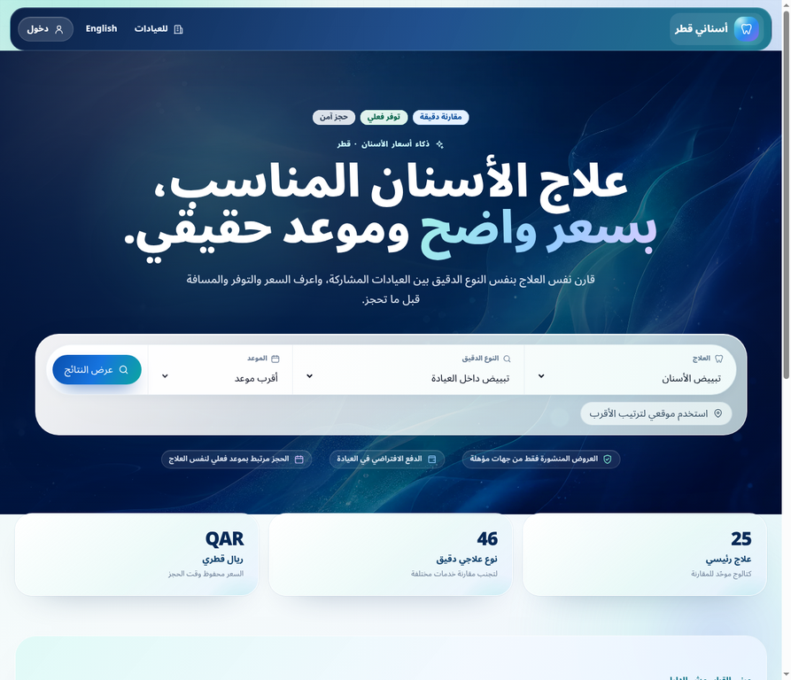
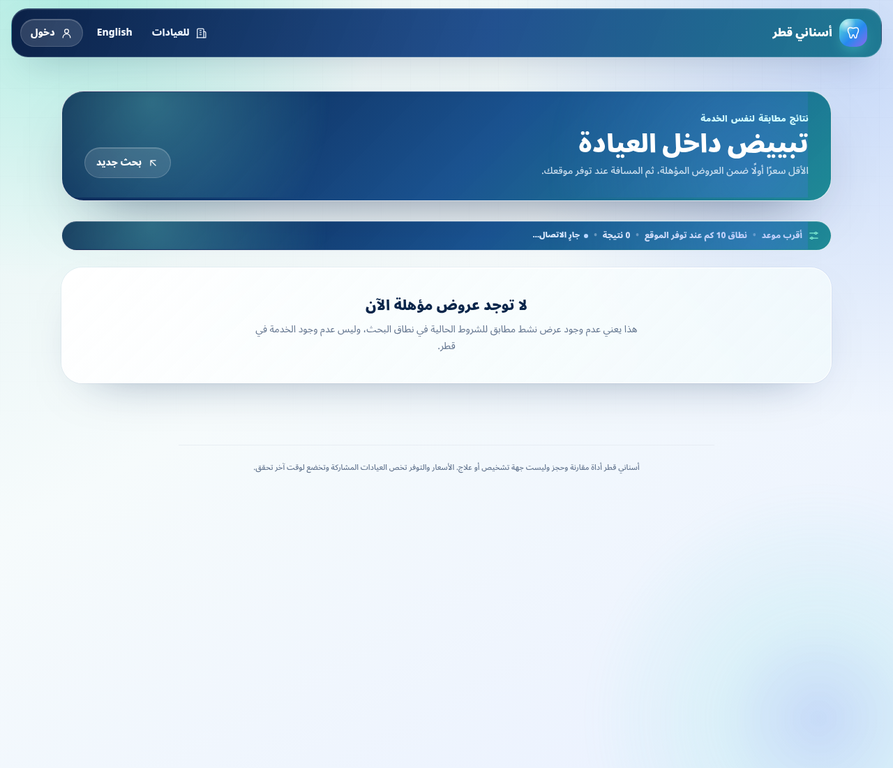

# تقرير اعتماد الإنتاج — أسناني قطر

**المحرر:** Manus AI

**التاريخ:** 18 أغسطس 2026
**النطاق:** اعتماد إعادة التصميم البصري وإصلاح عامل الخدمة PWA على النطاقين الرسميين.

## الملخص التنفيذي

تم اعتماد إصدار الإنتاج `dpl_Gyes26G3Q8vstUjTZX5Sn6F9KtqQ` بحالة **READY** وبهدف `production`. يربط مزود الاستضافة هذا الإصدار بالنطاقين `www.mmc-mms.com` و`mmc-mms.com`، إضافة إلى نطاقات المشروع. أظهر الفحص الحي على الموقع الرسمي الهوية البصرية الجديدة، وتبديل اللغة، ومسار المقارنة، ونقطة الصحة العامة، وعامل خدمة نشطًا ومسيطرًا على الصفحة.[1]

> لا يمكن إثبات أن أي نظام برمجي «بلا خطأ بنسبة 100%» في كل ظرف مستقبلي. ما يمكن إثباته هو أن بوابات الجودة والسيناريوهات الحية المدرجة أدناه اجتازت بنجاح على الإصدار المعتمد، مع عدم إنشاء حجوزات أو إرسال رسائل خلال هذا الاعتماد.

| محور الاعتماد | النتيجة | الدليل |
| --- | --- | --- |
| إصدار الإنتاج | ناجح | `READY`، هدف `production`، ومعرّف الإصدار موثق أعلاه |
| النطاقات الرسمية | ناجح | ظهور `www.mmc-mms.com` و`mmc-mms.com` ضمن أسماء الإنتاج المعتمدة |
| الهوية البصرية | ناجح | شاشة رئيسية داكنة متدرجة مع خلفية طبية، رأس زجاجي، ونموذج مقارنة بارز |
| تبديل العربية والإنجليزية | ناجح | تبديل حي كامل للرأس والواجهة ونموذج البحث على الموقع الرسمي |
| مسار المقارنة | ناجح | انتقل البحث إلى عنوان يتضمن العلاج والنوع الدقيق وتفضيل الموعد الصحيح |
| حالة عدم وجود عروض | ناجح | رسالة عربية صريحة تفرق بين عدم وجود عرض مؤهل وعدم وجود الخدمة في قطر |
| عامل الخدمة PWA | ناجح | سجل نشط على `https://www.mmc-mms.com/` مع `controller=true` |
| نقطة الصحة | ناجح | HTTP 200: `ok=true` و`database=true` و`server_operations=true` و`treatments=25` |

## التحقق الحي على الموقع الرسمي

بدأ التحقق من [الصفحة الرئيسية الرسمية](https://www.mmc-mms.com/) في الإنجليزية ثم بدّل إلى العربية من مفتاح اللغة نفسه. ظلت البنية المرئية متماسكة بعد التحويل؛ فظهرت الهوية والرأس والنموذج وسياق المقارنة باللغة العربية واتجاهها الصحيح. توثق الصورة التالية حالة العربية من الموقع الرسمي.[2]

استخدم التحقق الإعداد الافتراضي للعلاج والنوع الدقيق من دون إدخال بيانات شخصية أو الضغط على إجراء حجز. فتح زر النتائج رابطًا يحمل `treatment` و`variant` و`when=earliest` بالقيم المتوقعة. لم تعرض قاعدة الإنتاج عرضًا مؤهلًا لهذا النوع في لحظة التحقق؛ لذا ظهرت حالة فارغة سليمة بدل بطاقة مكررة أو إجراء حجز غير متاح.[3]

## بوابات الجودة

أعيدت بوابات الجودة من الإيداع النهائي قبل الاعتماد. اجتازت الحزمة الثابتة والتحقق من الأنواع والتدقيق و50 اختبار وحدة، ثم اجتازت حزمة المتصفح المتسلسلة 40 حالة عبر سطح المكتب والهاتف في **40.9 ثانية**. كما اختُبر فحص ما قبل النشر خارج شجرة Git لمحاكاة طريقة رفع المصدر المباشر إلى مزود الاستضافة.[4]

| البوابة | النتيجة | التغطية المؤكدة |
| --- | --- | --- |
| `predeploy:check` | ناجح | ملفات أساسية، مفاتيح بيئة موثقة، وفحص مواد سرية |
| `typecheck` | ناجح | TypeScript بلا أخطاء |
| `lint` | ناجح | تدقيق المشروع بلا مخالفات |
| `test` | ناجح | 50 اختبار وحدة في 12 ملفًا |
| `build` | ناجح | Next.js 16.3.1 وتوليد 17 مسارًا |
| `test:e2e` | ناجح | 40 سيناريو عامًا وPWA على سطح المكتب والهاتف |
| فحص إنتاجي يدوي | ناجح | الرئيسية، اللغة، النتائج، الصحة، وتسجيل PWA |

## إصلاح عامل الخدمة

كان العامل في معاينات الإنتاج ينتقل من حالة `installing` إلى `redundant`. أثبت التشخيص أن طلب التخزين المسبق لـ`/offline.html` مع `credentials: "omit"` يفشل في بيئة Vercel، بينما ينجح طلب الاعتماد الافتراضي. أزيل هذا الخيار من [عامل الخدمة](../public/sw.js)، وأصبح العامل نشطًا على المعاينة ثم على النطاق الرسمي. كما نُقل استدعاء التسجيل إلى مفتاح اللغة العميل المتهجَّن لضمان بدء التسجيل في الواجهة الفعلية.[5]

| الإصلاح | الإيداع | الأثر المتحقق |
| --- | --- | --- |
| تسجيل العامل من مكون عميل متهجَّن | `a230731` | تسجيل متاح عند تشغيل الواجهة الفعلية |
| إصلاح التخزين المسبق على Vercel | `498dd87` | عامل نشط وغير منتظر على المعاينة والإنتاج |
| فحص ما قبل النشر خارج Git | `d537959` | بناء إنتاج مباشر لا يفشل لغياب `.git` |

## حدود الاعتماد المقصودة

لم تُنشأ أي حجوزات حقيقية، ولم يُدخل رقم شخصي أو هاتف أو بيانات مريض، ولم تُرسل رسائل. يظل اختبار إرسال SMS مستثنى صراحةً وفق توجيه مالك المشروع. أما تسجيل الدخول السحري، ولوحات المريض والعيادة والإدارة، فقد غُطيت في تقارير التحقق الحي السابقة؛ لم يُعد تنفيذها خلال هذا الاعتماد الإنتاجي الأخير تجنبًا لتوليد بيانات اختبار أو إشعارات غير لازمة.[6]

## المراجع

[1]: https://www.mmc-mms.com/ "الموقع الرسمي — أسناني قطر"
[2]: ./evidence/production-release/home-ar.webp "لقطة الشاشة الرئيسية العربية من الإنتاج"
[3]: ./evidence/production-release/results-ar-empty-state.webp "لقطة نتائج المقارنة من الإنتاج"
[4]: ./PWA_REGISTRATION_FIX_VALIDATION_2026-08-18.md "سجل بوابات الجودة وإصلاح PWA"
[5]: ../public/sw.js "عامل الخدمة الإنتاجي"
[6]: ./LIVE_ROLE_TEST_REPORT_2026-08-18.md "تقرير التحقق الحي السابق للأدوار"
