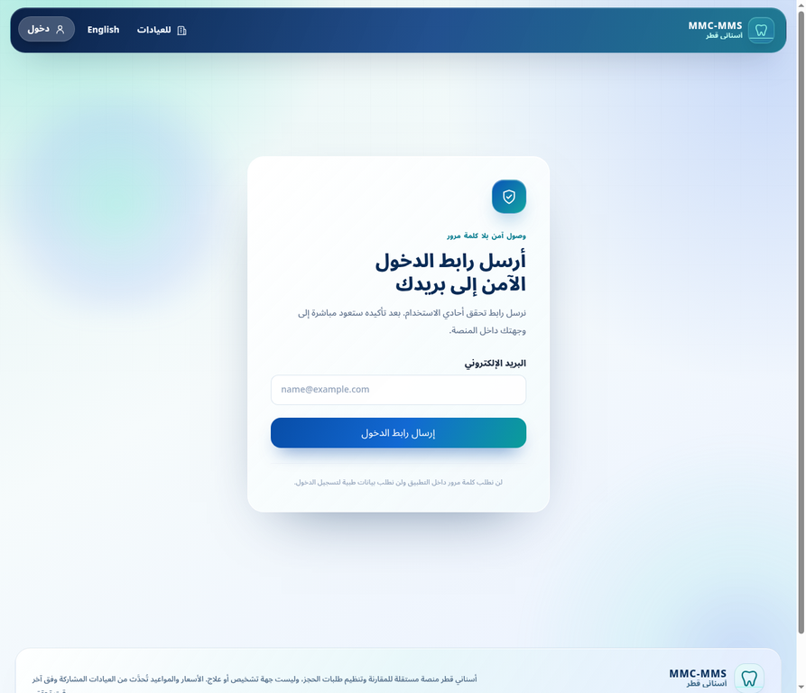
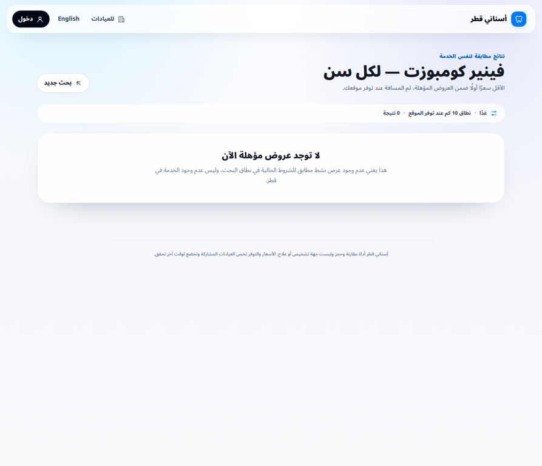
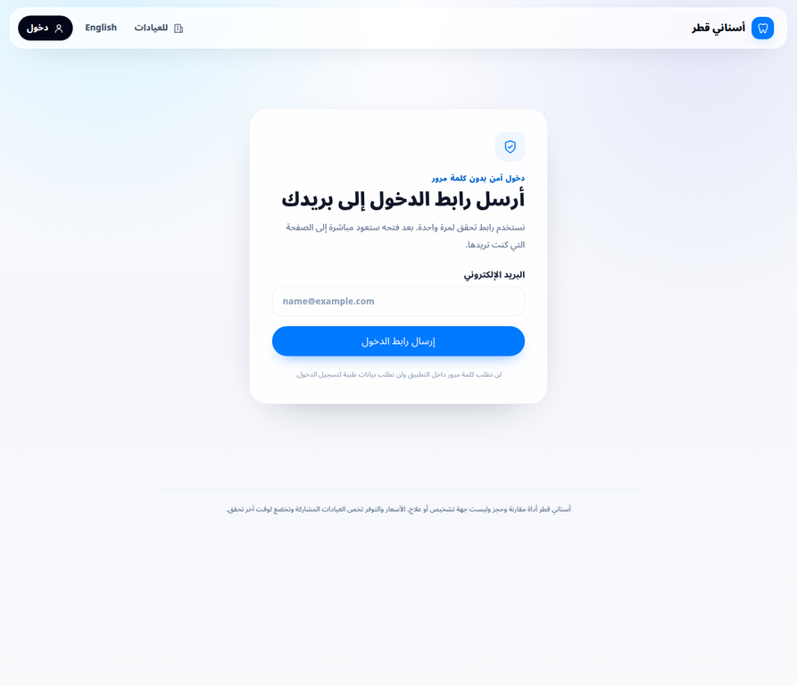

# كتيب التشغيل الذاتي — أسناني قطر / MMC-MMS

> **الغرض من هذا الكتيب:** تمكين المريض وموظفي العيادة ومدير المنصة من استخدام ما يظهر لهم في التطبيق من دون مدرس، وبصورة لا تتجاوز صلاحياتهم. كل خطوة هنا مبنية على الواجهة والعقود البرمجية الفعلية في هذا المستودع، لا على إجراءات افتراضية.
>
> **حدود مهمة:** أسناني قطر منصة مقارنة وتنظيم طلبات حجز، وليست جهة تشخيص أو علاج. لا يُقال إن الفحص أو الأشعة أو العلاج مشمول بالسعر إلا عندما يصرّح العرض بذلك. ولا تُرسل رسائل OTP أو إشعارات خارجية حقيقية عندما لا يكون مزودها مهيّأ في بيئة التشغيل.

## فهرس سريع

| إذا كنت… | ابدأ من |
|---|---|
| زائرًا أو مريضًا | [البحث والحجز وحساب المريض](#4-المريض-البحث-وطلب-الحجز-والحساب) |
| ممثل عيادة | [لوحة العيادة](#5-لوحة-العيادة) |
| عميل تشغيلي مقيّد | [الحجوزات المصرح بها](#59-العميل-التشغيلي-المقيد) |
| مدير منصة | [لوحة الإدارة](#6-لوحة-الإدارة) |
| لا يظهر لك زر ما | [حل المشكلات وحدود الصلاحية](#7-حل-المشكلات-وحدود-الصلاحية) |

## 1. قبل البدء

### 1.1 الدخول واللغة

افتح [الموقع الرسمي](https://www.mmc-mms.com). يمكن للزائر البحث والمقارنة من دون تسجيل دخول. للدخول إلى حساب المريض أو لوحة العيادة، اختر **«دخول»** ثم اكتب **اسم الدخول** و**كلمة المرور**. اسم دخول المريض هو nickname مستقل عن اسمه الكامل، طوله من حرفين إلى عشرة أحرف/أرقام إنجليزية ويكون فريدًا؛ أما حسابات العيادة والإدارة فتحتفظ بعقد اسم الدخول التشغيلي القائم. لا تكشف المنصة ما إذا كان الاسم أو كلمة المرور غير صحيحين؛ تظهر رسالة موحّدة حفاظًا على أمان الحساب. يعود المستخدم بعد النجاح إلى الوجهة التي طلبها.

تظهر روابط **«الخصوصية»** و**«الشروط»** في تذييل الموقع وداخل قسم إنشاء حساب المريض. هذه المسارات مهيأة تقنياً وتصرح بوضوح عندما يكون النص القانوني النهائي في انتظار اعتماد المالك/المختص؛ لا تقدم للزائر وعداً قانونياً غير منشور ولا تتجاوز رسالة الاعتماد الظاهرة.

*الصورة 1 — الصفحة الرئيسية العربية الحية في الإنتاج. المربعات المرقمة التي تظهر عليها تخص أداة الاختبار البصري فقط وليست جزءًا من واجهة العميل.*

*الصورة 2 — لقطة حية لشاشة الدخول الحالية. تستخدم الواجهة اسم المستخدم وكلمة المرور؛ لا تُخزن كلمة المرور في ملف المريض أو العيادة.*

### 1.2 قاعدة الصلاحية

ظهور رابط **«للعيادات»** أو أي صفحة لا يمنح صلاحية بحد ذاته. التطبيق يتحقق من الجلسة ثم الدور في الخادم وقاعدة البيانات. إذا لم يظهر لك زر حفظ أو نشر أو تأكيد، فهذا يعني أن دورك لا يملك الإجراء، أو أن حالة السجل لا تسمح به، أو أن المركز/الفرع لم يعتمد بعد.

| الدور | النطاق الفعلي |
|---|---|
| الزائر | بحث ومقارنة ومطالعة نطاق السعر فقط. |
| المريض | ملفه وملفات تابعيه، طلب الحجز، إلغاء حجز قابل للإلغاء، وتقييم زيارة مكتملة. |
| `owner` | كل العمليات التشغيلية للمركز والفروع المخولة، ومن ضمنها العروض والمواعيد والحضور. |
| `manager` | تشغيل الفروع المخولة مثل المالك، مع قيود العضويات حسب السياسة. |
| `receptionist` | المواعيد وساعات العمل والتأكيد والإلغاء والحضور للفروع المخولة؛ يقرأ الأسعار ولا يعدلها. |
| العميل التشغيلي المقيّد | حساب يزوّده المدير الأعلى بنطاق `clinic_bookings_only` وعضوية `receptionist` نشطة لفرع محدد؛ يفتح `/clinic/bookings` فقط ولا يصل إلى الحساب أو الإدارة أو سطح العيادة العام. |
| `pricing_manager` | إنشاء عروض وطلب تعديل أسعارها للفروع المخولة؛ لا ينشر العرض ولا يرى بيانات المريض الشخصية. |
| `viewer` | قراءة تشغيلية بلا تعديل وبلا بيانات مريض شخصية. |
| `platform_admin` | حوكمة كل العناصر المعروضة للعملاء وإدارة الكتالوج والعروض والمواعيد والمحتوى والتقارير. |

## 2. معنى الحالات والأزرار

### 2.1 حالات السعر ونطاق العلاج

كل عرض يصف البنود التالية بحالة واحدة: **التسجيل، الفحص، الأشعة، تشخيص/تحاليل إضافية، التخدير، المختبر، والدواء**.

| الحالة | معناها للمريض وللعيادة |
|---|---|
| **مشمول** | يدخل البند في السعر المعروض. |
| **غير مشمول** | لا يدخل البند في السعر؛ تظهر أي تكلفة لاحقة لدى العيادة حسب سياستها. |
| **يتحدد بعد التقييم** | لا يمكن تثبيت شمول البند قبل تقييم الحالة؛ لا يجوز وصف العرض بأنه باقة شاملة. |
| **لا ينطبق** | لا يرتبط البند بهذا العلاج. |

يوجد أيضًا: عناصر مشمولة إضافية، عناصر مستثناة، عدد الزيارات، شروط المتابعة، وملاحظات للمريض. إذا كان العرض **باقة**، فلا يُقال إنها شاملة إلا بعد تعبئة هذه الإفصاحات كاملة.

### 2.2 حالات العرض والموعد والحجز

| الكيان | الحالات المهمة | من يديرها |
|---|---|---|
| عرض العيادة | `draft`، `active`، `needs_review`، `stale`، `suspended`، `archived` | العيادة تنشئ المسودة؛ الإدارة تملك التحكم الكامل بالحالة. |
| الموعد | `draft`، `published`، `held`، `consumed`، `expired`، `cancelled` | العيادة تنشئ/تنشر حسب الدور؛ الإدارة تستطيع ضبطها. |
| الحجز | انتظار تأكيد العيادة، `confirmed`، `checked_in`، `completed`، `clinic_cancelled`، `no_show`، `failed` | العيادة حسب مصفوفة الدور وحالة الحجز؛ المريض يطلب الإلغاء عبر حسابه عندما تسمح الحالة. |

## 3. البحث والمقارنة قبل أي حجز

### 3.1 خطوات البحث

1. من الصفحة الرئيسية، اختر **العلاج الرئيسي** في الحقل الأول.
2. اختر **النوع الدقيق** في الحقل الثاني. لا تتجاوز هذه الخطوة؛ المقارنة تعتمد النوع الدقيق وليس الاسم العام.
3. اختر التفضيل الزمني: **أقرب موعد** أو **اليوم** أو **غدًا**.
4. اختياريًا اضغط **«استخدم موقعي لترتيب الأقرب»**. إن رفض المتصفح الموقع أو تعذر الحصول عليه، يبقى البحث متاحًا بلا مسافة.
5. بعد تحديد الموقع، اختر **نطاق المسافة**: 1 أو 5 أو 10 أو 25 أو 50 كم. هذا النطاق يحدد العروض المرئية حول موقعك؛ ليس تقديراً لخدمة العيادة ولا يحفظ إحداثياتك ضمن حدث الاختيار.
6. اختياريًا اختر تفضيل الممارس **طبيبة** أو **طبيب** أو اتركه بلا تفضيل. يعرض البحث فقط العروض التي يتاح لها موعد لدى ممارس يطابق الاختيار.
7. اضغط **«قارن الخيارات الآن»**.

*الصورة 3 — لقطة إنتاجية حية آمنة في 19 أغسطس 2026، وتظهر اختيار نطاق المسافة 1/5/10/25/50 كم ومعيار الترتيب. لم يُرسل النموذج ولم يُطلب الموقع.*

*الصورة 4 — الواجهة الحية نفسها بالإنجليزية. يطابق ترتيب الحقول النسخة العربية مع انعكاس اتجاه الواجهة.*

### 3.2 كيف تقرأ النتيجة

تظهر بطاقة العرض المؤهل فقط عندما يكون النوع العلاجي مطابقًا وعرض السعر صالحًا وموعده قابلًا للحجز. قبل طلب الحجز، راجع الاسم، الفرع، الممارس الذي سيستقبل الموعد، مدة الخدمة، المسافة عند استخدام الموقع، وقت آخر تحقق، ونطاق السعر بالتفصيل. عند ظهور زر **«الاتجاهات على الخريطة»**، يفتح رابط Google Maps بإحداثيات الفرع المنشورة أو بعنوانه؛ لا يرسل التطبيق موقع المريض إلى خدمة خرائط إلا إذا اختار المريض استخدام موقعه للبحث أو ضغط رابط الاتجاهات.

إذا ظهرت رسالة عدم وجود عروض مؤهلة، فهذا **لا يعني عدم وجود العلاج في قطر**. يعني فقط أنه لا يوجد عرض عام يطابق النوع والموعد والموقع المختار حاليًا. عد إلى البحث وغيّر الوقت أو النوع أو الموقع.

*الصورة 5 — حالة نتائج بلا عروض مؤهلة. استخدم زر «بحث جديد» بدل تكرار الطلب نفسه.*

## 4. المريض: البحث وطلب الحجز والحساب

### 4.1 طلب موعد

بعد ظهور عرض يملك موعدًا صالحًا، اضغط **«احجز هذا الموعد»**. إذا لم تكن مسجّلًا، أنشئ حساب المريض أولًا من صفحة الدخول أو من خطوة التسجيل داخل بطاقة الحجز. لا ينشأ الحجز عند إنشاء الحساب؛ يُنشأ الحساب والملف الذاتي فقط، ثم يظل تأكيد الهاتف والموعد مطلوبين.

| المرحلة | الحقول المطلوبة | الحقول الاختيارية أو المؤجلة |
|---|---|---|
| إنشاء حساب المريض | الاسم، الرقم الشخصي، الجنسية، رقم الهاتف، nickname فريد من **2 إلى 10 أحرف/أرقام إنجليزية**، البريد الإلكتروني، وكلمة مرور من **4 إلى 10 أحرف أو أرقام إنجليزية**. تتضمن القائمة جميع رموز الجنسيات ISO 3166-1 alpha-2 المعروضة بلغة الواجهة. لا يمكن إعادة استخدام الرقم الشخصي أو رقم الهاتف لحساب مريض آخر. | تاريخ الميلاد والجنس. |
| قبل تأكيد الحجز | ملف المريض المكتمل، بما في ذلك تاريخ الميلاد الصحيح، ورقم هاتف قابل للتحقق. | الجنس اختياري. |

عند الحجز، أكمل تاريخ الميلاد إن لم يُدخل أثناء التسجيل، ثم اضغط **«حفظ البيانات وإرسال رمز التحقق»**. أدخل الرمز واضغط **«تأكيد الحجز»**. لا يُنشأ الحجز ما لم يكن الملف كاملًا و`phone_verified_at` مثبتًا. بعد تأكيد العيادة، تحفظ المنصة رسالة التأكيد داخل **«حسابي»** متضمنة العلاج والفرع والمكان والوقت ورابط الاتجاهات والتنبيه بالحضور قبل الموعد بـ30 دقيقة؛ لا تستخدم هذه الرسالة SMS للحجز.

> إذا ظهرت رسالة أن SMS غير مهيأ، لا تحاول تجاوزها ولا تعد العميل بحجز. يعني ذلك أن مزود OTP غير مهيأ في البيئة؛ اطلب من مدير المنصة إكمال إعدادات مزود الرسائل ثم أعد العملية.

### 4.2 إدارة ملف المريض والتابعين

من **«حسابي»** يستطيع المستخدم إنشاء ملف لنفسه أو لتابع. يمكن أرشفة ملف تابع عند عدم الحاجة إليه، لكن لا يمكن أرشفة ملف **self**. الأرشفة لا تعني محو سجل الحجز السابق ولا تمنح حق تعديل ملف شخص آخر.

يستطيع المريض حذف حسابه من قسم **«حذف حسابي»** بكتابة `DELETE` ثم التأكيد. يوقف الإجراء الوصول ويؤرشف ملفه الشخصي مع إبقاء الحد الأدنى من سجل الحجز والتدقيق التشغيلي؛ لا يمكن استعادته من الحساب المحذوف. لا يملك موظف العيادة أو العميل التشغيلي هذا الإجراء، ويستطيع المدير الأعلى تنفيذه من الإدارة فقط.

### 4.3 إلغاء طلب أو موعد

من قائمة الحجوزات في الحساب، يظهر زر الإلغاء فقط للحالات التي يسمح بها الخادم؛ وهي الحجز المنتظر لتأكيد العيادة أو الحجز المؤكد. إذا لم يظهر زر الإلغاء أو ظهرت رسالة «غير قابل للإلغاء»، فالحالة لم تعد تسمح بالإلغاء الذاتي. لا تعدل الحالة يدويًا ولا تكرر طلبات الإلغاء.

### 4.4 التقييم بعد الزيارة

يظهر نموذج التقييم فقط عندما تكون حالة الحجز **`completed`**. اختر تقييمًا من 1 إلى 5، وأضف نصًا اختياريًا، ثم أرسل. يُحفظ التقييم أولًا كـ`pending` لمراجعة الإدارة، ولا يمكن إضافة تقييم ثانٍ للحجز نفسه.

## 5. لوحة العيادة

### 5.1 الوصول وتقديم طلب الانضمام

افتح **«للعيادات»**. إن لم تكن لديك جلسة، يحوّلك التطبيق تلقائيًا إلى الدخول. بعد دخول مستخدم لا يملك عضوية عيادة، تظهر بطاقة **طلب الانضمام**؛ اكتب الاسم القانوني واسم العرض ثم أرسل الطلب. لا يصبح المركز قابلًا للتشغيل العام قبل أن يعتمد مدير المنصة المركز والفرع والممارس عند الحاجة.

*الصورة 6 — المثال الحقيقي الذي يوضح أن لوحة العيادة لا تفتح للزائر. بعد الدخول بدور مخوّل فقط تظهر لوحة التشغيل.*

### 5.1.1 حسابا التشغيل على مستوى العيادة

يظهر قسم **«حسابات تشغيل العيادة»** لمالك العيادة فقط عندما تكون العيادة نشطة. يستطيع المالك إنشاء **حسابين تشغيليين كحد أقصى**؛ يكتب لكل حساب البريد الإلكتروني واسم المستخدم وكلمة مرور مؤقتة. لا تُخزن كلمة المرور في ملف العيادة أو في سجلات التشغيل؛ تديرها خدمة المصادقة فقط.

يحصل هذا النوع من الحسابات على عضوية **`manager`** داخل المركز نفسه، فيستطيع تنفيذ إجراءات التشغيل المسموحة للمدير في الفروع المخوّلة، لكنه لا يملك أي صلاحية للإدارة العامة للمنصة ولا يمكنه إنشاء حساب ثالث. يعرض القسم اسم المستخدم وحالة الحساب، ويمكن للمالك اختيار **«إلغاء الحساب»**؛ عندها تُسحب العضوية التشغيلية فورًا ويعطّل اسم المستخدم وتبقى عملية الإلغاء مسجلة لأغراض التدقيق.

> هذا الحساب الإداري للعيادة **ليس** العميل التشغيلي المقيّد أدناه. العميل المقيّد ينشئه المدير الأعلى من الإدارة، ويرتبط بفرع محدد ولا يرى إلا شاشة الحجوزات المصرح بها.

### 5.2 إضافة فرع وممارس

هذه العملية متاحة لمالك أو مدير مركز **نشط**.

1. في بطاقة **«إضافة فرع»** اكتب اسم الفرع، والمنطقة والعنوان إن توفرا. الإحداثيات اختيارية ويُسمح بها فقط ضمن نطاق إحداثيات صحيح.
2. اضغط حفظ. الفرع الجديد يدخل مسار الاعتماد ولا يُعامل كفرع عام قبل التحقق.
3. في بطاقة **«إضافة ممارس»** اكتب الاسم ومرجع الترخيص إن توفر، واختر **طبيبة** أو **طبيب** عند معرفة هذه البيانات، ثم احفظ. يظهر الممارس بحالة معلّقة حتى التحقق الإداري. لا تختر الجنس على التخمين؛ يحدد هذا الحقل نتائج تفضيل المريض.

لا يوجد زر حذف نهائي للفرع أو الممارس في لوحة العيادة. لا تحاول حذف السجل من المتصفح أو SQL؛ حالة الاعتماد والحوكمة تحفظ أثر التشغيل.

### 5.3 ساعات العمل

تُتاح لمالك/مدير/موظف استقبال في الفرع النشط. في الواجهة الحالية، إدخال وقت الافتتاح والإغلاق يحفظ **الوقت نفسه لأيام الأسبوع السبعة** للفرع المحدد؛ يجب أن يكون الإغلاق بعد الافتتاح.

> **حد واجهة مقصود:** لا توجد في لوحة العيادة الحالية شاشة لإغلاق يوم منفرد أو إغلاق فرع نهائيًا. لا تقدّم هذا كإجراء متاح. لإيقاف توفر مواعيد، ألغِ/أوقف المواعيد المتأثرة وفق صلاحيتك، واطلب تدخل الإدارة عندما تكون الحاجة لحوكمة فرع أو عرض عام.

### 5.4 إضافة عرض سعر أو خدمة جديدة

يحتاج العرض إلى فرع مخوّل ونوع علاجي نشط في الكتالوج.

1. افتح بطاقة **«عرض سعر جديد»**.
2. اختر الفرع ثم النوع العلاجي الدقيق.
3. اختر نوع السعر:

| نوع السعر | ما يجب إدخاله |
|---|---|
| ثابت `fixed` | السعر الأدنى/المعروض مطلوب. |
| يبدأ من `from` | السعر الأدنى مطلوب. |
| نطاق `range` | الحد الأدنى والحد الأعلى مطلوبان، والأعلى لا يقل عن الأدنى. |
| باقة `package` | السعر الأدنى مطلوب، مع الإفصاح الكامل عن الشمول. |
| تقييم مطلوب `consultation_required` | لا تدخل أي مبلغ. |

4. أدخل مدة الخدمة بين 5 و480 دقيقة.
5. عيّن حالة كل بند في **نطاق السعر**: التسجيل والفحص والأشعة والتشخيص الإضافي والتخدير والمختبر والدواء.
6. أضف العناصر المشمولة والمستثناة وعدد الزيارات وشروط المتابعة والملاحظات عند وجودها.
7. اضغط **«حفظ مسودة»**.

المالك أو المدير يستطيع نشر المسودة عندما يكون المركز/الفرع مؤهلين، أما `pricing_manager` فينشئ العرض ولا ينشره. لا يظهر العرض في المقارنة العامة قبل أن يصبح نشطًا ويلبي قاعدة نطاق السعر.

### 5.5 تعديل سعر عرض نشط

لا تعدل سعر عرض نشط مباشرة من لوحة العيادة. في بطاقة **«عروض الأسعار»** اكتب الحد الأدنى والحد الأعلى عند اللزوم، وسببًا لا يقل عن ثلاثة أحرف، ثم اختر **«طلب تعديل»**. يصل الطلب إلى الإدارة؛ لا تصبح الأسعار الجديدة عامة إلا بعد الموافقة.

### 5.6 إنشاء المواعيد ونشرها

1. في بطاقة **«موعد جديد»** اختر الفرع والنوع العلاجي والممارس المتاح للموعد.
2. أدخل البداية والنهاية. يجب أن تكون النهاية بعد البداية، ويحوّل التطبيق الوقت إلى توقيت قطر.
3. احفظ كـ`draft`.
4. يظهر الموعد في قائمة **«المواعيد»**. يملك `owner` و`manager` و`receptionist` للفرع المخوّل زر **«نشر»**.

لا تنشر موعدًا لا يمكن للعيادة الوفاء به. الإلغاء أو الحجز أو انتهاء الصلاحية يغيّر حالة الموعد ويمنع استخدامه بصورة غير صحيحة.

### 5.7 إدارة الحجوزات والتأكيدات والحضور

تظهر إشعارات **`booking_requested`** داخل اللوحة للأدوار التشغيلية، مع رقم الحجز وموعده والعلاج، وبأقل بيانات لازمة. تظهر بيانات المريض التشغيلية فقط للأدوار المسموح لها.

| الحالة الحالية | الخيارات التي قد تظهر | القيد |
|---|---|---|
| انتظار تأكيد العيادة أو حجز معلّق | **تأكيد** أو **فشل**؛ وقد يظهر إلغاء المركز حسب الحالة. | ينفذها `owner` أو`manager` أو`receptionist` للفرع المخول. |
| مؤكد | **تسجيل حضور**، **إلغاء المركز**، **فشل**؛ و**عدم الحضور** بعد وقت الموعد فقط. | لا يسجل عدم حضور قبل وقت البداية. |
| تم تسجيل الحضور | **إكمال الزيارة**، أو **عكس الحضور** للمالك/المدير مع سبب لا يقل عن ثلاثة أحرف. | لا يعكس موظف الاستقبال الحضور. |
| مكتمل أو ملغى أو no-show أو failed | لا تغيّر الحالة من الواجهة التشغيلية المعتادة. | تحفظ مصفوفة الحالة التاريخ التشغيلي. |

للتأكيد، اختر الحالة من القائمة ثم اضغط **«تطبيق»**. لا ترسل رسالة خارجية يدويًا وتفترض أنها وصلت؛ صندوق الإرسال يعرض حالته عند الإدارة، أما SMS/Push الخارجي فيحتاج مزودًا مهيّأً.

### 5.8 كشف نشاط العيادة

يتاح كشف النشاط لــ`owner` و`manager` فقط للعيادة المحددة؛ لا يراه موظف الاستقبال أو مدير التسعير أو القارئ. من أعلى قسم التشغيل، حدّد **تاريخ البداية** و**تاريخ النهاية** وطريقة التجميع: **بالساعة** أو **باليوم** أو **بالأسبوع** أو **بالشهر**، ثم اضغط **«تحديث الكشف»**. كل الأوقات والتجميعات تُعرض بتوقيت قطر (`Asia/Qatar`).

يعرض الكشف إجمالي المرضى والحجوزات، وما استجد خلال الفترة، ثم جدولاً للفترات يبيّن المرضى الجدد والحجوزات الجديدة والمؤكدة والمسجّل حضورها والمكتملة والمغلقة من دون إكمال. المجال دائماً **مقيد ببيانات عيادتك**؛ لا يتيح هذا السطح مقارنة مراكز أخرى أو تحميل بيانات المنصة. استخدم **«طباعة الكشف»** عند الحاجة إلى نسخة ورقية. لا يظهر تصدير CSV في لوحة العيادة؛ هو إجراء إداري حصري للنطاق الكامل.

### 5.9 العميل التشغيلي المقيد

العميل التشغيلي المقيّد هو حساب ينشئه **المدير الأعلى** من لوحة الإدارة، ويربطه بعيادة وفرع محددين. لا يملك هذا الحساب صفحة حساب مريض أو لوحة عيادة شاملة أو لوحة إدارة؛ فحاجز المسارات يعيده إلى `/clinic/bookings` حتى لو فتح رابطًا آخر.

1. افتح رابط الدخول واستخدم **اسم المستخدم** و**كلمة المرور** اللذين زودك بهما المدير. لا تشاركهما ولا تحفظهما في ملف فرع أو رسالة.
2. بعد الدخول تصل إلى **«الحجوزات المصرح بها»**. تظهر علامة الفرع المخوّل، وعدادات: تتطلب إجراء، القادمة، والسجل السابق.
3. راجع بيانات المريض التي تظهر للحجز ضمن الفرع فقط. لا تنسخها خارج الحاجة التشغيلية ولا تحاول فتح بيانات حجز من فرع آخر.
4. عندما تتاح قائمة إجراء، اختر فقط انتقال الحالة المطلوب ثم اضغط **«تنفيذ»**. لا تعيد المحاولة إذا أعاد النظام تعارضًا أو تغيرت حالة الموعد؛ حدّث الشاشة أولًا.
5. إذا أزيلت العضوية أو ألغى المدير الحساب، ينتهي الوصول؛ لا تحاول إنشاء حساب بديل أو تغيير claims في المتصفح.

| ما يحدث | التفسير الصحيح | الإجراء |
|---|---|---|
| يعيدك `/` أو`/account` أو`/admin` أو`/clinic` إلى الحجوزات | سلوك مقصود للنطاق `clinic_bookings_only`. | استخدم `/clinic/bookings` فقط. |
| لا توجد حجوزات | لا توجد حجوزات في الفرع المخوّل ضمن العرض الحالي. | بدّل العرض إلى القادمة أو السجل؛ لا تنشئ موعدًا أو حجزًا وهميًا. |
| لا تظهر بيانات مريض | الحجز خارج فرعك أو لا تملك الصلاحية الحالية. | راجع المدير الأعلى؛ لا تطلب صلاحية عامة. |
| لا يظهر زر إجراء | حالة الحجز لا تقبل انتقالًا أو لا يملك الحساب ذلك الإجراء. | راجع الحالة وحدّث الصفحة بدل تكرار الطلب. |

## 6. لوحة الإدارة

### 6.1 الوصول ومبدأ التحكم

لا تظهر لوحة `/admin` إلا إذا كان `app_metadata.platform_admin === true`. حارس الواجهة ليس كافيًا؛ الخادم يعيد التوجيه عند غياب الادعاء. لا تشارك حساب المدير ولا تمنح الادعاء عبر تعديل المتصفح.

*الصورة 7 — لا يحصل الزائر على شاشة الإدارة. اللقطة تثبت حاجز الوصول، وليست ادعاءً بامتلاك صلاحية مدير.*

### 6.2 اعتماد المراكز والفروع والممارسين

في قسم **العناصر المعلّقة**، يختار المدير المصدر ونوع العنصر ويكتب مصدر التحقق ومرجع الترخيص/المعرف عند توفره، ثم يضغط **«تحقق وفعّل»**. لا تفعّل مركزًا أو فرعًا أو ممارسًا من دون سجل تحقق يمكن مراجعته.

### 6.3 فتح وإغلاق الميزات العامة

يعرض قسم **Feature flags** المفاتيح المدعومة حاليًا: `payments` و`promotions` و`instant_slots` و`verified_reviews`.

1. اختر **مفعل** أو **معطل**.
2. اكتب كائن JSON صحيحًا في حقل الإعدادات. لا تكتب نصًا عاديًا أو قائمة؛ الحقل يقبل كائن JSON فقط.
3. اضغط **«حفظ ونشر الإعداد»**.

هذا هو الإجراء الرسمي لفتح/إغلاق ميزة عامة مدعومة. لا تضف مفتاحًا غير موجود ولا تعدّل الكود من اللوحة.

### 6.4 إضافة أو تعديل أو إخفاء خدمة علاجية

**العلاج الرئيسي:** أدخل `code` إنجليزيًا صغيرًا بفواصل سفلية، والفئة، والاسم العربي والإنجليزي، ونسخة المقارنة، ثم أضف. لتعديل علاج قائم غيّر الحقول ذاتها واختر:

- **مرئي/متاح**: يظهر ضمن البحث وفق بقية الشروط.
- **مخفي/غير متاح**: يوقف ظهوره الجديد ويحفظ السجل بدل حذفه نهائيًا.

**النوع العلاجي الدقيق:** اختر العلاج الرئيسي، ثم أدخل `variant_key` والاسمين العربي والإنجليزي وسمات JSON. استخدم JSON صحيحًا مثل `{}` عندما لا توجد سمات. يمكن تعديل النوع أو تعطيله بالطريقة نفسها.

> لا يوجد حذف نهائي للعلاج أو النوع في واجهة الإدارة. التعطيل/الإخفاء هو الإجراء الآمن المعتمد لمنع ظهوره في بحث وحجز جديدين من دون كسر السجلات التاريخية.

### 6.5 التحكم في عروض العيادات

من **التحكم في العروض** يستطيع المدير تعديل نوع السعر، الحدين السعريين، مدة العلاج، كل بنود نطاق السعر، وحالة العرض. الحالات المتاحة: `draft` و`active` و`needs_review` و`stale` و`suspended` و`archived`.

| ما تريد فعله | الحالة المناسبة |
|---|---|
| نشر عرض مكتمل وموثوق | `active` بعد مراجعة السعر والنطاق. |
| إيقاف العرض مؤقتًا | `suspended`. |
| إخفاء العرض نهائيًا مع الاحتفاظ بالسجل | `archived`. |
| إعادته للعيادة/المراجعة | `needs_review` أو `stale` حسب سبب الحوكمة. |

لا تجعل عرضًا `active` إذا كان نطاق السعر ناقصًا أو لا يوضح الأشعة/الفحص/التحليل عند انطباقها.

### 6.6 التحكم في المواعيد

من **التحكم في المواعيد** عدّل البداية والنهاية والحالة. الحالات المتاحة: `draft` و`published` و`held` و`consumed` و`expired` و`cancelled`.

- استخدم `published` للموعد القابل للبحث والحجز.
- استخدم `cancelled` عند إلغاء توفر الموعد.
- لا تضع الموعد `consumed` أو `held` يدويًا إلا ضمن سياسة تشغيل واعية؛ هذه الحالات جزء من دورة الحجز.

### 6.7 مراجعة تعديل السعر والتسوية والتقارير

في قسم **مراجعة السعر**، راجع ملخص الطلب وسببه. اضغط **«موافقة»** للنشر وفق القواعد، أو **«رفض»** مع سبب لا يقل عن ثلاثة أحرف. لا ترفض من دون سبب مفيد للعيادة.

في **إنشاء تسوية**، اختر العيادة وتاريخ البداية والنهاية ونوع الفترة (أسبوعي، شهري، سنوي، يدوي) وملاحظة اختيارية، ثم أنشئ فترة مفتوحة. يمكن في قسم المالية اختيار العيادة والفترة، تحديث التقرير، طباعته أو تصديره CSV. هذا لا يمثل تنفيذ دفع؛ إنه تقرير وتشغيل تسوية.

### 6.8 التقييمات والنزاعات

تُراجع التقييمات المعلّقة وتُنقل إلى `published` أو `hidden` أو `removed`. استخدم `hidden` عندما يحتاج المحتوى إخفاءً قابلًا للمراجعة، و`removed` للمحتوى الذي لا يجب عرضه. قسم النزاعات في الواجهة الحالية يعرض النزاعات وحالتها للمراقبة؛ لا يقدّم زر حل مباشر في هذه الشاشة.

### 6.9 قاعدة المعرفة وقوالب الإشعارات

**قاعدة المعرفة:** أنشئ مسودة بعنوان وسمة وجمهور ولغة وMarkdown، ثم اضغط حفظ. بعد المراجعة اضغط **«اعتماد المقالة»**. للأرشفة اضغط **«أرشفة»**؛ لا يوجد تعديل مباشر لمقالة معتمدة في الواجهة الحالية، لذلك أنشئ نسخة/مقالة جديدة ثم أرشف القديمة عند الحاجة.

**قوالب الإشعارات:** أنشئ مسودة من مفتاح قالب وقناة (`push` أو`email` أو`in_app`) ولغة وموضوع اختياري ونص الرسالة، ثم احفظ واضغط **«تفعيل القالب»**. قناة `in_app` تحفظ الرسالة داخل حساب المريض ولا تثبت إرسالًا خارجيًا؛ أما SMS فلم تعد قناة لإشعارات الحجز، وتبقى خدمة OTP منفصلة وتحتاج مزودًا مهيأً. لا توجد أداة تعطيل قالب مباشر ضمن البطاقة الحالية؛ لا تعد العميل بوجودها.

### 6.10 كشف النشاط التشغيلي الشامل

في قسم **«كشف النشاط التشغيلي الشامل»**، يختار مدير المنصة تاريخ البداية والنهاية والتجميع **بالساعة/اليوم/الأسبوع/الشهر** ثم يضغط **«تحديث الكشف»**. يعمل التجميع وفق توقيت قطر (`Asia/Qatar`) ويظهر نطاق التقرير وفترته ووقت إنشائه بوضوح حتى لا تختلط أرقام فترات مختلفة.

يعرض النطاق الإداري إجمالي العيادات والعيادات النشطة والمرضى والحجوزات، مع جدول للفترات يشمل العيادات الجديدة والمرضى الجدد والحجوزات الجديدة والمؤكدة والمسجّل حضورها والمكتملة والمغلقة من دون إكمال. استخدم **«طباعة الكشف»** لنسخة الطباعة، أو **«تصدير CSV»** لتنزيل البيانات نفسها بصيغة قابلة للمراجعة. لا تشارك CSV خارج التفويض التشغيلي؛ يحتوي على مؤشرات تشغيلية للمنصة كلها.

> لا تستبدل تعذّر تحميل التقرير بأرقام صفرية. راجع الفترة والصلاحية، ثم أعد التحميل أو أبلغ الدعم التشغيلي إذا استمر الخطأ.
>
> **حد الصور المقصود:** لا تتضمن الأصول الحالية لقطة كشف نشاط للعيادة أو للإدارة، لأن تصويرهما يتطلب جلسة مخوّلة وقد يعرض بيانات تشغيلية أو شخصية. لا تُنشأ لقطة وهمية؛ عند توفر جلسة اختبار مخولة وبيانات آمنة تُضاف لقطة حقيقية إلى سجل الأصول.

## 7. حل المشكلات وحدود الصلاحية

| الموقف | التفسير الصحيح | التصرف |
|---|---|---|
| لا يظهر زر نشر عرض | لا تملك دور owner/manager، أو الفرع/المركز غير نشط، أو العرض ليس مسودة صالحة. | راجع الدور وحالة الاعتماد، أو اطلب من المدير/المالك النشر. |
| لا يظهر زر تعديل سعر | موظف الاستقبال أو viewer لا يملك تعديلًا. | استخدم pricing manager أو owner/manager. |
| لا يظهر المريض أو بياناته | الدور لا يملك PII أو الحجز خارج الفرع المخول. | لا تحاول الالتفاف؛ راجع العضوية. |
| لا يمكن إرسال OTP | مزود SMS أو أسراره غير مهيأة، أو تجاوزت الحدود. | لا تنشئ حجزًا بديلًا يدويًا؛ أصلح إعداد المزود أو انتظر مدة الحد. |
| يرفض التسجيل رقم الهاتف أو الرقم الشخصي | القيمة لا تطابق الصيغة أو لا يمكن استعمالها لحساب جديد وفق سياسة منع التكرار. لا تعرض المنصة صاحب البيانات الآخر. | صحح الصيغة، أو سجّل الدخول إلى حسابك القائم، أو راجع الدعم التشغيلي مع إثبات الملكية. |
| لا يظهر خيار طبيبة/طبيب أو اتجاهات | لا يوجد ممارس مرتبط بالموعد بالجنس المطلوب، أو لا توجد إحداثيات/عنوان منشور للفرع. | أزل تفضيل الجنس أو غيّره، أو راجع الفرع ليكمل بيانات الممارس والموقع. |
| لا يمكن إلغاء حجز | الحجز تجاوز الحالة القابلة للإلغاء. | راجع العيادة عبر قنواتها التشغيلية. |
| لا توجد عروض | لا توجد عروض عامة مؤهلة للشروط الحالية. | غيّر الوقت أو الموقع أو **نطاق المسافة** أو النوع؛ لا تضف سعرًا وهميًا. |
| لا يظهر كشف نشاط العيادة | دورك ليس `owner` أو`manager`، أو لم يكتمل تحميل البيانات المصرح بها. | راجع العضوية والعيادة المحددة، ثم أعد تحميل الكشف؛ لا تطلب بيانات منصة من هذا السطح. |
| لا يعمل تصدير CSV للنشاط | التصدير محصور في مدير المنصة ونطاق التقرير الكامل. | استخدم الطباعة في لوحة العيادة، أو راجع جلسة مدير المنصة للتصدير الإداري. |
| لا يمكنك إغلاق يوم منفرد | الواجهة الحالية لا تدعم استثناءات أيام منفردة للعيادة. | أوقف المواعيد المتأثرة أو اطلب تدخل الإدارة. |
| تريد حذف سجل | لا توجد عمليات حذف نهائي في أسطح الكتالوج والعروض التشغيلية. | استخدم الإخفاء/الأرشفة/التعليق حسب الكيان. |

## 8. قوائم تحقق ذاتية

### قبل نشر عرض

1. النوع العلاجي الدقيق صحيح ونشط.
2. السعر يتوافق مع نوع السعر المختار.
3. المدة بين 5 و480 دقيقة.
4. حالة كل بند من نطاق السعر محددة.
5. الزيارات والمتابعة والاستثناءات واضحة عند الحاجة.
6. الموعد المنشور يطابق النوع والفرع وقابل للتنفيذ.

### قبل تأكيد حجز

1. الحجز يخص الفرع المخوّل.
2. الموعد ما زال صالحًا في نظام العيادة.
3. حالة الحجز تسمح بالتأكيد.
4. لا تُدخل أو تشارك بيانات المريض خارج الحاجة التشغيلية.
5. لا تعلن إرسال SMS/Push ما لم يؤكد صندوق الإرسال التسليم ويكون المزود مفعّلًا.

### قبل تفعيل شيء للعموم

1. تأكد من الدور الإداري والبيئة المقصودة.
2. راجع أثر `active` أو `published` أو feature flag على العميل.
3. لا تنشر علاجًا أو عرضًا أو موعدًا بلا بيان أو تحقق.
4. عند الإيقاف، فضّل `suspended` أو`archived` أو تعطيل `active` بدل حذف سجل تاريخي.

## 9. مصدر كل تعليم وصور الكتيب

| المصدر | ماذا يثبت |
|---|---|
| [`app/clinic/page.tsx`](../../app/clinic/page.tsx) و[`app/clinic/actions.ts`](../../app/clinic/actions.ts) | أقسام لوحة العيادة، الأدوار، ونماذج الفروع والعروض والمواعيد والحجوزات وحسابي التشغيل على مستوى العيادة. |
| [`app/clinic/bookings/page.tsx`](../../app/clinic/bookings/page.tsx) و[`lib/supabase/proxy.ts`](../../lib/supabase/proxy.ts) | مساحة العميل التشغيلي المقيّد ونطاق مساراته. |
| [`app/admin/actions.ts`](../../app/admin/actions.ts) | مسار المدير الأعلى لإنشاء وإلغاء العميل التشغيلي المقيّد. |
| [`app/admin/page.tsx`](../../app/admin/page.tsx) و[`app/admin/actions.ts`](../../app/admin/actions.ts) | أدوات الإدارة وحالات التحكم والحوكمة. |
| [`app/login/actions.ts`](../../app/login/actions.ts) و[`lib/account-auth.server.ts`](../../lib/account-auth.server.ts) | الدخول باسم المستخدم وكلمة المرور، وربط اسم المستخدم بحساب المصادقة دون تخزين كلمة المرور. |
| [`app/account/actions.ts`](../../app/account/actions.ts) و[`components/book-button.tsx`](../../components/book-button.tsx) | تفعيل بيانات دخول الحسابات السابقة، تسجيل المريض أثناء طلب الحجز، OTP، الإلغاء، والتقييم. |
| [`lib/validation.ts`](../../lib/validation.ts) و[`lib/price-scope.ts`](../../lib/price-scope.ts) | قواعد الإدخال وأنواع السعر ونطاق السعر. |
| [`components/activity-report-card.tsx`](../../components/activity-report-card.tsx) و[`lib/activity-report.ts`](../../lib/activity-report.ts) | بطاقة كشف النشاط، حقول الفترة والتجميع، وحدود الطباعة/التصدير. |
| [`app/api/admin/reports/activity-csv/route.ts`](../../app/api/admin/reports/activity-csv/route.ts) | التصدير الإداري الوحيد بصيغة CSV لكشف نشاط نطاق المنصة. |
| [`CLIENT_OPERATIONS_MANUAL_ASSET_LOG.md`](../CLIENT_OPERATIONS_MANUAL_ASSET_LOG.md) | مصدر كل صورة، وتأكيد أنها لقطة حية أو لقطة وصول مقيدة، وحدود استعمالها. |

**سياسة التحديث:** عند إضافة زر أو حالة أو دور أو تكامل جديد، يحدّث هذا الكتيب في الإيداع نفسه مع لقطة حقيقية مخوّلة أو مع توضيح صريح بأن العنصر مقيد ولا توجد لقطة تشغيلية له. يجب أن يميّز التحديث بين حساب تشغيل العيادة ذي دور `manager` والعميل التشغيلي المقيّد بالفرع؛ لا تدمجهما في وصف واحد.

## 10. ملحق التغطية الكاملة للإجراءات

هذا الملحق يربط كل Server Action ظاهر في أسطح التطبيق **وأسطح التقرير المقيدة** بالدور والإجراء المشروح أعلاه. لا يعني وجود الدالة أو السطح أن كل مستخدم يستطيع تنفيذه؛ الصلاحية الفعلية تبقى محكومة بالجلسة وRLS وحالة السجل.

| الإجراء الفعلي أو السطح | من يراه/يطلبه | الإجراء المبسّط في الكتيب | المرجع |
|---|---|---|---|
| `setLocale` | كل زائر | بدّل العربية/الإنجليزية من رأس الصفحة. | [1.1](#11-الدخول-واللغة) |
| `loginWithPassword` | كل مستخدم | أدخل اسم المستخدم وكلمة المرور للدخول. | [1.1](#11-الدخول-واللغة) |
| `activateLoginCredentials` | حساب قديم بجلسة نشطة | فعّل اسم مستخدم وكلمة مرور مرة واحدة من صفحة الحساب. | [1.1](#11-الدخول-واللغة) |
| `createClinicOperatorAccount` | مالك عيادة نشطة | أنشئ أحد حسابي التشغيل الإداريين على مستوى العيادة فقط. | [5.1.1](#511-حسابا-التشغيل-على-مستوى-العيادة) |
| `revokeClinicOperatorAccount` | مالك العيادة | اسحب حساب تشغيل إداريًا قائمًا لعيادتك. | [5.1.1](#511-حسابا-التشغيل-على-مستوى-العيادة) |
| `createOperationalClientAccount` | المدير الأعلى | أنشئ العميل التشغيلي المقيّد بعيادة وفرع محددين. | [5.9](#59-العميل-التشغيلي-المقيد) |
| `revokeOperationalClientAccount` | المدير الأعلى | اسحب وصول العميل التشغيلي المقيّد مع حفظ الأثر. | [5.9](#59-العميل-التشغيلي-المقيد) |
| `createPatientProfile` | صاحب الحساب | أضف ملفك أو تابعًا مع الهوية والتاريخ والهاتف. | [4.2](#42-إدارة-ملف-المريض-والتابعين) |
| `archivePatientProfile` | صاحب الحساب | أرشف تابعًا فقط؛ ملف self لا يؤرشف. | [4.2](#42-إدارة-ملف-المريض-والتابعين) |
| `cancelBooking` | صاحب الحجز | ألغِ فقط عندما يظهر زر الإلغاء للحالة المسموحة. | [4.3](#43-إلغاء-طلب-أو-موعد) |
| `submitReview` | صاحب حجز مكتمل | أرسل تقييمًا واحدًا من 1 إلى 5. | [4.4](#44-التقييم-بعد-الزيارة) |
| `applyClinic` | مستخدم مسجّل بلا عضوية | أرسل الاسم القانوني واسم العرض لطلب الانضمام. | [5.1](#51-الوصول-وتقديم-طلب-الانضمام) |
| `createBranch` | `owner` أو`manager` لمركز نشط | أضف فرعًا، ثم انتظر التحقق قبل التشغيل العام. | [5.2](#52-إضافة-فرع-وممارس) |
| `setDailyHours` | `owner` أو`manager` أو`receptionist` | احفظ الافتتاح/الإغلاق الموحدين لأيام الأسبوع السبعة. | [5.3](#53-ساعات-العمل) |
| `createPractitioner` | `owner` أو`manager` لمركز نشط | أضف ممارسًا، ثم انتظر التحقق الإداري. | [5.2](#52-إضافة-فرع-وممارس) |
| `createOffer` | `owner` أو`manager` أو`pricing_manager` | أنشئ عرضًا مسودة بنطاق سعر كامل. | [5.4](#54-إضافة-عرض-سعر-أو-خدمة-جديدة) |
| `requestPriceRevision` | أدوار إدارة العرض | أرسل تعديل السعر مع سبب. | [5.5](#55-تعديل-سعر-عرض-نشط) |
| `publishOffer` | `owner` أو`manager` | انشر المسودة المؤهلة. | [5.4](#54-إضافة-عرض-سعر-أو-خدمة-جديدة) |
| `createSlot` | `owner` أو`manager` أو`receptionist` | أنشئ موعدًا مسودة للنوع والفرع. | [5.6](#56-إنشاء-المواعيد-ونشرها) |
| `publishSlot` | `owner` أو`manager` أو`receptionist` | انشر الموعد القابل للتنفيذ. | [5.6](#56-إنشاء-المواعيد-ونشرها) |
| `markBookingCheckedIn` | الدور التشغيلي المخول | سجّل حضور مريض مؤكد عند وصوله. | [5.7](#57-إدارة-الحجوزات-والتأكيدات-والحضور) |
| `reverseBookingCheckIn` | `owner` أو`manager` | اعكس الحضور بسبب تشغيلي واضح. | [5.7](#57-إدارة-الحجوزات-والتأكيدات-والحضور) |
| `changeBookingStatus` | `owner` أو`manager` أو`receptionist` | أكد أو ألغِ أو سجّل no-show/failed ضمن الحالة المسموحة. | [5.7](#57-إدارة-الحجوزات-والتأكيدات-والحضور) |
| `clinicActivityReport` | `owner` أو`manager` | حدّد الفترة والتجميع، ثم حدّث وطبع كشفاً لعيادتك فقط. | [5.8](#58-كشف-نشاط-العيادة) |
| `platformActivityReport` | `platform_admin` | حدّد الفترة والتجميع، ثم حدّث وطبع كشف المنصة الكامل. | [6.10](#610-كشف-النشاط-التشغيلي-الشامل) |
| `/api/admin/reports/activity-csv` | `platform_admin` | صدّر CSV لكشف النشاط الكامل بعد مراجعة الفترة. | [6.10](#610-كشف-النشاط-التشغيلي-الشامل) |
| `verifyAndActivate` | `platform_admin` | تحقّق وفعّل مركزًا أو فرعًا أو ممارسًا. | [6.2](#62-اعتماد-المراكز-والفروع-والممارسين) |
| `updateFeatureFlag` | `platform_admin` | افتح/أغلق ميزة عامة مدعومة مع JSON صحيح. | [6.3](#63-فتح-وإغلاق-الميزات-العامة) |
| `createTreatmentCatalog` | `platform_admin` | أضف علاجًا رئيسيًا. | [6.4](#64-إضافة-أو-تعديل-أو-إخفاء-خدمة-علاجية) |
| `updateTreatmentCatalog` | `platform_admin` | عدّل أو أخفِ علاجًا رئيسيًا قائمًا. | [6.4](#64-إضافة-أو-تعديل-أو-إخفاء-خدمة-علاجية) |
| `createTreatmentVariant` | `platform_admin` | أضف نوع علاج دقيق. | [6.4](#64-إضافة-أو-تعديل-أو-إخفاء-خدمة-علاجية) |
| `updateTreatmentVariant` | `platform_admin` | عدّل أو أخفِ نوعًا دقيقًا قائمًا. | [6.4](#64-إضافة-أو-تعديل-أو-إخفاء-خدمة-علاجية) |
| `updateAdminOffer` | `platform_admin` | اضبط السعر والنطاق وحالة عرض المركز. | [6.5](#65-التحكم-في-عروض-العيادات) |
| `updateAdminSlot` | `platform_admin` | اضبط وقت الموعد وحالته. | [6.6](#66-التحكم-في-المواعيد) |
| `moderateReview` | `platform_admin` | انشر أو أخفِ أو أزل تقييمًا. | [6.8](#68-التقييمات-والنزاعات) |
| `reviewPriceRevision` | `platform_admin` | وافق أو ارفض طلب تعديل سعر مع سبب عند الرفض. | [6.7](#67-مراجعة-تعديل-السعر-والتسوية-والتقارير) |
| `createSupportKnowledgeArticle` | `platform_admin` | أنشئ مسودة قاعدة معرفة. | [6.9](#69-قاعدة-المعرفة-وقوالب-الإشعارات) |
| `approveSupportKnowledgeArticle` | `platform_admin` | اعتمد مقالة مسودة. | [6.9](#69-قاعدة-المعرفة-وقوالب-الإشعارات) |
| `archiveSupportKnowledgeArticle` | `platform_admin` | أرشف مقالة بدل حذفها. | [6.9](#69-قاعدة-المعرفة-وقوالب-الإشعارات) |
| `createNotificationTemplate` | `platform_admin` | أنشئ مسودة قالب رسالة. | [6.9](#69-قاعدة-المعرفة-وقوالب-الإشعارات) |
| `activateNotificationTemplate` | `platform_admin` | فعّل قالب رسالة مسودة. | [6.9](#69-قاعدة-المعرفة-وقوالب-الإشعارات) |
| `createSettlement` | `platform_admin` | أنشئ فترة تسوية مفتوحة. | [6.7](#67-مراجعة-تعديل-السعر-والتسوية-والتقارير) |
